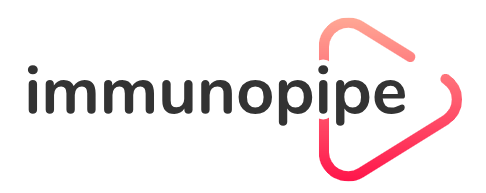

  

Integrative analysis for single-cell RNA sequencing and single-cell TCR sequencing data

`immunopipe` is a pipeline based on [`pipen`](https://github.com/pwwang/pipen) framework. It includes a set of processes for scTCR- and scRNA-seq data analysis in `R`, `python` and `bash`. The pipeline is designed to be flexible and configurable. It is also easy to extend the pipeline by adding new processes.

## Documentaion

https://pwwang.github.io/immunopipe

## Example

https://github.com/pwwang/immunopipe-example
