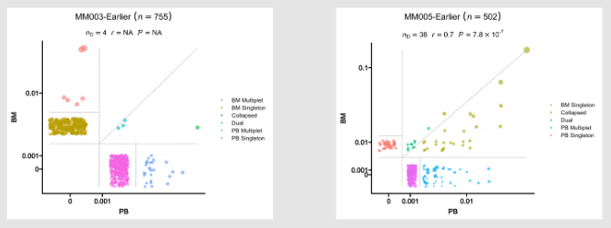

# Configurations

In this section, we are discussing how to configure the pipeline itself and some common issues we may encounter or need to be aware of to configure individual processes. For the configurations of each process in details, please refer to the individual process pages.

As mentioned in `pipen`'s [docs](https://pwwang.github.io/pipen/configurations/), the configurations to control the pipeline can be `~/.pipen.toml` and/or `./.pipen.toml`. You can set the default values in those files. Additionally, you can also pass a configuration file from command line, as described in [`Running the pipeline`](./running.md) section. You can override the default values in the configuration files by passing arguments from command line.

The configuration file is in [`toml`](https://toml.io) format. A schematic example is shown below:

```toml
forks = 4
# Other pipeline configurations

# process configurations
[TCellSelection]
forks = 2  # override the default value

# envs of the process
# e.g
[TCellSelection.envs]
indicator_genes = ["CD3D", "CD3E", "CD3G"]

# other processes
# [ProcessName]
# ...
```

!!! tip
    In the individual process pages, we will list the `envs` of the process. For example,

    - `indicator_genes`: The genes to be used to select T cells.

    This means that the environment variable `indicator_genes` should be set as follows:

    ```toml
    [TCellSelection.envs]
    indicator_genes = ["CD3D", "CD3E", "CD3G"]
    ```


## Pipeline configurations

There are pipeline level configurations and process level configurations. The pipeline level configurations are used to control the pipeline itself. The process level configurations set here are the default values for all the processes. You can override the default values for each process in the process level configurations.

You can check all avaiable configuration items and more details [here](https://pwwang.github.io/pipen/configurations/). Here we only list some of the most important ones. The rest ones are not recommended to change unless you know what you are doing.

### Pipeline level configurations

- `name`: The name of the pipeline (Default: `"Immunopipe"`)
  - It will change the working directory to `./.pipen/<name>`, where the pipeline information and intermediate files will be stored.
  - It will also change the default output directory to `./<name>-output`.
- `outdir`: The output directory (Default: `"./<name>-output"`)
- `loglevel`: The logging level for the logger (Default: `"info"`)
- `plugin_opts`: The options for the plugins.
    - Following `pipen` plugins are installed with `immunopipe`. You may check the links for more details.
    - [`pipen-board`][1]: Visualizing configuration and running of pipen pipelines on the web.
    - [`pipen-verbose`][2]: Adding verbosal information in logs for pipen.
    - [`pipen-runinfo`][3]: Generating running information for jobs in pipen pipelines.
    - [`pipen-filters`][4]: Adding a set of useful filters for pipen templates.
    - [`pipen-args`][5]: Command line argument parser for pipen
    - [`pipen-annotate`][6]: Using docstring to annotate pipen processes.
    - [`pipen-report`][7]: Generating reports for pipen pipelines.
    - [`pipen-log2file`][8]: Logging to files for pipen pipelines.
    - [`pipen-cli-run`][9]: Running pipen processes/process groups from command line.
- `scheduler_opts`: The options for the scheduler.
    - `immunopipe` is implemented using `pipen`, which is backended by [`xqute`][10]. Supported schedulers and options are listed [here](https://github.com/pwwang/xqute).

### Process level configurations

- `cache`: Should we detect whether the jobs are cached. If `true`, the jobs will be skipped if the output files exist and newer than the input files. (Default: `true`)
- `error_strategy`: The strategy to handle the errors.
    - `halt`: Any failure will just halt the entire pipeline (default)
    - `ignore`: Ignore the error and keep running (assuming the job runs successfully anyway)
    - `retry`: Retry to job running.
      After `num_retries` times of retrying, if the job is still failing, then halt the pipeline.

- `num_retries`: The number of retries for the jobs. (Default: `3`)
- `forks`: How many jobs to run simultaneously? (Default: `1`)

To know more about the configuration items for the pipeline, you can also read the [pipen docs](https://pwwang.github.io/pipen/configurations/).

## Enabling/disabling processes

By default, only a subset of processes are enabled. These processes include:

- [`SampleInfo`](processes/SampleInfo.md)
- [`ImmunarchLoading`](processes/ImmunarchLoading.md)
- [`SeuratPreparing`](processes/SeuratPreparing.md)
- [`SeuratClusteringOfAllCells`](processes/SeuratClusteringOfAllCells.md)
- [`MarkersForClustersOfAllCells`](processes/MarkersForClustersOfAllCells.md)
- [`TopExpressingGenesOfAllCells`](processes/TopExpressingGenesOfAllCells.md)
- [`CellTypeAnnotation`](processes/CellTypeAnnotation.md)
- [`SeuratMetadataMutater`](processes/SeuratMetadataMutater.md)
- [`SeuratClusterStats`](processes/SeuratClusterStats.md)
- [`CloneResidency`](processes/CloneResidency.md)
- [`Immunarch`](processes/Immunarch.md)
- [`Immunarch2VDJtools`](processes/Immunarch2VDJtools.md)
- [`VJUsage`](processes/VJUsage.md)

To enable more processes, you just need to add configurations for the processes. As long as the process name appears in the configuration file, the process will be enabled. For example, if you want to enable [`TCellSelection`](processes/TCellSelection.md), you can add the following lines to the configuration file:

```toml
[TCellSelection.envs]
indicator_genes = ["CD3D", "CD3E", "CD3G"]
```

If [`TCellSelection`](processes/TCellSelection.md) is enabled, then [`SeuratClusteringOfTCells`](processes/SeuratClusteringOfTCells.md), [`MarkersForClustersOfTCells`](processes/MarkersForClustersOfTCells.md), and [`TopExpressingGenesOfTCells`](processes/TopExpressingGenesOfTCells.md) will be enabled automatically.

Similarly, if [`TCRClustering`](processes/TCRClustering.md) or [`TCRClusteringStats`](processes/TCRClusteringStats.md) is enabled, then [`TCRClustering`](processes/TCRClustering.md), [`TCRClusters2Seurat`](processes/TCRClusters2Seurat.md), and [`TCRClusteringStats`](processes/TCRClusteringStats.md) will be enabled automatically.

For other processes, make sure you have them configured to enable them.

## Understanding the data

Understanding how the data is presented in the pipeline is helpful for the configuration, especially for the processes, such as [`RadarPlots`](processes/RadarPlots.md) and [`CellsDistribution`](processes/CellsDistribution.md). The configurations of this kind of processes are relying on the metadata.

You can refer to the individual process pages for more details. Here we just give an introduction of how it works to set the configurations.

### Using existing columns in the metadata

In most cases, you can use the existing columns in the metadata to set the configurations. For example, if you want to plot the clone residency for each patient/subject, you need to specify the column name of the sample ID, as well as the column with the paired sample information (i.e. `tumor` vs `blood`).

Suppose the metadata (sitting in `immdata$meta` in `R` for example) is as follows:

|     Sample    | Source |
| ------------- | ------ |
| MM003-Eariler | BM     |
| MM003-Eariler | PB     |
| MM005-Eariler | BM     |
| MM005-Eariler | PB     |

Then you can set the configurations as follows:

```toml
[RadarPlots.envs]
subject = "Sample"
group = "Source"
```

And you will get the following plots:



### Mutating the metadata

Sometimes, you may want to mutate the metadata to get the desired information. Of course, you can have them prepared in the input file, as those extra columns with meta information will be attached to the object (either `immunarch$meta` or `srtobj@meta.data`) automatically. See [`Preparing the input`](./preparing-input.md) for more details. However, sometimes the metadata is specific to some processes, you may not want to have them prepared in the input file to get all processes contaminated. Moreover, those derived columns are usually based on the existing columns, so that is also helpful to create them on the fly to keep the input file clean.

In such a case, for example, if you want to plot the clone residency for each patient/subject, but the sample IDs and source information are not in the metadata directly. The information you can trace is from a `LABID` column, which is in the format of `<subject>-<source>-<timepoint>`. Then you can mutate the metadata to get the desired information.

Suppose the metadata (sitting in `immdata$meta` in `R` for example) is as follows:

| LABID |
| ----- |
| MM003-BM-Earlier |
| MM003-PB-Earlier |
| MM005-BM-Earlier |
| MM005-PB-Earlier |

Then you can set the configurations as follows:

```toml
[CloneResidency.envs.mutaters]
Sample = "stringr::str_extract(LABID, '^[^-]+')"
Source = "stringr::str_extract(LABID, '(?<=-)[^-]+(?=-)')"

[CloneResidency.envs]
subject = "Sample"
group = "Source"
```

You will get the same plots as above.

The key-value pairs of `mutaters` are passed to [`dplyr::mutater()`][11] function. The actual code to mutate the metadata is as follows:

```r
df %>% mutate(
    Sample = stringr::str_extract(LABID, '^[^-]+'),
    Source = stringr::str_extract(LABID, '(?<=-)[^-]+(?=-)')
)
```

So, for this kind of advanced configurations, you need to have some knowledge of `dplyr` in `R`.

You also need to pay attention to the keys of `mutaters`. Basically, the keys are the column names you want to create. So you need to make sure that the column names are not in the metadata already. Otherwise, the existing columns will be overwritten.

For scRNA-seq data, the existing column names of the metadata are:

- `orig.ident`
- `nCount_RNA`
- `nFeature_RNA`

and the meta columns in the input file. See also [`Preparing the input`](./preparing-input.md) for more details.

There could also be some other columns, depending on the previous processes. For example, if you have the cells clustered, then there will be a column named `seurat_clusters` in the metadata.

For scTCR-seq data, `Sample` is the only existing column in the metadata after loaded. Then the meta columns from the input file will be attached to the metadata.

The best practice is to use a prefix for the column names you want to create. For example, if you want to create a column named `Sample`, you can use `my_Sample` instead. Then you can make sure that the column names are not in the metadata already.

The other thing you need to pay attention to is that you should try to avoid `.` or `-` in the column names. For example, if you want to create a column named `Sample-Source`, you can use `Sample_Source` instead. This is because that the column names will be used as the keys of the environment variables, and some processes will translate `-` into `.`. See also [`Namespace environment variables`](#namespace-environment-variables) for more details.

### Filtering the data

In most processes where we need to filter the data, we don't provide an option for you to set the expression for [`dplyr::filter()`][14]. Instead, you can make use of the `mutaters` to create a column for filtering. For example, if you only want to plot clone residency for only one patient/subject (e.g. `MM003-Eariler`) in [`CloneResidency`](processes/CloneResidency.md), you can set the configurations as follows (suppose we have `Sample` and `Source` columns in the metadata):

```toml
[RadarPlots.envs.mutaters]
SingleSample = "if_else(Sample == 'MM003-Eariler', Sample, NA)"

[RadarPlots.envs]
subject = "SingleSample"
group = "Source"
```

Then you will get only one plot for `MM003-Eariler`, but not for `MM005-Eariler`. The `NA`s will be filtered out automatically.

## Namespace environment variables

There are some enviroment variables marked as `namespace`, which means that you can have sub-keys for them. For example, the `envs.SCTransform` of [`SeuratClusteringOfAllCells`](processes/SeuratClusteringOfAllCells.md) process is a `namespace` environment variable. It takes the arguments of [`Seurat::SCTransform()`][12] function. The names of arguments have dot (`.`) in them, such as `do.scale`, `do.center`, `seed.use`, etc. In the configuration file, we need to use dash (`-`) instead of dot (`.`) to set the values for these arguments. For example, if we want to set `do.scale` to `TRUE`, we need to set `do-scale` to `true` in the configuration file.

```toml
[SeuratClusteringOfAllCells.envs.SCTransform]
do-scale = true
```

This is because that we use [`pipen-args`][5] plugin backended by [`argx`][13] to parse the command line arguments, including the configuration file. If we use `.` directly in the configuration file:

```toml
[SeuratClusteringOfAllCells.envs.SCTransform]
do.scale = true
```

Then the `pipen-args` will parse it as `do` is the key and `scale` is the sub-key, and the above configuration will be parsed as:

```toml
[SeuratClusteringOfAllCells.envs.SCTransform]
do = { scale = true }
```

which is not what we want.

The reason why `.` is parsed as sub-key is that we want the argument to be able to be passed from command line. For example, if we want to set `do.scale` to `TRUE` from command line, we can do:

```bash
$ immunopipe --SeuratClusteringOfAllCells.envs.SCTransform.do-scale true
```

If we use `.` instead of `-`:

```bash
$ immunopipe --SeuratClusteringOfAllCells.envs.SCTransform.do.scale true
```

Then the `pipen-args` will parse it as

```toml
[SeuratClusteringOfAllCells.envs.SCTransform]
do = { scale = true }
```

again.

!!! tip
    You don't need to worry about which environment variables are `namespace` ones. We will mention it in the individual process pages and the description of the environment variables in `pipen-board` configuration descriptions.


[1]: https://github.com/pwwang/pipen-board
[2]: https://github.com/pwwang/pipen-verbose
[3]: https://github.com/pwwang/pipen-runinfo
[4]: https://github.com/pwwang/pipen-filters
[5]: https://github.com/pwwang/pipen-args
[6]: https://github.com/pwwang/pipen-annotate
[7]: https://github.com/pwwang/pipen-report
[8]: https://github.com/pwwang/pipen-log2file
[9]: https://github.com/pwwang/pipen-cli-run
[10]: https://github.com/pwwang/xqute
[11]: https://dplyr.tidyverse.org/reference/mutate.html
[12]: https://satijalab.org/seurat/reference/sctransform
[13]: https://github.com/pwwang/argx
[14]: https://dplyr.tidyverse.org/reference/filter.html
