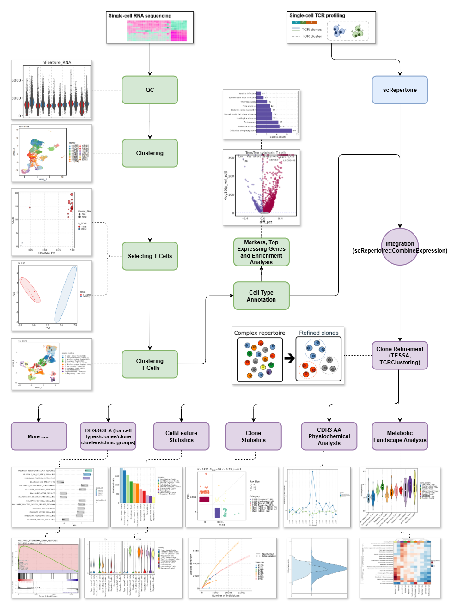

# Introduction

## The pipeline architecture

`immunopipe` is built upon [`pipen`](https://github.com/pwwang/pipen). It is recommended to read the [pipen docs](https://pwwang.github.io/pipen) first to get a better understanding of the pipeline.

Here, we just want to highlight some concepts that are helpful to use the pipeline as a user.

A _[process](https://pwwang.github.io/pipen/defining-proc/)_ is a unit of work in the pipeline. `immunopipe` includes a set of processes. Some of them are reused from [`biopipen`](https://github.com/pwwang/biopipen) and some are written specifically for `immunopipe`.

The input of a process is typically a [`pandas`](https://pandas.pydata.org/) `DataFrame`, which serves as the channel passing data between processes. The rows of the data frame are distributed to the jobs of the process, and columns are spreaded to the input variables of the _[job](https://pwwang.github.io/pipen/api/pipen.job/#pipenjobjob)_ s. See more illustration [here](https://pwwang.github.io/pipen/channels/). In our case, most processes are just single-job processes. Other than the start processes, the input of a process is the output of other process(es). So users don't need to worry about the input of the processes in the configurations.

_`envs`_ of a process is the most important part of `immunopipe` that a user needs to configure. It defines the environment variables of the process. The environment variables are shared by all the jobs of the process.

!!! note
    These environment variables are not the same as the environment variables of the system. They are just variables that are used in the process across its jobs.

See individual process pages for more details about the `envs` of each process.

## Analyses and processes

As shown in the figure above, `immunopipe` includes a set of processes for scTCR- and scRNA-seq data analysis. The processes are grouped into categories below.

Also check the pipeline [diagram](https://github.com/pwwang/immunopipe/blob/dev/docs/diagram.svg?raw=true) to see how the processes are connected.

### Data input and QC

- [`SampleInfo`](processes/SampleInfo.md): Read sample information from a CSV file and list the sample information in the report.
- [`ImmunarchLoading`](processes/ImmunarchLoading.md): Load the data into `immunarch` objects.
- [`SeuratPreparing`](processes/SeuratPreparing.md): Read the data into `Seurat` objects and perform QC.

### Clustering of all cells

- [`SeuratClusteringOfAllCells`](processes/SeuratClusteringOfAllCells.md): Perform clustering on all cells.
- [`MarkersForClustersOfAllCells`](processes/MarkersForClustersOfAllCells.md): Find markers for each cluster and perform enrichment analysis.
- [`TopExpressingGenesOfAllCells`](processes/TopExpressingGenesOfAllCells.md): Find top expressing genes for each cluster of all cells and perform enrichment analysis.

### T cell selection

- [`TCellSelection`](processes/TCellSelection.md): Select T cells from all cells.

### Clustering of T cells

- [`SeuratClusteringOfTCells`](processes/SeuratClusteringOfTCells.md): Perform clustering on T cells selected above.
- [`MarkersForClustersOfTCells`](processes/MarkersForClustersOfTCells.md): Find markers for each T-cell cluster and perform enrichment analysis.
- [`SeuratClusterStats`](processes/SeuratClusterStats.md): Investigate statistics for each T-cell cluster (i.e. the number of cells in each cluster, the number of cells in each sample for each cluster, feature/gene expression visualization, dimension reduction plots, etc.).
- [`TopExpressingGenesOfTCells`](processes/TopExpressingGenesOfTCells.md): Find top expressing genes for each T-cell cluster and perform enrichment analysis.

### TCR data analyses

- [`CloneResidency`](processes/CloneResidency.md): Explore the residency of TCR clones for paired samples (e.g. tumor vs blood) from the same patient.
- [`Immunarch2VDJtools`](processes/Immunarch2VDJtools.md): Convert `immunarch` objects to files for [`VDJtools`](https://vdjtools-doc.readthedocs.io/en/master/) for `VJUsage`
- [`VJUsage`](processes/VJUsage.md): Investigate the V/J gene usage of TCR clones.
- [`RadarPlots`](processes/RadarPlots.md): Visualize proportion of cells in different groups for each cluster.
- [`TCRClustering`](processes/TCRClustering.md): Perform clustering on TCR clones based on CDR3 amino acid sequences.
- [`TCRClusteringStats`](processes/TCRClusteringStats.md): Investigate statistics for TCR clusters (i.e. TCR cluster size distribution, shared TCR clusters among samples, revisited sample diversity using TCR clusters instead of clonotypes, etc.)
- [`Immunarch`](processes/Immunarch.md): Perform TCR clonotype analyses using [`immunarch`](https://immunarch.com/) package.

### Integrative analyses

- [`CellTypeAnnotation`](processes/CellTypeAnnotation.md): Annotate cell types for each T-cell cluster.
- [`TCRClusters2Seurat`](processes/TCRClusters2Seurat.md): Attach TCR clusters to `Seurat` objects.
- [`SeuratMetadataMutater`](processes/SeuratMetadataMutater.md): Integrate TCR data into `Seurat` objects.
- [`CellsDistribution`](processes/CellsDistribution.md): Investigate the distribution of cells in different groups for each T-cell cluster.<!-- - [`CloneHeterogeneity`](processes/CloneHeterogeneity.md): Investigate the heterogeneity of TCR clones in different groups for each T-cell cluster. -->
- [`CDR3AAPhyschem`](processes/CDR3AAPhyschem.md): Investigate the physicochemical properties of CDR3 amino acid sequences of one cell type over another (i.e. `Treg` vs `Tconv`).
- [`ScFGSEA`](processes/ScFGSEA.md): Perform GSEA analysis for comparisons between two groups of cells. For example, between two cell types, clone groups, TCR clusters or clinical groups.
- [`MarkersFinder`](processes/MarkersFinder.md): Find markers for clones or clone groups and perform enrichment analysis.
- [`MarkersOverlapping`](processes/MarkersOverlapping.md): Investigate the overlapping of markers for different groups.
- [`MetaMarkers`](processes/MetaMarkers.md): Find meta markers for more than 2 clones or clone groups and perform enrichment analysis.

### Metabolic landscape analyses

- [`ScrnaMetabolicLandscape`](processes/ScrnaMetabolicLandscape.md): A group of folowwing processes to perform metabolic landscape analyses.
- [`MetabolicInput`](processes/MetabolicInput.md): Prepare the input files for metabolic landscape analyses.
- [`MetabolicExprImpution`](processes/MetabolicExprImpution.md): Impute the dropout values in the expression matrix.
- [`MetabolicPathwayActivity`](processes/MetabolicPathwayActivity.md): Investigate the metabolic pathways of the cells in different groups and subsets.
- [`MetabolicPathwayHeterogeneity`](processes/MetabolicPathwayHeterogeneity.md): Show metabolic pathways enriched in genes with highest contribution to the metabolic heterogeneities.
- [`MetabolicFeatures`](processes/MetabolicFeatures.md): Perform gene set enrichment analysis against the metabolic pathways for groups in different subsets.
- [`MetabolicFeaturesIntraSubset`](processes/MetabolicFeaturesIntraSubset.md): Perform gene set enrichment analysis against the metabolic pathways for subsets based on the designed comparison in different groups.
