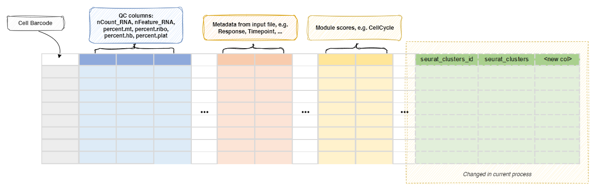

# CellTypeAnnotation

Annotate all or selected T/B cell clusters.

Annotate the cell clusters. Currently, the following ways are supported:<br />

1. Pass the cell type annotation directly (at cluster-level or cell-level)
2. Use [`ScType`](https://github.com/IanevskiAleksandr/sc-type)
3. Use [`scCATCH`](https://github.com/ZJUFanLab/scCATCH)
4. Use [`hitype`](https://github.com/pwwang/hitype)
5. Use [`celltypist`](https://github.com/Teichlab/celltypist)
6. Use [`scSorter`](https://pmc.ncbi.nlm.nih.gov/articles/PMC7898451/)
7. Use [`SCINA`](https://github.com/jcao89757/SCINA)
8. Use [`SingleR`](https://github.com/dviraran/SingleR)
9. Use [`scHDeepInsight`](https://github.com/shangruJia/scHDeepInsight)
10. Use [`GPTCelltype`](https://github.com/Winnie09/GPTCelltype)
11. Use [`cellassign`](https://github.com/Irrationone/cellassign)
12. Use [`scBERT`](https://github.com/TencentAILabHealthcare/scBERT)
13. Use [`CelliD`](https://github.com/RausellLab/CelliD)

The annotated cell types will replace the original identity column in the metadata,
so that the downstream processes will use the annotated cell types.<br />

/// Note

When cell types are annotated, the original identity column (e.g. `seurat_clusters`) will be renamed
to `envs.backup_col` (e.g. `seurat_clusters_id`), and the new identity column will be added.<br />

///

If you are using cluster-based tool, a text file containing the mapping from
the original identity to the new cell types will be generated and saved to
a tsv file under `<workdir>/<pipline_name>/CellTypeAnnotation/0/output/`.<br />

The `<workdir>` is typically `./.pipen` and the `<pipline_name>` is `Immunopipe`
by default.<br />

/// Note

If you have other annotation processes, including [`SeuratClustering`](./SeuratClustering.md)
process or [`SeuratMap2Ref`](./SeuratMap2Ref.md) process enabled in the same run,
you may want to specify a different name for the column to store the annotated cell types
using `envs.newcol`, so that the results from different annotation processes won't overwrite each other.<br />

///

/// Attention

If you are running the pipeline with the Docker image, following tools are not available in the Docker image:<br />

- `scHDeepInsight`
- `scBERT`
- `cellassign`

///

## Input

- `sobjfile`:
    The single-cell object in RDS/qs/qs2/h5ad format.<br />

## Output

- `outfile`: *Default: `{{in.sobjfile | stem}}.annotated.{{- ext0(in.sobjfile) if envs.outtype == 'input' else envs.outtype -}}`*. <br />
    The rds/qs/qs2/h5ad file of seurat object with cell type annotated.<br />
    A text file containing the mapping from the old identity to the new cell types
    will be generated and saved to `cluster2celltype.tsv` under the job output directory.<br />
    Note that if `envs.ident` is specified, the output Seurat object will have
    the identity set to the specified column in metadata.<br />

## Environment Variables

- `tool` *(`choice`)*: *Default: `direct`*. <br />
    The tool to use for cell type annotation.<br />
    - `sctype`:
        Use `scType` to annotate cell types.<br />
        See <https://github.com/IanevskiAleksandr/sc-type>
    - `hitype`:
        Use `hitype` to annotate cell types.<br />
        See <https://github.com/pwwang/hitype>
    - `sccatch`:
        Use `scCATCH` to annotate cell types.<br />
        See <https://github.com/ZJUFanLab/scCATCH>
    - `celltypist`:
        Use `celltypist` to annotate cell types.<br />
        See <https://github.com/Teichlab/celltypist>
    - `scsorter`:
        Use `scSorter` to annotate cell types.<br />
        See <https://github.com/pwwang/scSorter>
    - `scina`:
        Use `SCINA` to annotate cell types.<br />
        See <https://github.com/jcao89757/SCINA>
    - `singler`:
        Use `SingleR` to annotate cell types.<br />
        See <https://github.com/dviraran/SingleR>
    - `schdeepinsight`:
        Use `scHDeepInsight` to annotate cell types.<br />
        See <https://github.com/shangruJia/scHDeepInsight>
    - `gptcelltype`:
        Use `GPTCelltype` to annotate cell types
        with GPT-4. See <https://github.com/Winnie09/GPTCelltype>
    - `cellassign`:
        Use `cellassign` to annotate cell types
        with a probabilistic model.<br />
        See <https://github.com/Irrationone/cellassign>
    - `scbert`:
        Use `scBERT` to annotate cell types with a
        BERT-based transformer model.<br />
        See <https://github.com/TencentAILabHealthcare/scBERT>
    - `cellid`:
        Use `CelliD` to annotate cell types with MCA-based
        per-cell gene signature enrichment.<br />
        See <https://github.com/RausellLab/CelliD>
    - `direct`:
        Directly assign cell types
    - `cell`:
        Directly assign cell types, but at cell-level instead of cluster-level.<br />
- `assay`:
    The assay to use for the analysis. If not specified, the default assay will be used.<br />
    Will not be inherited by the cases under `envs.cases`.<br />
    To use a different assay for a case, specify it in the case args.<br />
    This will be also used to convert Seurat object to h5ad if the input is Seurat object
    and the output is h5ad.<br />
- `sctype_tissue`:
    The tissue to use for `sctype`.<br />
    Available tissues should be the first column (`tissueType`) of `sctype_db`.<br />
    If not specified, all rows in `sctype_db` will be used.<br />
- `sctype_db`:
    The database to use for sctype.<br />
    Check examples at <https://github.com/IanevskiAleksandr/sc-type/blob/master/ScTypeDB_full.xlsx>
- `ident`:
    The column name in metadata to use as the clusters.<br />
    If not specified, the identity column will be used when input is rds/qs/qs2 (supposing we have a Seurat object).<br />
    If input data is h5ad, this is required to run cluster-based annotation tools.<br />
    For `celltypist`, this is a shortcut to set `over_clustering` in `celltypist_args`.<br />
- `backup_col`: *Default: `seurat_clusters_id`*. <br />
    The backup column name to store the original identities.<br />
    If not specified, the original identity column will not be stored.<br />
    If `envs.newcol` is specified, this will be ignored.<br />
- `hitype_tissue`:
    The tissue to use for `hitype`.<br />
    Available tissues should be the first column (`tissueType`) of `hitype_db`.<br />
    If not specified, all rows in `hitype_db` will be used.<br />
- `hitype_db`:
    The database to use for hitype.<br />
    Compatible with `sctype_db`.<br />
    See also <https://pwwang.github.io/hitype/articles/prepare-gene-sets.html>
    You can also use built-in databases, including `hitypedb_short`, `hitypedb_full`, and `hitypedb_pbmc3k`.<br />
- `scsorter_db`:
    The database to use for scSorter. It will be loaded and passed to the `anno`
    argument of `RunScSorter()`. It could be either:<br />
    * A TSV file with cell type annotations, with columns `Type`, `Marker`, and `Weight`.<br />
    * A RDS/qs2 file of the annotation data frame with the same columns as above.<br />
    You can also use `#` followed by the column names to specify the columns as `Type`, `Marker` and `weight` (optional),
    for example, `file:///path/to/scsorter_db.tsv#celltype,marker,weight`.<br />
- `scsorter_args` *(`ns`)*:
    The arguments for `scSorter::RunScSorter()` if `tool` is `scsorter`.<br />
    - `<more>`:
        Other arguments for [`scSorter::RunScSorter()`](https://github.com/pwwang/scSorter/blob/9baae9f0e0904ddbf3f9bb5dacb9227503a8ce3e/R/scSorter.R#L73).<br />
- `scina_db` *(`type=str`)*:
    The path to the SCINA signature file.<br />
    It can be an RDS file containing a named list of
    signature genes (the names are the cell types and the
    values are the marker gene symbols), or a CSV file
    with the markers for each cell type in a column.<br />
- `scina_args` *(`ns`)*:
    The arguments for `SCINA::SCINA()` if `tool` is `scina`.<br />
    - `max_iter`:
        Maximum number of EM iterations (default: 100).<br />
    - `convergence_n`:
        Stop if assignment stays stable for N consecutive rounds (default: 10).<br />
    - `convergence_rate`:
        Fraction of cells with stable assignment for convergence (default: 0.99).<br />
    - `sensitivity_cutoff`:
        Cutoff (0-1) for removing signatures of absent cell types (default: 1).<br />
    - `rm_overlap` *(`flag`)*:
        Whether to remove genes shared between multiple signatures (default: TRUE).<br />
    - `allow_unknown` *(`flag`)*:
        Whether to allow unknown cells (default: TRUE).<br />
    - `<more>`:
        Other arguments for [`SCINA::SCINA()`](https://rdrr.io/cran/SCINA/man/SCINA.html).<br />
- `singler_db` *(`type=str`)*:
    The path to the SingleR reference file.<br />
    It can be an RDS, qs, or qs2 file containing a reference object,
    supporting:<br />
    * `SummarizedExperiment` (e.g., from the `celldex` package).<br />
    References can be obtained via `celldex::HumanPrimaryCellAtlasData()`,
    `celldex::BlueprintEncodeData()`, `celldex::MonacoImmuneData()`,
    `celldex::DatabaseImmuneCellExpressionData()`,
    `celldex::NovershternHematopoieticData()`, `celldex::ImmGenData()`,
    `celldex::MouseRNAseqData()`.<br />
    * `Seurat` object. Labels are auto-detected from metadata.<br />
    Save with `saveRDS()` or `biopipen.utils::write_obj()`.<br />
    Both the Bioconductor and CRAN versions of SingleR are supported
    and auto-detected at runtime.<br />
- `singler_args` *(`ns`)*:
    The arguments for `SingleR::SingleR()` if `tool` is `singler`.<br />
    Both the [Bioconductor](https://bioconductor.org/packages/SingleR)
    and [CRAN](https://github.com/dviraran/SingleR) versions are
    auto-detected.<br />
    - `label` *(`type=str`)*:
        The metadata/colData column name for
        reference labels. Auto-detected from `label.main`,
        `label.fine`, `label.ont`, `label` in order.<br />
    - `<more>`:
        See the SingleR documentation for your version:<br />
    - `[`Bioconductor`](https`:
        //rdrr.io/bioc/SingleR/man/SingleR.html)
        or [`CRAN`](https://github.com/dviraran/SingleR).<br />
- `schdeepinsight_ref` *(`type=str`)*:
    The path to the scHDeepInsight
    reference RDS file. The bundled `reference.rds` from the
    scHDeepInsight repo provides immune cell reference.<br />
    See <https://github.com/shangruJia/scHDeepInsight>.<br />
- `schdeepinsight_args` *(`ns`)*:
    The arguments for scHDeepInsight
    if `tool` is `schdeepinsight`.<br />
    - `batch_size` *(`type=int`)*:
        Batch size for CNN prediction
    - `(default`:
        128).<br />
    - `python` *(`type=str`)*:
        Path to Python executable with
        `SCHdeepinsight` installed.<br />
    - `assay` *(`type=str`)*:
        Assay to use for h5ad conversion.<br />
- `gptcelltype_args` *(`ns`)*:
    The arguments for
    `GPTCelltype::gptcelltype()` if `tool` is `gptcelltype`.<br />
    - `api_key` *(`type=str`)*:
        OpenAI API key (required).<br />
    - `model` *(`type=str`)*:
        GPT model (required, e.g.<br />
        'gpt-4', 'gpt-4o').<br />
    - `base_url` *(`type=str`)*:
        Custom base URL for
        OpenAI-compatible providers. Sets
        `OPENAI_BASE_URL` environment variable.<br />
    - `tissuename` *(`type=str`)*:
        Tissue name for context.<br />
    - `assay` *(`type=str`)*:
        Assay to use for
        `FindAllMarkers()`.<br />
    - `<more>`:
        Additional args passed to
    - ``Seurat:`:
        FindAllMarkers()`.<br />
- `cellassign_db` *(`type=str`)*:
    The path to the marker gene info
    file for `cellassign`. Supports:<br />
    * RDS/qs2 file: a binary gene×celltype matrix or a
    named list (cell type → vector of marker genes)
    * CSV/TSV file: with columns `gene` and `cell_type`
- `cellassign_args` *(`ns`)*:
    The arguments for
    `cellassign::cellassign()` if `tool` is `cellassign`.<br />
    - `python` *(`type=str`)*: *Default: `python`*. <br />
        Path to Python with `tensorflow` installed.<br />
    - `assay` *(`type=str`)*:
        Assay to extract raw counts from.<br />
    - `min_delta` *(`type=int`)*:
        Min log-fold change for marker
        overexpression (default: 2).<br />
    - `B` *(`type=int`)*:
        Number of RBF dispersion bases
    - `(default`:
        20).<br />
    - `shrinkage` *(`flag`)*:
        Hierarchical shrinkage on delta
    - `n_batches` *(`type=int`)*:
        Data subsample batches
    - `learning_rate` *(`type=float`)*:
        ADAM learning rate
    - `max_iter_em` *(`type=int`)*:
        Max EM iterations
    - `verbose` *(`flag`)*:
        Print progress (default: TRUE).<br />
    - `<more>`:
        Additional args to
    - ``cellassign:`:
        cellassign()`.<br />
- `scbert_ref` *(`type=str`)*:
    The path to the scBERT repo
    directory (containing `performer_pytorch/`).<br />
- `scbert_model` *(`type=str`)*:
    The path to the fine-tuned
    model checkpoint (.pth file).<br />
- `scbert_label_dict` *(`type=str`)*:
    The path to the label
    dictionary pickle file (maps class indices to cell
    type names).<br />
- `scbert_args` *(`ns`)*:
    The arguments for scBERT inference
    if `tool` is `scbert`.<br />
    - `python` *(`type=str`)*:
        Path to Python with scBERT
        dependencies (torch, scanpy, etc.).<br />
    - `bin_num` *(`type=int`)*:
        Number of bins for
        expression embedding (default: 5).<br />
    - `gene_num` *(`type=int`)*:
        Number of genes expected
        by the model (default: 16906).<br />
    - `seed` *(`type=int`)*:
        Random seed (default: 2021).<br />
    - `pos_embed` *(`flag`)*:
        Use Gene2vec positional
        encoding (default: TRUE).<br />
    - `novel_type` *(`flag`)*:
        Enable novel cell type
        detection (default: FALSE).<br />
    - `unassign_thres` *(`type=float`)*:
        Confidence
        threshold for unassigned cells (default: 0.5).<br />
    - `<more>`:
        Additional args to the wrapper script.<br />
- `cellid_db` *(`type=str`)*:
    The path to the marker gene set
    file for `cellid`. Supports:<br />
    * RDS/qs2 file: a named list (cell type → vector
    of marker genes)
    * CSV/TSV file: with columns `gene` and `cell_type`
- `cellid_args` *(`ns`)*:
    The arguments for CelliD
    if `tool` is `cellid`.<br />
    - `nmcs` *(`type=int`)*:
        Number of MCA components
    - `(default`:
        TRUE).<br />
    - `n_features` *(`type=int`)*:
        Top n features per
        cell for hypergeometric test (default: 200).<br />
    - `dims` *(`type=auto`)*:
        MCA dimensions to use
    - `min_size` *(`type=int`)*:
        Min overlapping genes
    - `log_trans` *(`flag`)*:
        -log10 transform p-values
    - `p_adjust` *(`flag`)*:
        Benjamini-Hochberg correction
- `cell_types` *(`type=auto`)*: *Default: `[]`*. <br />
    The cell types to use for direct or cell-level annotation.<br />
    For `direct`, the cell types will be assigned to the clusters in the order of the original identities.<br />
    If given as a list (array), you can use `"-"` or `""` as the placeholder for the clusters that
    you want to keep the original cell types. If the length of `cell_types` is shorter than the number of
    clusters, the remaining clusters will be kept as the original cell types.<br />
    You can also use `NA` to remove the clusters from downstream analysis. This
    only works when `envs.newcol` is not specified.<br />
    If given as a dict (map), the keys are the original cluster names and the values are the new cell types.<br />

    /// Note
    If `tool` is `direct` and `cell_types` is not specified or an empty list,
    the original cell types will be kept and nothing will be changed.<br />
    ///

    For `cell`, it must be a TSV file with cell-level annotations.<br />
    You can specify the column names after the `#`. For example,
    `file:///path/to/cell_types.tsv#cell_id,cell_type` will use `cell_id` as the cell id column
    to match the cell ids in the Seurat object, and `cell_type` as the cell type column to assign the cell types.<br />
    Multiple cell type columns can be specified, and the first one will be used as the new identity column.<br />
    You can also use 1-based column index to specify the columns, for example, `file:///path/to/cell_types.tsv#1,3`
    will use the first column as the cell id column and the third column as the cell type column.<br />
    If cells in the Seurat object are not found in the cell type file, `NA`s will be assigned to those cells.<br />
    If not columns are specified, the first two columns will be used as the cell id and cell type columns.<br />
    Prefix `file://` is optional.<br />

- `more_cell_types` *(`type=json`)*:
    The additional cell type annotations to add to the metadata.<br />
    The keys are the new column names and the values are the cell types lists.<br />
    The cell type lists work the same as `cell_types` above.<br />
    This is useful when you want to keep multiple annotations of cell types.<br />

- `sccatch_args` *(`ns`)*:
    The arguments for `scCATCH::findmarkergene()` if `tool` is `sccatch`.<br />
    - `species`:
        The specie of cells.<br />
    - `cancer`: *Default: `Normal`*. <br />
        If the sample is from cancer tissue, then the cancer type may be defined.<br />
    - `tissue`:
        Tissue origin of cells must be defined.<br />
    - `marker`:
        The marker genes for cell type identification.<br />
    - `if_use_custom_marker` *(`flag`)*: *Default: `False`*. <br />
        Whether to use custom marker genes. If `True`, no `species`, `cancer`, and `tissue` are needed.<br />
    - `<more>`:
        Other arguments for [`scCATCH::findmarkergene()`](https://rdrr.io/cran/scCATCH/man/findmarkergene.html).<br />
        You can pass an RDS file to `sccatch_args.marker` to work as custom marker. If so,
        `if_use_custom_marker` will be set to `TRUE` automatically.<br />
- `celltypist_args` *(`ns`)*:
    The arguments for `celltypist::celltypist()` if `tool` is `celltypist`.<br />
    - `model`:
        The path to model file.<br />
    - `python`: *Default: `python`*. <br />
        The python path where celltypist is installed.<br />
    - `majority_voting`: *Default: `True`*. <br />
        When true, it refines cell identities within local subclusters after an over-clustering approach
        at the cost of increased runtime.<br />
    - `over_clustering` *(`type=auto`)*:
        The column name in metadata to use as clusters for majority voting.<br />
        Set to `False` to disable over-clustering.<br />
        When `in.sobjfile` is rds/qs/qs2 (supposing we have a Seurat object), the default ident is used by default.<br />
        Otherwise, it is False by default.<br />
    - `assay`:
        When converting a Seurat object to AnnData, the assay to use.<br />
        If input is h5seurat, this defaults to RNA.<br />
        If input is Seurat object in RDS, this defaults to the default assay.<br />
- `merge` *(`flag`)*: *Default: `False`*. <br />
    Whether to merge the clusters with the same cell types.<br />
    Otherwise, a suffix will be added to the cell types (ie. `.1`, `.2`, etc).<br />
- `newcol`:
    The new column name to store the cell types.<br />
    If not specified, the identity column will be overwritten.<br />
    If specified, the original identity column will be kept and `Idents` will be kept as the original identity.<br />
    For tool `cell`, this can be used to save the cell types to a new column in metadata
    in additional to the column name specified in the cell type annotation file (and set as the identity).<br />
    For tool `scsorter`, this can be used to save the cell types to a new column in metadata in addition to
    `scSorter_celltype` (and set as the identity).<br />
- `add_prefix` *(`flag`)*:
    Whether to add a prefix to the new column names in metadata.<br />
    Only used when in non-default cases. The prefix will be the case name followed by `_`.<br />
- `cases` *(`type=json`)*: *Default: `{}`*. <br />
    Run multiple cases of cell type annotation on the same Seurat object.<br />
    The keys are the prefix of column names added to the metadata (unless `add_prefix` is `False`),
    and the values will inherit the above options.<br />
    The default case is `DEFAULT`, meaning no prefix will be added to the column names.<br />
    The annotation from the last case will be set as the identity of the output Seurat object.<br />
    If any case requires h5ad conversion (e.g., `celltypist`), the object is pre-converted
    once and shared across those tools.<br />
- `ncores` *(`type=int`)*: *Default: `1`*. <br />
    Number of cores to use for parallel execution of multiple cases.<br />
    When > 1, cases are run in parallel via `mclapply`. This is not inherited by individual cases.<br />
- `outtype` *(`choice`)*: *Default: `input`*. <br />
    The output file type. Currently only works for `celltypist`.<br />
    An RDS file will be generated for other tools.<br />
    - `input`:
        Use the same file type as the input.<br />
    - `rds`:
        Use RDS file.<br />
    - `qs`:
        Use qs2 file.<br />
    - `qs2`:
        Use qs2 file.<br />
    - `h5ad`:
        Use AnnData file.<br />

## Examples

```toml
[CellTypeAnnotation.envs]
tool = "direct"
cell_types = ["CellType1", "CellType2", "-", "CellType4"]
```

The cell types will be assigned as:<br />

```
0 -> CellType1
1 -> CellType2
2 -> 2
3 -> CellType4
```

## Metadata

When `envs.tool` is `direct` and `envs.cell_types` is empty, the metadata of
the `Seurat` object will be kept as is.<br />

When `envs.newcol` is specified, the original identity column (e.g. `seurat_clusters`) will
be kept is, and the annotated cell types will be saved in the new column.<br />
Otherwise, the original identity column will be replaced by the
annotated cell types and the original identity column will be
saved at `envs.backup_col` (e.g. `seurat_clusters_id`).<br />



