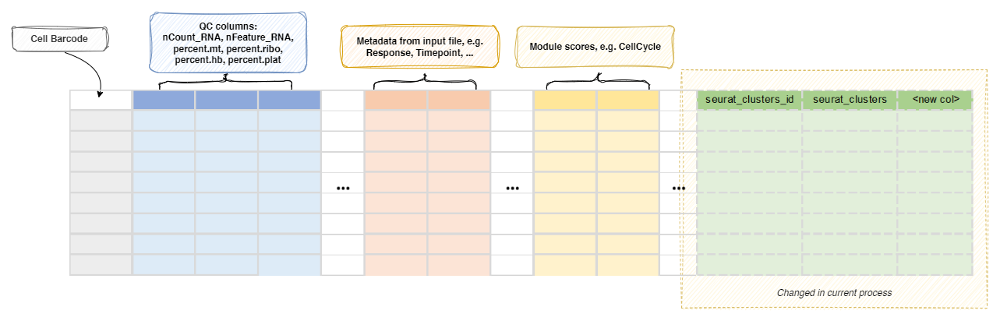

# CellTypeAnnotation

Annotate all or selected T/B cell clusters.

Annotate the cell clusters. Currently, the following ways are supported:<br />

1. Pass the cell type annotation directly (at cluster-level or cell-level)
2. Use [`ScType`](https://github.com/IanevskiAleksandr/sc-type) (cluster-level, marker-based)
3. Use [`scCATCH`](https://github.com/ZJUFanLab/scCATCH) (cluster-level, marker-based)
4. Use [`hitype`](https://github.com/pwwang/hitype) (cell-level or cluster-level, marker-based)
5. Use [`celltypist`](https://github.com/Teichlab/celltypist) (cell-level, model-based)
6. Use [`scSorter`](https://pmc.ncbi.nlm.nih.gov/articles/PMC7898451/) (cell-level, marker-based)
7. Use [`SCINA`](https://github.com/jcao89757/SCINA) (cell-level, marker-based)
8. Use [`SingleR`](https://github.com/dviraran/SingleR) (cluster-level, model-based)
9. Use [`scHDeepInsight`](https://github.com/shangruJia/scHDeepInsight) (cell-level, model-based)
10. Use [`LLMCelltype`](https://github.com/pwwang/LLMCelltype) (cluster-level, LLM-based, a fork of [`gptcelltype`](https://github.com/Winnie09/GPTCelltype))
11. Use [`cellassign`](https://github.com/Irrationone/cellassign) (cell-level, marker-based)
12. Use [`scBERT`](https://github.com/TencentAILabHealthcare/scBERT) (cell-level, model-based)
13. Use [`CelliD`](https://github.com/RausellLab/CelliD) (cell-level, marker-based)
14. Use [`scAgentType`](https://github.com/sathyasjali/scAgentType) (cluster-level, LLM-based, agentic)
15. Use [`garnett`](https://cole-trapnell-lab.github.io/garnett/) (cell-level, model-based)
16. Use [`UCell`](https://github.com/carmonalab/UCell) (cell-level, marker-based scoring)
17. Use [`AUCell`](https://github.com/aertslab/AUCell) (cell-level, marker-based scoring)
18. Use [`GSVA`](https://bioconductor.org/packages/release/bioc/html/GSVA.html) (cell-level, marker-based scoring)
19. Use [`singscore`](https://bioconductor.org/packages/release/bioc/html/singscore.html) (cell-level, marker-based scoring)
20. Use [`scmap`](https://bioconductor.org/packages/release/bioc/html/scmap.html) (cell-level or cluster-level, reference-based)
21. Use [`CHETAH`](https://bioconductor.org/packages/release/bioc/html/CHETAH.html) (cell-level, reference-based)
22. Use [`scClassify`](https://bioconductor.org/packages/release/bioc/html/scClassify.html) (cell-level, reference-based)
23. Use [`scPred`](https://github.com/powellgenomicslab/scPred) (cell-level, reference-based)
24. Use [`Azimuth`](https://github.com/satijalab/azimuth) (cluster-level, reference-based)
25. Use [`SCSA`](https://github.com/bioinfo-ibms-pumc/SCSA) (cluster-level, marker-based, python)
26. Use [`MACA`](https://github.com/ImXman/MACA) (cell-level, marker-based, python, a modernized fork should be used, https://github.com/pwwang/MACA/tree/modernize)
27. Use [`scMapNet`](https://github.com/Yuz7/scMapNet) (cell-level, marker-based, python)
28. Use [`mLLMCelltype`](https://github.com/cafferychen777/mLLMCelltype) (cluster-level, LLM-based)
29. Use [`LICT`](https://github.com/Glowworm-cell/LICT) (cluster-level, LLM-based, a modernized fork should be used, https://github.com/pwwang/LICT/tree/modernize)
30. Use [`MapQuery`](https://satijalab.org/seurat/reference/mapquery) (cell-level, reference-based)

The `<workdir>` is typically `./.pipen` and the `<pipline_name>` is `Immunopipe`
by default.<br />

/// Note

If you have other annotation processes, including [`SeuratClustering`](./SeuratClustering.md)
process or [`SeuratMap2Ref`](./SeuratMap2Ref.md) process enabled in the same run,
you may want to specify a different name for the column to store the annotated cell types
using `envs.anno_col`, so that the results from different annotation processes won't overwrite each other.<br />

///

/// Attention

If you are running the pipeline with the Docker image, following tools are not available in the Docker image:<br />

- Direct assignment: `direct`, `cell`
- Marker-based: `ScType`, `hitype`, `scSorter`, `SCINA`, `CelliD`, `UCell`, `AUCell`, `GSVA`, `singscore`, `SCSA`, `MACA`
- Model-based: `celltypist`, `SingleR`
- LLM-based: `LLMCelltype`, `mLLMCelltype`, `LICT`
- Reference-based: `scmap`, `CHETAH`, `scClassify`, `MapQuery`

///

## Input

- `sobjfile`:
    The single-cell object in RDS/qs/qs2/h5ad format.<br />

## Output

- `outfile`: *Default: `{{in.sobjfile | stem}}.annotated.{{- ext0(in.sobjfile) if envs.outtype == 'input' else envs.outtype -}}`*. <br />
    The rds/qs/qs2/h5ad file of seurat object with cell type annotated.<br />
    A text file containing the mapping from the old identity to the new cell types
    will be generated and saved to `cluster2celltype.tsv` under the job output directory.<br />
    Another text file containing the per-cell annotations will be generated and saved
    to `cell2celltype.tsv` under the job output directory, with the cell barcodes in
    the first column (`Cell`) and one column per case that produces cell-level annotations.<br />
    Note that the identity of the output Seurat object will be set to the annotation
    column (`envs.anno_col`) when `envs.set_ident` is `True` (see `envs.set_ident`).<br />

## Environment Variables

- `tool` *(`choice`)*: *Default: `direct`*. <br />
    The tool to use for cell type annotation.<br />
    - `sctype` *(`cluster-level`)*:
        Use `scType` to annotate cell types.<br />
        See <https://github.com/IanevskiAleksandr/sc-type>
    - `hitype` *(`cell-level`)*:
        Use `hitype` to annotate cell types.<br />
        Runs at cell-level by default; set `envs.ident` for cluster-level
        annotations (hitype then scores each cluster as a whole and
        assigns it one cell type). See <https://github.com/pwwang/hitype>
    - `sccatch` *(`cluster-level`)*:
        Use `scCATCH` to annotate cell types.<br />
        See <https://github.com/ZJUFanLab/scCATCH>
    - `celltypist` *(`cell-level`)*:
        Use `celltypist` to annotate cell types.<br />
        It can also generate cluster-level annotations via its over-clustering
        mechanism (`envs.celltypist.over_clustering` or `envs.ident`).<br />
        See <https://github.com/Teichlab/celltypist>
    - `scsorter` *(`cluster-level`)*:
        Use `scSorter` to annotate cell types.<br />
        See <https://github.com/pwwang/scSorter>, an optimized version of
        <https://pmc.ncbi.nlm.nih.gov/articles/PMC7898451/>, which increases the
        speed of the original scSorter.<br />
    - `scina` *(`cell-level`)*:
        Use `SCINA` to annotate cell types.<br />
        See <https://github.com/jcao89757/SCINA>
    - `singler` *(`cluster-level`)*:
        Use `SingleR` to annotate cell types.<br />
        See <https://github.com/dviraran/SingleR>
    - `garnett` *(`cell-level`)*:
        Use `Garnett` to annotate cell types with a
        pre-trained classifier (trained from marker genes and expression data).<br />
        See <https://cole-trapnell-lab.github.io/garnett/>
    - `schdeepinsight` *(`cell-level`)*:
        Use `scHDeepInsight` to annotate cell types.<br />
        See <https://github.com/shangruJia/scHDeepInsight>
    - `llmcelltype` *(`cluster-level`)*:
        Use `LLMCelltype` to annotate cell types
        with LLMs. See <https://github.com/pwwang/LLMCelltype>
        It is the model provider agnostic version of
        [`gptcelltype`](https://github.com/Winnie09/GPTCelltype).<br />
    - `cellassign` *(`cell-level`)*:
        Use `cellassign` to annotate cell types
        with a probabilistic model.<br />
        See <https://github.com/Irrationone/cellassign>
    - `scbert` *(`cell-level`)*:
        Use `scBERT` to annotate cell types with a
        BERT-based transformer model.<br />
        See <https://github.com/TencentAILabHealthcare/scBERT>
    - `cellid` *(`cell-level`)*:
        Use `CelliD` to annotate cell types with MCA-based
        per-cell gene signature enrichment.<br />
        See <https://github.com/RausellLab/CelliD>
    - `scagenttype` *(`cluster-level`)*:
        Use `scAgentType` to annotate cell types
        with an agentic LLM workflow.<br />
        See <https://github.com/sathyasjali/scAgentType>
    - `ucell` *(`cell-level`)*:
        Use `UCell` to annotate cell types by scoring the
        marker table with equal weights.<br />
        See <https://github.com/carmonalab/UCell>
    - `aucell` *(`cell-level`)*:
        Use `AUCell` to annotate cell types by scoring the
        marker table with equal weights.<br />
        See <https://github.com/aertslab/AUCell>
    - `gsva` *(`cell-level`)*:
        Use `GSVA` to annotate cell types by scoring the
        marker table with equal weights.<br />
        See <https://bioconductor.org/packages/release/bioc/html/GSVA.html>
    - `singscore` *(`cell-level`)*:
        Use `singscore` to annotate cell types by scoring
        the marker table with equal weights.<br />
        See <https://bioconductor.org/packages/release/bioc/html/singscore.html>
    - `scmap` *(`cell-level`)*:
        Use `scmap` to transfer the cell types of a
        reference object.<br />
        See <https://bioconductor.org/packages/release/bioc/html/scmap.html>
    - `cheetah` *(`cell-level`)*:
        Use `CHETAH` to transfer the cell types of a
        reference object.<br />
        See <https://bioconductor.org/packages/release/bioc/html/CHETAH.html>
    - `scclassify` *(`cell-level`)*:
        Use `scClassify` to transfer the cell types of
        a reference object.<br />
        See <https://bioconductor.org/packages/release/bioc/html/scClassify.html>
    - `scpred` *(`cell-level`)*:
        Use `scPred` to transfer the cell types of a
        reference object.<br />
        See <https://github.com/powellgenomicslab/scPred>
    - `azimuth` *(`cell-level`)*:
        Use `Azimuth` to transfer the annotation levels of
        a published reference.<br />
        See <https://github.com/satijalab/azimuth>
    - `scsa` *(`cluster-level`)*:
        Use `SCSA` to annotate cell types.<br />
        See <https://github.com/bioinfo-ibms-pumc/SCSA>
    - `maca` *(`cell-level`)*:
        Use `MACA` to annotate cell types.<br />
        See <https://github.com/ImXman/MACA>
    - `scmapnet` *(`cell-level`)*:
        Use `scMapNet` to annotate cell types.<br />
        See <https://github.com/Yuz7/scMapNet>
    - `mllmcelltype` *(`cluster-level`)*:
        Use `mLLMCelltype` to annotate cell types
        with LLMs. See <https://github.com/cafferychen777/mLLMCelltype>
    - `lict` *(`cluster-level`)*:
        Use `LICT` to annotate cell types with LLMs.<br />
        See <https://github.com/Glowworm-cell/LICT>
    - `mapquery` *(`cell-level`)*:
        Use `Seurat::MapQuery()` to transfer the cell
        types of a reference object.<br />
        See <https://satijalab.org/seurat/reference/mapquery>
    - `direct` *(`cluster-level`)*:
        Directly assign cell types
    - `cell` *(`cell-level`)*:
        Directly assign cell types, but at cell-level instead of cluster-level.<br />
- `assay`:
    The assay to use for the analysis. If not specified, the default assay will be used.<br />
    Will not be inherited by the cases under `envs.cases`.<br />
    To use a different assay for a case, specify it in the case args.<br />
    This will be also used to convert Seurat object to h5ad if the input is Seurat object
    and the output is h5ad.<br />
- `layer`:
    The layer in the assay to use for the analysis. If not specified, the default layer will be used.<br />
- `ident`:
    The column name in metadata to use as the clusters.<br />
    For cluster-level tools, this is required, and if not specified,
    the identity column will be used when input is rds/qs/qs2 (supposing we have a Seurat object).<br />
    If input data is h5ad, this is required to run cluster-based annotation tools.<br />
    For cell-level tools, if specified, a cluster-level annotation will also be generated
    by majority vote of the cells in each cluster, and saved to `cluster2celltype.tsv`.<br />
    For `hitype`, this switches to cluster-level scoring (cell-level is the default
    when it is not set).<br />
    For `celltypist`, this is a shortcut to set `over_clustering` in `envs.celltypist`
    (see `envs.celltypist.over_clustering`).<br />
    `"ident"` can be used as an alias for the identity column.<br />
    To set it for a specific case, use `envs.cases.X.ident`.<br />
- `anno_col` *(`type=str`)*: *Default: `CellType`*. <br />
    The name of the column to store the annotated cell types (default: `CellType`).<br />
    For cluster-level tools (or cell-level tools with `envs.ident`), the annotation
    column stores the cluster-level cell types.<br />
    For cell-level tools, the per-cell annotations are also saved to a tool-specific
    column (e.g. `scina_celltype`), and if `envs.ident` is specified, `anno_col` stores
    the majority-vote results of the clusters.<br />
    For the default case (`DEFAULT`), the column is named as `anno_col`; for other cases,
    the case name is prefixed to the column name unless `envs.add_prefix` is `False`.<br />
- `set_ident` *(`flag`)*: *Default: `True`*. <br />
    Whether to set the identity of the output Seurat object to the annotation column.<br />
    If all cases have `set_ident` set to `False`, the original identity is kept.<br />
    If multiple cases have `set_ident` set to `True`, a warning is given and the last case wins.<br />
    Can be set per case via `envs.cases.X.set_ident` (default: True).<br />
- `sctype` *(`ns`)*:
    The arguments for `sctype` if `tool` is `sctype`.<br />
    - `tissue`:
        The tissue to use for `sctype`.<br />
        Available tissues should be the first column (`tissueType`) of `db`.<br />
        If not specified, all rows in `db` will be used.<br />
    - `cancer`:
        Filter the markers by the `cancer` column of a universal
        marker table (see the note above). Only works with a universal
        marker table that has a `cancer` column.<br />
    - `species`:
        Filter the markers by the `species` column of a universal
        marker table (see the note above). Only works with a universal
        marker table that has a `species` column.<br />
    - `db`: *Default: `""`*. <br />
        The database to use for sctype.<br />
        Check examples at <https://github.com/IanevskiAleksandr/sc-type/blob/master/ScTypeDB_full.xlsx>
        Can also be a universal marker table (see the note above).<br />
- `hitype` *(`ns`)*:
    The arguments for `hitype` if `tool` is `hitype`.<br />
    - `tissue`:
        The tissue to use for `hitype`.<br />
        Available tissues should be the first column (`tissueType`) of `db`.<br />
        If not specified, all rows in `db` will be used.<br />
    - `cancer`:
        Filter the markers by the `cancer` column of a universal
        marker table (see the note above). Only works with a universal
        marker table that has a `cancer` column.<br />
    - `species`:
        Filter the markers by the `species` column of a universal
        marker table (see the note above). Only works with a universal
        marker table that has a `species` column.<br />
    - `db`:
        The database to use for hitype.<br />
        Compatible with `sctype.db`.<br />
        See also <https://pwwang.github.io/hitype/articles/prepare-gene-sets.html>
        You can also use built-in databases, including `hitypedb_short`, `hitypedb_full`, and `hitypedb_pbmc3k`.<br />
        Can also be a universal marker table (see the note above).<br />
        When the table has a `weight` column (e.g. trained by
        `HitypeWeightTrainer`), the weights are used as-is for
        scoring (hitype >= 0.0.6).<br />
    - `norm`: *Default: `sqrt`*. <br />
        The normalization method for `hitype::hitype_score()`.<br />
        One of "sqrt", "weight", "none" (default: "sqrt").<br />
        "weight" is recommended when scoring with learned weights.<br />
    - `use_sensitivity`: *Default: `True`*. <br />
        Whether to weight markers by their
        sensitivity (default: `True`). `False` is recommended when
        scoring with learned weights.<br />
    - `threshold`: *Default: `0.0`*. <br />
        The assignment threshold passed to `RunHitype`
        (default: `0.0`).<br />
- `scsorter` *(`ns`)*:
    The arguments for `scSorter::RunScSorter()` if `tool` is `scsorter`.<br />
    - `db`:
        The database to use for scSorter. It will be loaded and passed to the `anno`
        argument of `RunScSorter()`. It could be either:<br />
        * A TSV file with cell type annotations, with columns `Type`, `Marker`, and `Weight`.<br />
        * A RDS/qs2 file of the annotation data frame with the same columns as above.<br />
        Can also be a universal marker table (see the note above).<br />
        You can also use `#` followed by the column names (aliases allowed)
        or 1-based indices to specify the columns, for example,
        `file:///path/to/scsorter_db.tsv#celltype,marker,weight`.<br />
        A third column is used as `Weight` only if it is named `weight` (or an alias of it).<br />
    - `assay`:
        The assay to use for `RunScSorter()`.<br />
        If not specified, `envs.assay` will be used.<br />
    - `tissue`:
        Filter the markers by the `tissue` column of a universal
        marker table (see the note above). Only works with a universal
        marker table that has a `tissue` column.<br />
    - `cancer`:
        Filter the markers by the `cancer` column of a universal
        marker table (see the note above). Only works with a universal
        marker table that has a `cancer` column.<br />
    - `species`:
        Filter the markers by the `species` column of a universal
        marker table (see the note above). Only works with a universal
        marker table that has a `species` column.<br />
    - `<more>`:
        Other arguments for [`scSorter::RunScSorter()`](https://github.com/pwwang/scSorter/blob/9baae9f0e0904ddbf3f9bb5dacb9227503a8ce3e/R/scSorter.R#L73).<br />
- `scina` *(`ns`)*:
    The arguments for `SCINA::SCINA()` if `tool` is `scina`.<br />
    - `db` *(`type=str`)*:
        The path to the SCINA signature file.<br />
        It can be an RDS file containing a named list of
        signature genes (the names are the cell types and the
        values are the marker gene symbols), or a CSV file
        with the markers for each cell type in a column.<br />
        Can also be a universal marker table (see the note above).<br />
    - `tissue`:
        Filter the markers by the `tissue` column of a universal
        marker table (see the note above). Only works with a universal
        marker table that has a `tissue` column.<br />
    - `cancer`:
        Filter the markers by the `cancer` column of a universal
        marker table (see the note above). Only works with a universal
        marker table that has a `cancer` column.<br />
    - `species`:
        Filter the markers by the `species` column of a universal
        marker table (see the note above). Only works with a universal
        marker table that has a `species` column.<br />
    - `max_iter` *(`type=int`)*:
        Maximum number of EM iterations (default: 100).<br />
    - `convergence_n` *(`type=int`)*:
        Stop if assignment stays stable for N consecutive rounds (default: 10).<br />
    - `convergence_rate` *(`type=float`)*:
        Fraction of cells with stable assignment for convergence (default: 0.99).<br />
    - `sensitivity_cutoff` *(`type=float`)*:
        Cutoff (0-1) for removing signatures of absent cell types (default: 1).<br />
    - `rm_overlap` *(`flag`)*:
        Whether to remove genes shared between multiple signatures (default: TRUE).<br />
    - `allow_unknown` *(`flag`)*:
        Whether to allow unknown cells (default: TRUE).<br />
    - `<more>`:
        Other arguments for [`SCINA::SCINA()`](https://rdrr.io/cran/SCINA/man/SCINA.html).<br />
- `singler` *(`ns`)*:
    The arguments for `SingleR::SingleR()` if `tool` is `singler`.<br />
    Both the [Bioconductor](https://bioconductor.org/packages/SingleR)
    and [CRAN](https://github.com/dviraran/SingleR) versions are
    auto-detected.<br />
    - `db` *(`type=str`)*:
        The path to the SingleR reference file.<br />
        It can be an RDS, qs, or qs2 file containing a reference object,
        supporting:<br />
        * `SummarizedExperiment` (e.g., from the `celldex` package).<br />
        References can be obtained via `celldex::HumanPrimaryCellAtlasData()`,
        `celldex::BlueprintEncodeData()`, `celldex::MonacoImmuneData()`,
        `celldex::DatabaseImmuneCellExpressionData()`,
        `celldex::NovershternHematopoieticData()`, `celldex::ImmGenData()`,
        `celldex::MouseRNAseqData()`.<br />
        * `Seurat` object. Labels are auto-detected from metadata.<br />
        Save with `saveRDS()` or `biopipen.utils::write_obj()`.<br />
        Both the Bioconductor and CRAN versions of SingleR are supported
        and auto-detected at runtime.<br />
    - `label` *(`type=str`)*:
        The metadata/colData column name for
        reference labels. Auto-detected from `label.main`,
        `label.fine`, `label.ont`, `label` in order.<br />
    - `<more>`:
        See the SingleR documentation for your version:<br />
        [`Bioconductor`](https://rdrr.io/bioc/SingleR/man/SingleR.html)
        or [`CRAN`](https://github.com/dviraran/SingleR).<br />
- `garnett` *(`ns`)*:
    The arguments for `garnett::classify_cells()`
    if `tool` is `garnett`. The process takes a **trained** classifier
    and predicts the cell types for each cell — no training step is
    performed. A classifier can be trained with the
    `GarnettClassifierTrainer` process from a Seurat object and marker
    genes, or you can use a pre-trained one from
    <https://cole-trapnell-lab.github.io/garnett/classifiers/>.<br />
    The Seurat object is converted to a monocle3 `cell_data_set` for
    classification, and cells that cannot be confidently classified
    are labeled `Unknown`.<br />
    - `classifier` *(`type=str`)*:
        The path to the trained classifier
        file (an RDS file containing a `garnett_classifier` object,
        saved by `garnett::save_classifier()`).<br />
    - `db` *(`type=str`)*: *Default: `none`*. <br />
        The name of the installed annotation package
        used to convert the gene IDs of the expression data to the
        gene IDs the classifier was trained on (default: `none`, i.e.<br />
        no conversion). The official pre-trained classifiers are
        trained on ENSEMBL gene IDs, so for expression data with gene
        symbols you need e.g. `db: org.Hs.eg.db` together with
        `cds_gene_id_type: SYMBOL`.<br />
    - `cds_gene_id_type` *(`choice`)*: *Default: `custom`*. <br />
        The gene ID type of the expression
        data, used when `db` is not `none` (default: `custom`).<br />
        Supported types include `custom`, `SYMBOL`, `ENSEMBL`, `ENTREZID`.<br />
    - `assay` *(`type=str`)*:
        The assay to use for classification.<br />
        If not specified, `envs.assay` will be used.<br />
        The assay must contain raw counts.<br />
    - `cluster_extend` *(`flag`)*: *Default: `False`*. <br />
        Use Garnett's own cluster mode: the
        clusters are passed as the `garnett_cluster` column of the
        `cell_data_set`, and `classify_cells()` extends the labels over
        each cluster (`cluster_ext_type`) instead of the engine
        aggregating the per-cell labels by majority vote
        (default: FALSE).<br />
    - `<more>`:
        Other arguments for
        [`garnett::classify_cells()`](https://github.com/cole-trapnell-lab/garnett/blob/monocle3/R/classify.R),
        e.g. `rank_prob_ratio`,
        `cluster_extend_max_frac_unknown`, `cluster_extend_max_frac_incorrect`,
        `return_type_levels`, and `verbose`.<br />
- `schdeepinsight` *(`ns`)*:
    The arguments for scHDeepInsight
    if `tool` is `schdeepinsight`. Gated by default: the
    `SCHdeepinsight` package (0.3.5) is not installed, and the tool
    additionally needs a reference file and a pretrained checkpoint.<br />
    To un-gate it, run `pip install SCHdeepinsight` (plus
    `pip install git+https://github.com/alok-ai-lab/pyDeepInsight.git`)
    in `python` and download the checkpoint from
    <https://github.com/shangruJia/scHDeepInsight>.<br />
    - `ref` *(`type=str`)*:
        The path to the scHDeepInsight
        reference RDS file. The bundled `reference.rds` from the
        scHDeepInsight repo provides immune cell reference.<br />
        See <https://github.com/shangruJia/scHDeepInsight>.<br />
    - `batch_size` *(`type=int`)*:
        Batch size for CNN prediction
        (default: 128).<br />
    - `python` *(`type=str`)*:
        Path to Python executable with
        `SCHdeepinsight` installed.<br />
    - `assay` *(`type=str`)*:
        Assay to use for h5ad conversion.<br />
- `llmcelltype` *(`ns`)*:
    The arguments for
    `LLMCelltype::llmcelltype()` if `tool` is `llmcelltype`.<br />
    - `api_key` *(`type=str`)*:
        OpenAI API key
    - `model` *(`type=str`)*:
        GPT model (required, e.g.<br />
        'gpt-4', 'gpt-4o').<br />
    - `base_url` *(`type=str`)*:
        Custom base URL for
        OpenAI-compatible providers.<br />
    - `tissuename` *(`type=str`)*:
        Tissue name for context.<br />
    - `sigmarkers` *(`type=str`)*: *Default: `p_val_adj < 0.05`*. <br />
        A expression to filter the result from `RunSeuratDEAnalysis()`, e.g. `avg_log2FC > 0.25 & p_val_adj < 0.05`,
        to be used for generating the marker gene list for LLM.<br />
    - `assay` *(`type=str`)*:
        Assay to use for
        `FindAllMarkers()`.<br />
    - `<more>`:
        Additional args passed to
        [`biopipen.utils::RunSeuratDEAnalysis()`](https://pwwang.github.io/biopipen.utils.R/reference/RunSeuratDEAnalysis.html).<br />
    - `cache`: *Default: `/tmp`*. <br />
- `cellassign` *(`ns`)*:
    The arguments for
    `cellassign::cellassign()` if `tool` is `cellassign`.<br />
    - `db` *(`type=str`)*:
        The path to the marker gene info
        file for `cellassign`. Supports:<br />
        * RDS/qs2 file: a binary gene×celltype matrix or a
        named list (cell type → vector of marker genes)
        * CSV/TSV file: with columns `gene` and `cell_type`
        Can also be a universal marker table (see the note above).<br />
    - `tissue`:
        Filter the markers by the `tissue` column of a universal
        marker table (see the note above). Only works with a universal
        marker table that has a `tissue` column.<br />
    - `cancer`:
        Filter the markers by the `cancer` column of a universal
        marker table (see the note above). Only works with a universal
        marker table that has a `cancer` column.<br />
    - `species`:
        Filter the markers by the `species` column of a universal
        marker table (see the note above). Only works with a universal
        marker table that has a `species` column.<br />
    - `python` *(`type=str`)*: *Default: `python`*. <br />
        Path to Python with `tensorflow` installed.<br />
    - `assay` *(`type=str`)*:
        Assay to extract raw counts from.<br />
    - `min_delta` *(`type=int`)*:
        Min log-fold change for marker
        overexpression (default: 2).<br />
    - `B` *(`type=int`)*:
        Number of RBF dispersion bases
        (default: 10).<br />
    - `shrinkage` *(`flag`)*:
        Hierarchical shrinkage on delta
        (default: TRUE).<br />
    - `n_batches` *(`type=int`)*:
        Data subsample batches
        (default: 1).<br />
    - `learning_rate` *(`type=float`)*:
        ADAM learning rate
        (default: 0.1).<br />
    - `max_iter_em` *(`type=int`)*:
        Max EM iterations
        (default: 20).<br />
    - `verbose` *(`flag`)*:
        Print progress (default: TRUE).<br />
    - `<more>`:
        Additional args to
        `cellassign::cellassign()`.<br />
- `scbert` *(`ns`)*:
    The arguments for scBERT inference
    if `tool` is `scbert`.<br />
    - `ref` *(`type=str`)*:
        The path to the scBERT repo
        directory (containing `performer_pytorch/`).<br />
    - `model` *(`type=str`)*:
        The path to the fine-tuned
        model checkpoint (.pth file).<br />
    - `label_dict` *(`type=str`)*:
        The path to the label
        dictionary pickle file (maps class indices to cell
        type names).<br />
    - `python` *(`type=str`)*:
        Path to Python with scBERT
        dependencies (torch, scanpy, etc.).<br />
    - `bin_num` *(`type=int`)*:
        Number of bins for
        expression embedding (default: 5).<br />
    - `gene_num` *(`type=int`)*:
        Number of genes expected
        by the model (default: 16906).<br />
    - `seed` *(`type=int`)*:
        Random seed (default: 2021).<br />
    - `pos_embed` *(`flag`)*:
        Use Gene2vec positional
        encoding (default: TRUE).<br />
    - `novel_type` *(`flag`)*:
        Enable novel cell type
        detection (default: FALSE).<br />
    - `unassign_thres` *(`type=float`)*:
        Confidence
        threshold for unassigned cells (default: 0.5).<br />
    - `<more>`:
        Additional args to the wrapper script.<br />
- `cellid` *(`ns`)*:
    The arguments for CelliD
    if `tool` is `cellid`.<br />
    - `db` *(`type=str`)*:
        The path to the marker gene set
        file for `cellid`. Supports:<br />
        * RDS/qs2 file: a named list (cell type → vector
        of marker genes)
        * CSV/TSV file: with columns `gene` and `cell_type`
        Can also be a universal marker table (see the note above).<br />
    - `tissue`:
        Filter the markers by the `tissue` column of a universal
        marker table (see the note above). Only works with a universal
        marker table that has a `tissue` column.<br />
    - `cancer`:
        Filter the markers by the `cancer` column of a universal
        marker table (see the note above). Only works with a universal
        marker table that has a `cancer` column.<br />
    - `species`:
        Filter the markers by the `species` column of a universal
        marker table (see the note above). Only works with a universal
        marker table that has a `species` column.<br />
    - `nmcs` *(`type=int`)*:
        Number of MCA components
        (default: 50).<br />
    - `n_features` *(`type=int`)*:
        Top n features per
        cell for hypergeometric test (default: 200).<br />
    - `dims` *(`type=auto`)*:
        MCA dimensions to use
        (default: seq(nmcs)).<br />
    - `min_size` *(`type=int`)*:
        Min overlapping genes
        (default: 10).<br />
    - `log_trans` *(`flag`)*:
        -log10 transform p-values
        (default: TRUE).<br />
    - `p_adjust` *(`flag`)*:
        Benjamini-Hochberg correction
        (default: TRUE).<br />
    - `group_gsea` *(`flag`)*: *Default: `False`*. <br />
        Use CelliD's own cluster mode
        (`CelliD::RunGroupGSEA()`): the clusters are annotated from the
        gene-set enrichment scores of the whole group (the best-scoring
        pathway by NES) instead of the engine aggregating the per-cell
        hypergeometric test by majority vote (default: FALSE).<br />
- `cell_types` *(`type=auto`)*: *Default: `[]`*. <br />
    The cell types to use for direct or cell-level annotation.<br />
    For `direct`, the cell types will be assigned to the clusters in the order of the original identities.<br />
    If given as a list (array), you can use `"-"` or `""` as the placeholder for the clusters that
    you want to keep the original cell types. If the length of `cell_types` is shorter than the number of
    clusters, the remaining clusters will be kept as the original cell types.<br />
    You can also use `NA` to remove the clusters from downstream analysis
    (the cells in these clusters will be removed from the Seurat object).<br />
    If given as a dict (map), the keys are the original cluster names and the values are the new cell types.<br />
    For `cell`, it must be a TSV file with cell-level annotations.<br />
    You can specify the column names after the `#`. For example,
    `file:///path/to/cell_types.tsv#cell_id,cell_type` will use `cell_id` as the cell id column
    to match the cell ids in the Seurat object, and `cell_type` as the cell type column to assign the cell types.<br />
    Multiple cell type columns can be specified, and the first one will be used as the annotation column
    (the others will be added as additional annotation columns).<br />
    You can also use 1-based column index to specify the columns, for example, `file:///path/to/cell_types.tsv#1,3`
    will use the first column as the cell id column and the third column as the cell type column.<br />
    If cells in the Seurat object are not found in the cell type file, `NA`s will be assigned to those cells.<br />
    If no columns are specified, the first two columns will be used as the cell id and cell type columns.<br />
    Prefix `file://` is optional.<br />

    For `cell`, it must be a TSV file with cell-level annotations.<br />
    You can specify the column names after the `#`. For example,
    `file:///path/to/cell_types.tsv#cell_id,cell_type` will use `cell_id` as the cell id column
    to match the cell ids in the Seurat object, and `cell_type` as the cell type column to assign the cell types.<br />
    Multiple cell type columns can be specified, and the first one will be used as the new identity column.<br />
    You can also use 1-based column index to specify the columns, for example, `file:///path/to/cell_types.tsv#1,3`
    will use the first column as the cell id column and the third column as the cell type column.<br />
    If cells in the Seurat object are not found in the cell type file, `NA`s will be assigned to those cells.<br />
    If not columns are specified, the first two columns will be used as the cell id and cell type columns.<br />
    Prefix `file://` is optional.<br />

- `more_cell_types` *(`type=json`)*:
    The additional cell type annotations to add to the metadata.<br />
    The keys are the new column names and the values are the cell types lists.<br />
    The cell type lists work the same as `cell_types` above.<br />
    This is useful when you want to keep multiple annotations of cell types.<br />

- `sccatch` *(`ns`)*:
    The arguments for `scCATCH::findmarkergene()` if `tool` is `sccatch`.<br />
    - `species`:
        The specie of cells.<br />
        When `marker` is a custom (universal) marker table, only the rows
        matching the value are kept; otherwise it is used to filter the
        built-in scCATCH database.<br />
    - `cancer`:
        If the sample is from cancer tissue, then the cancer type may be defined.<br />
        Defaults to "Normal" if not `if_use_custom_marker`.<br />
        When `marker` is a custom (universal) marker table, only the rows
        matching the value are kept; otherwise it is used to filter the
        built-in scCATCH database.<br />
    - `tissue`:
        Tissue origin of cells must be defined.<br />
        When `marker` is a custom (universal) marker table, only the rows
        matching the value are kept; otherwise it is used to filter the
        built-in scCATCH database.<br />
    - `marker`:
        The marker genes for cell type identification.<br />
        Can also be a universal marker table (see the note above).<br />
        An error is raised if `species`, `cancer`, or `tissue` is set but
        the table has no such column or no rows match.<br />
    - `if_use_custom_marker` *(`flag`)*: *Default: `False`*. <br />
        Whether to use custom marker genes.<br />
        When `marker` is provided, this is set to `True` automatically, and
        `species`, `cancer`, and `tissue` filter the custom markers if set.<br />
    - `<more>`:
        Other arguments for [`scCATCH::findmarkergene()`](https://rdrr.io/cran/scCATCH/man/findmarkergene.html).<br />
        You can pass an RDS file to `sccatch.marker` to work as custom marker. If so,
        `if_use_custom_marker` will be set to `TRUE` automatically.<br />
- `celltypist` *(`ns`)*:
    The arguments for `celltypist::celltypist()` if `tool` is `celltypist`.<br />
    - `model`:
        The path to model file.<br />
    - `python`: *Default: `python`*. <br />
        The python path where celltypist is installed.<br />
    - `majority_voting`: *Default: `True`*. <br />
        When true, it refines cell identities within local subclusters after an over-clustering approach
        at the cost of increased runtime.<br />
    - `over_clustering` *(`type=auto`)*:
        The column name in metadata to use as clusters for majority voting.<br />
        Set to `False` to disable over-clustering.<br />
        When `in.sobjfile` is rds/qs/qs2 (supposing we have a Seurat object), the default ident is used by default.<br />
        Otherwise, it is False by default.<br />
    - `assay`:
        When converting a Seurat object to AnnData, the assay to use.<br />
        If input is h5seurat, this defaults to RNA.<br />
        If input is Seurat object in RDS, this defaults to the default assay.<br />
- `scagenttype` *(`ns`)*:
    The arguments for the scAgentType annotation agent
    if `tool` is `scagenttype`. It annotates each cluster via an agentic
    LLM workflow (ReAct) and needs Python >=3.10 with the `scagenttype`
    package installed, e.g.<br />
    `pip install "scagenttype[llm] @ git+https://github.com/sathyasjali/scAgentType.git"`.<br />
    - `python`: *Default: `python`*. <br />
        The python path where `scagenttype` is installed.<br />
    - `api`: *Default: `openai`*. <br />
        The LLM provider: `openai`, `anthropic`, or `google` (default: `openai`).<br />
    - `api_key`:
        The API key for the provider.<br />
        When not set, the key is read from the environment variable of
        the provider (`OPENAI_API_KEY`, `ANTHROPIC_API_KEY`, or `GOOGLE_API_KEY`).<br />
    - `model`:
        The model to use. Defaults are chosen per provider when not set.<br />
    - `base_url`:
        Custom API base URL (e.g. for proxies).<br />
        Passed to the subprocess via `OPENAI_BASE_URL` or `ANTHROPIC_BASE_URL`.<br />
    - `tissue`:
        The tissue of the data, e.g. `Human peripheral blood`.<br />
        Folded into `tissue_context` when `tissue_context` is not set.<br />
    - `species`:
        The species of the data.<br />
        Folded into `tissue_context` when `tissue_context` is not set.<br />
    - `assay`:
        When converting a Seurat object to AnnData, the assay to use.<br />
    - `<more>`:
        Other arguments for [`AnnotationAgent()`](https://github.com/sathyasjali/scAgentType),
        e.g. `tissue_context`, `n_markers`, `max_react_steps`,
        `confidence_threshold`, `self_consistency_n`, `cache_dir`,
        `enable_cellxgene`.<br />
- `ucell` *(`ns`)*:
    The arguments for [`UCell::AddModuleScore_UCell()`](https://github.com/carmonalab/UCell)
    if `tool` is `ucell`. UCell scores the universal marker table with
    equal (unit) weights, and each cell gets the cell type of its highest
    score (see the marker-based note above).<br />
    - `db` *(`type=str`)*:
        The path to the marker table (required).<br />
        Must be a universal marker table (see the note above).<br />
    - `assay` *(`type=str`)*:
        The assay to score. If not specified,
        the default assay will be used.<br />
    - `maxRank` *(`type=int`)*: *Default: `1000`*. <br />
        The number of top-ranked genes used to score
        a signature (default: 1000).<br />
    - `w_neg` *(`type=float`)*: *Default: `1`*. <br />
        The weight of the negative markers
        (default: 1).<br />
    - `name` *(`type=str`)*: *Default: `_UCell`*. <br />
        The suffix of the score columns added to the
        metadata (default: `_UCell`).<br />
    - `tissue`:
        Filter the markers by the `tissue` column of the universal
        marker table (see the note above).<br />
    - `cancer`:
        Filter the markers by the `cancer` column of the universal
        marker table (see the note above).<br />
    - `species`:
        Filter the markers by the `species` column of the universal
        marker table (see the note above).<br />
- `aucell` *(`ns`)*:
    The arguments for [`AUCell::AUCell_calcAUC()`](https://github.com/aertslab/AUCell)
    if `tool` is `aucell`. The negative-direction markers of the marker
    table are dropped (a ranked list has no direction).<br />
    - `db` *(`type=str`)*:
        The path to the marker table (required).<br />
        Must be a universal marker table (see the note above).<br />
    - `assay` *(`type=str`)*:
        The assay to score. If not specified,
        the default assay will be used.<br />
    - `aucMaxRank` *(`type=int`)*:
        The number of top-ranked genes to
        calculate the AUC on (default: 5% of the genes).<br />
    - `normAUC` *(`flag`)*: *Default: `True`*. <br />
        Whether to normalize the AUC to the maximum
        possible AUC (default: TRUE).<br />
    - `tissue` *(`type=str`)*:
        Filter the marker table by tissue, e.g.<br />
        `Immune system`.<br />
    - `cancer` *(`type=str`)*:
        Filter the marker table by cancer, e.g.<br />
        `Breast cancer`.<br />
    - `species` *(`type=str`)*:
        Filter the marker table by species, e.g.<br />
        `Human`.<br />
- `gsva` *(`ns`)*:
    The arguments for [`GSVA::gsva()`](https://bioconductor.org/packages/release/bioc/html/GSVA.html)
    if `tool` is `gsva`. The negative-direction markers of the marker
    table are dropped (a gene set has no direction).<br />
    - `db` *(`type=str`)*:
        The path to the marker table (required).<br />
        Must be a universal marker table (see the note above).<br />
    - `assay` *(`type=str`)*:
        The assay to score. If not specified,
        the default assay will be used.<br />
    - `kcdf` *(`choice`)*: *Default: `Gaussian`*. <br />
        The kernel to use for the enrichment scores.<br />
        `Gaussian` (default), `Poisson`, or `none`.<br />
    - `minSize` *(`type=int`)*: *Default: `1`*. <br />
        The minimum number of genes in a gene set
        (default: 1).<br />
    - `maxSize` *(`type=int`)*:
        The maximum number of genes in a gene set
        (default: `Inf`, i.e. no limit).<br />
    - `tissue` *(`type=str`)*:
        Filter the marker table by tissue, e.g.<br />
        `Immune system`.<br />
    - `cancer` *(`type=str`)*:
        Filter the marker table by cancer, e.g.<br />
        `Breast cancer`.<br />
    - `species` *(`type=str`)*:
        Filter the marker table by species, e.g.<br />
        `Human`.<br />
- `singscore` *(`ns`)*:
    The arguments for [`singscore::simpleScore()`](https://bioconductor.org/packages/release/bioc/html/singscore.html)
    if `tool` is `singscore`. Unlike the other scorers, the direction of
    the markers is used as-is (`upSet`/`downSet`).<br />
    - `db` *(`type=str`)*:
        The path to the marker table (required).<br />
        Must be a universal marker table (see the note above).<br />
    - `assay` *(`type=str`)*:
        The assay to score. If not specified,
        the default assay will be used.<br />
    - `subSamples` *(`type=int`)*:
        The number of random subsets of the ranked
        genes to score. Cells left out are assigned `NA`.<br />
    - `centerScore` *(`flag`)*:
        Whether to center the scores to a [0, 1]
        range.<br />
    - `tissue` *(`type=str`)*:
        Filter the marker table by tissue, e.g.<br />
        `Immune system`.<br />
    - `cancer` *(`type=str`)*:
        Filter the marker table by cancer, e.g.<br />
        `Breast cancer`.<br />
    - `species` *(`type=str`)*:
        Filter the marker table by species, e.g.<br />
        `Human`.<br />
- `scmap` *(`ns`)*:
    The arguments for `scmap::scmapCluster()` (`scmap::scmapCell()`
    when `use_cell_index` is `True`) if `tool` is `scmap`. The reference
    is a `SingleCellExperiment` (or a Seurat object, converted on the fly)
    with a `logcounts` assay.<br />
    - `db` *(`type=str`)*:
        The path to the reference (required).<br />
    - `assay` *(`type=str`)*:
        The assay of the reference and of the object
        (default: `RNA`).<br />
    - `cluster_col` *(`type=str`)*: *Default: `cell_type1`*. <br />
        The column of the reference's `colData`
        holding the cell types (default: `cell_type1`).<br />
    - `features` *(`type=auto`)*:
        The features used for the scmap index.<br />
        Defaults to all the features of the reference.<br />
    - `threshold` *(`type=float`)*: *Default: `0.5`*. <br />
        The similarity threshold below which a
        cell is labeled `unassigned` (default: 0.5).<br />
    - `use_cell_index` *(`flag`)*: *Default: `False`*. <br />
        Use the scmap-cell (k-means) index instead
        of the scmap-cluster index (default: FALSE).<br />
- `cheetah` *(`ns`)*:
    The arguments for [`CHETAH::CHETAHclassifier()`](https://bioconductor.org/packages/release/bioc/html/CHETAH.html)
    if `tool` is `cheetah`. The reference is a `SingleCellExperiment`
    (or a Seurat object, converted on the fly) holding counts.<br />
    - `db` *(`type=str`)*:
        The path to the reference (required).<br />
    - `assay` *(`type=str`)*:
        The assay of the reference and of the object
        (default: `RNA`).<br />
    - `input_c` *(`type=str`)*:
        The name of the assay of the input to use.<br />
    - `thresh` *(`type=float`)*: *Default: `0.1`*. <br />
        The confidence threshold below which a cell
        is labeled `Unassigned` (default: 0.1).<br />
    - `n_genes` *(`type=int`)*:
        The number of genes used for the classification.<br />
    - `pc_thresh` *(`type=float`)*:
        The threshold for the principal components.<br />
    - `only_pos` *(`flag`)*: *Default: `False`*. <br />
        Whether to use only the positively correlated
        genes. Defaults to the CHETAH default.<br />
    - `ref_ct` *(`type=str`)*:
        The reference's cell-type column name
        (auto-detected when not given).<br />
    - `label` *(`type=str`)*:
        The label vector/column used when the reference
        carries several.<br />
- `scclassify` *(`ns`)*:
    The arguments for `scClassify::scClassify()` /
    `scClassify::predict_scClassify()` if `tool` is `scclassify`.<br />
    The reference is either a labelled matrix (a list with `exprsMat` and
    `cellTypes`), or a pre-trained model from
    `scClassify::train_scClassify()`.<br />
    - `db` *(`type=str`)*:
        The path to the reference (required).<br />
    - `assay` *(`type=str`)*:
        The assay to classify (default: `RNA`).<br />
    - `algorithm` *(`choice`)*:
        The algorithm to use. `WKNN` (default), `KNN`,
        or `DWKNN` (the `lr` of the scClassify docs is not supported by
        the installed scClassify).<br />
    - `topN` *(`type=int`)*: *Default: `50`*. <br />
        The number of features used by the model
        (default: 50).<br />
    - `prob_threshold` *(`type=float`)*:
        The probability threshold below which
        a cell is labeled `unassigned`.<br />
    - `parallel` *(`flag`)*:
        Whether to run scClassify in parallel.<br />
- `scpred` *(`ns`)*:
    The arguments for [`scPred::scPredict()`](https://github.com/powellgenomicslab/scPred)
    if `tool` is `scpred`. The reference is a labelled Seurat object, and
    the feature space is extracted and the model trained on it at runtime.<br />
    - `db` *(`type=str`)*:
        The path to the reference (required).<br />
    - `assay` *(`type=str`)*:
        The assay to predict.<br />
    - `pvar` *(`type=str`)*: *Default: `cell_type`*. <br />
        The metadata column of the reference holding the
        cell types (default: `cell_type`).<br />
    - `model` *(`type=str`)*: *Default: `svmRadial`*. <br />
        The model to train (default: `svmRadial`).<br />
    - `reduction` *(`type=str`)*: *Default: `pca`*. <br />
        The reduction used for the feature space
        (default: `pca`).<br />
    - `threshold` *(`type=float`)*: *Default: `0.55`*. <br />
        The prediction-probability threshold
        passed to `scPredict()` (default: 0.55).<br />
- `azimuth` *(`ns`)*:
    The arguments for [`Azimuth::RunAzimuth()`](https://github.com/satijalab/azimuth)
    if `tool` is `azimuth`. The reference's own annotation levels are
    transferred to the query, and each cluster gets the majority call of
    its cells.<br />
    - `ref` *(`type=str`)*:
        The reference name (looked up through `SeuratData`,
        e.g. `pbmcref`, downloaded when not installed) or the path to a
        directory holding `ref.Rds` + `idx.annoy` (required).<br />
    - `db` *(`type=str`)*:
        An alias of `ref`.<br />
    - `assay` *(`type=str`)*:
        The assay to transfer.<br />
    - `anno_col_in` *(`type=str`)*:
        The `predicted.*` column of the Azimuth
        result to use as the annotation. Defaults to
        `predicted.celltype.l1` when present, otherwise the first
        `predicted.*` column.<br />
    - `dims`:
        Ignored with a warning: the installed Azimuth reads the
        dimensionality off the reference's own annoy index.<br />
    - `k.anchor`:
        Ignored with a warning, see `dims`.<br />
- `scsa` *(`ns`)*:
    The arguments for [`SCSA`](https://github.com/bioinfo-ibms-pumc/SCSA)
    if `tool` is `scsa`. SCSA is not on CRAN/Bioconductor/PyPI and its
    `SCSA.py` does not run on current numpy/pandas, so the wrapper
    lives in `biopipen/scripts/scrna/scsa-wrapper.py` and ports its
    scoring; the marker table is all it needs (SCSA's own reference
    database is not used).<br />
    - `db` *(`type=str`)*:
        The path to the marker table (required).<br />
        Must be a universal marker table (see the note above).<br />
    - `foldchange` *(`type=float`)*: *Default: `2.0`*. <br />
        The minimum fold change of a marker for
        it to be used (default: 2.0, SCSA's own `-f`).<br />
    - `pvalue` *(`type=float`)*: *Default: `0.05`*. <br />
        The maximum adjusted p-value of a marker for
        it to be used (default: 0.05, SCSA's own `-p`). A cluster with
        no marker left is not annotated.<br />
    - `python` *(`type=str`)*: *Default: `python`*. <br />
        The python path with the SCSA dependencies
        (`pandas`, `numpy`, `scanpy`) installed
        (default: the same python as the pipeline).<br />
- `maca` *(`ns`)*:
    The arguments for [`MACA`](https://github.com/ImXman/MACA)
    if `tool` is `maca`. MACA pins `scanpy==1.6.0` and `anndata==0.7.5`,
    so it needs its own environment. The MACA script lives in
    `biopipen/scripts/scrna/maca-wrapper.py`.<br />
    - `db` *(`type=str`)*:
        The path to the marker table (required).<br />
        Must be a universal marker table (see the note above).<br />
    - `python` *(`type=str`)*: *Default: `python`*. <br />
        The python path with MACA installed
        (default: the same python as the pipeline).<br />
    - `n_pcs` *(`type=int`)*:
        The number of principal components.<br />
    - `res` *(`type=auto`)*:
        The Louvain resolutions, e.g. `[1, 2, 3]`
        (default: MACA's own `[1, 2, 3]`).<br />
    - `n_neis` *(`type=auto`)*:
        The numbers of neighbors, e.g. `[5, 10]`
        (default: MACA's own `[5, 10]`).<br />
    - `freq` *(`type=float`)*: *Default: `0.5`*. <br />
        The frequency threshold of the cluster mapping
        (default: 0.5).<br />
    - `use_weight` *(`flag`)*: *Default: `False`*. <br />
        Whether to weight the markers by their order in
        the marker table (default: FALSE).<br />
- `scmapnet` *(`ns`)*:
    The arguments for [`scMapNet`](https://github.com/Yuz7/scMapNet)
    if `tool` is `scmapnet`. scMapNet turns each cell into a treemap image
    and classifies it with a vision transformer. Its pipeline (treemap
    image generation + `main_finetune.py`) is driven by
    `biopipen/scripts/scrna/scmapnet-wrapper.py`.<br />
    The pre-trained weights are a manual download and are licensed
    CC BY-NC 4.0 (non-commercial).<br />
    - `db` *(`type=str`)*:
        The path to the marker table (required).<br />
        Must be a universal marker table (see the note above).<br />
    - `python` *(`type=str`)*: *Default: `python`*. <br />
        The python path with the scMapNet dependencies
        (`torch`, `timm`, `torchvision`) installed
        (default: the same python as the pipeline).<br />
    - `scmapnet_dir` *(`type=str`)*:
        The path to the cloned scMapNet repo
        (required), i.e. the directory holding `main_finetune.py` and
        `generate_image_script.sh`.<br />
    - `weights` *(`type=str`)*:
        The path to the checkpoint used for the
        prediction (required). The pre-trained weights are not part of
        the repo, see <https://github.com/Yuz7/scMapNet>. The checkpoint
        must be fine-tuned on the cell types of the marker table, and
        the cell types are indexed in their sorted order.<br />
    - `organ` *(`type=str`)*:
        The organ of the cells. scMapNet builds the
        treemap images from an organ → cell type → gene hierarchy, so
        this is the `organ` of every marker in the table.<br />
- `mllmcelltype` *(`ns`)*:
    The arguments for
    `mLLMCelltype::annotate_cell_types()` if `tool` is `mllmcelltype`.<br />
    One call is made per run, with the top markers of every cluster.<br />
    - `tissue` *(`type=str`)*:
        The tissue of the cells (required),
        e.g. `human PBMC`.<br />
    - `model` *(`type=str`)*: *Default: `gpt-5.5`*. <br />
        The LLM to use (default: `gpt-5.5`).<br />
        The model decides the provider, and so which API key is needed.<br />
    - `api_key` *(`type=str`)*:
        The API key of the provider. When not set, the
        key is read from the environment variable of the provider
        (`OPENAI_API_KEY` or `ANTHROPIC_API_KEY`); without one, only the
        prompt is built and an error is raised instead of annotating.<br />
    - `top_gene_count` *(`type=int`)*: *Default: `10`*. <br />
        The number of top markers per cluster
        put into the prompt (default: 10).<br />
    - `base_urls` *(`type=str`)*:
        The base URLs of the providers, for
        OpenAI-compatible endpoints. A single URL is the request URL
        mLLMCelltype posts to, so a host-only one (or a `.../v1`) is
        completed with the `/chat/completions` path; a named list of
        per-provider URLs is used as it is.<br />
    - `return_reasoning` *(`flag`)*: *Default: `False`*. <br />
        Whether to return the reasoning of the
        model along with the cell types (default: FALSE).<br />
- `lict` *(`ns`)*:
    The arguments for `LICT::LLMCellType()` if `tool` is `lict`.<br />
    LICT queries every provider at once and combines the answers; the
    providers without a key are skipped.<br />
    - `species` *(`type=str`)*: *Default: `Human`*. <br />
        The species of the cells (default: `Human`).<br />
    - `tissue` *(`type=str`)*:
        The tissue of the cells.<br />
    - `topgenenumber` *(`type=int`)*: *Default: `30`*. <br />
        The number of top markers per cluster
        put into the prompt (default: 30).<br />
    - `validate` *(`flag`)*: *Default: `True`*. <br />
        Whether to validate the markers
        (default: TRUE).<br />
    - `percent` *(`type=float`)*: *Default: `0.5`*. <br />
        The percentage of the markers to use
        (default: 0.5).<br />
    - `keys` *(`type=json`)*:
        The API keys of the providers, as a map from the
        environment variable name to its value, e.g.<br />
        `{ "openai_api_key": "<key>" }`. They are set in the R session
        (and inherited by the child processes) before the call.<br />
    - `provider` *(`type=str`)*:
        The provider whose answer to use. Defaults to
        the first provider that answered.<br />
- `mapquery` *(`ns`)*:
    The arguments for [`Seurat::MapQuery()`](https://satijalab.org/seurat/reference/mapquery)
    if `tool` is `mapquery`. The reference's cell types are transferred to
    the cells of the query; as for the other cell-level tools, each cluster
    also gets the majority call of its cells when `envs.ident` is set.<br />
    - `db` *(`type=str`)*:
        The reference Seurat object file (required).<br />
    - `use` *(`type=str`)*:
        The metadata column of the reference holding the
        cell types to transfer (required).<br />
    - `ident_name` *(`type=str`)*: *Default: `predicted.id`*. <br />
        The metadata column of the query that receives
        the transferred labels (kept distinct from `ident` so the clustering
        column is not overwritten) (default: `predicted.id`).<br />
    - `refnorm` *(`choice`)*: *Default: `auto`*. <br />
        The normalization method the reference used; the
        same method is used for the query (default: `auto`).<br />
        - `LogNormalize`:
            Normalize the query with `NormalizeData()`.<br />
        - `SCT`:
            Normalize the query with `SCTransform()`.<br />
        - `SCTransform`:
            An alias of `SCT`.<br />
        - `auto`:
            Automatically detect the normalization method.<br />
    - `skip_if_normalized` *(`flag`)*: *Default: `True`*. <br />
        Whether to skip the normalization if the
        query is already normalized (default: TRUE).<br />
    - `ncores` *(`type=int`)*: *Default: `1`*. <br />
        Number of cores to use for the mapping.<br />
    - `map_query` *(`ns`)*:
        The arguments for `Seurat::MapQuery()`.<br />
    - `find_transfer_anchors` *(`ns`)*:
        The arguments for `Seurat::FindTransferAnchors()`.<br />
    - `sctransform` *(`ns`)*:
        The arguments for `Seurat::SCTransform()`.<br />
    - `normalize_data` *(`ns`)*:
        The arguments for `Seurat::NormalizeData()`.<br />
- `merge` *(`flag`)*: *Default: `False`*. <br />
    Whether to merge the clusters with the same cell types.<br />
    Otherwise, a suffix will be added to the cell types (ie. `.1`, `.2`, etc).<br />
- `add_prefix` *(`flag`)*:
    Whether to add a prefix to the new column names in metadata.<br />
    Only used when in non-default cases. The prefix will be the case name followed by `_`.<br />
- `cases` *(`type=json`)*: *Default: `{}`*. <br />
    Run multiple cases of cell type annotation on the same Seurat object.<br />
    The keys are the prefix of column names added to the metadata (unless `add_prefix` is `False`),
    and the values will inherit the above options.<br />
    The default case is `DEFAULT`, meaning no prefix will be added to the column names.<br />
    The identity of the output Seurat object will be set according to `envs.set_ident` of each case
    (see `envs.set_ident`).<br />
    If any case requires h5ad conversion (e.g., `celltypist`), the object is pre-converted
    once and shared across those tools.<br />
- `ncores` *(`type=int`)*: *Default: `1`*. <br />
    Number of cores to use for parallel execution of multiple cases.<br />
    When > 1, cases are run in parallel via `mclapply`. This is not inherited by individual cases.<br />
- `outtype` *(`choice`)*: *Default: `input`*. <br />
    The output file type. Currently only works for `celltypist`.<br />
    An RDS file will be generated for other tools.<br />
    - `input`:
        Use the same file type as the input.<br />
    - `rds`:
        Use RDS file.<br />
    - `qs`:
        Use qs2 file.<br />
    - `qs2`:
        Use qs2 file.<br />
    - `h5ad`:
        Use AnnData file.<br />
- `sctype_db`:

## The tools can be divided into two categories


- Cluster-level tools: annotate the clusters, each cluster being assigned one cell type.<br />
  These include `sctype`, `sccatch`, `scsorter`, `singler`, `azimuth`, `llmcelltype`,
  `mllmcelltype`, `lict`, `scagenttype`, `scsa`, and `direct`.<br />
- Cell-level tools: annotate the cells, each cell being assigned one cell type.<br />
  These include `scina`, `hitype`, `cellassign`, `cellid`, `scbert`, `schdeepinsight`,
  `llmcelltype`, `cell`, `garnett`, `ucell`, `aucell`, `gsva`, `singscore`, `scmap`,
  `cheetah`, `scclassify`, `scpred`, `mapquery`, `maca`, and `scmapnet`.<br />
  For cell-level tools, a cluster-level annotation can also be generated by specifying
  `envs.ident` (or `envs.cases.X.ident` for a specific case), where each cluster is
  assigned the cell type by majority vote of the cells in the cluster.<br />
- `hitype` can run at either level: cell-level when `envs.ident` is not set,
  or cluster-level when `envs.ident` is set (hitype then scores each cluster
  as a whole and assigns its cell type directly, not by majority vote).<br />
- `celltypist` is a special cell-level tool, which can also generate cluster-level
  annotations via its over-clustering mechanism (`envs.celltypist.over_clustering`
  or `envs.ident`).<br />

`scsa` annotates the clusters like `sctype` and `sccatch`, but its wrapper maps
the cluster labels back onto the cells, so a per-cell column is produced as well
(the same shape as `azimuth`: a cluster-level mapping plus per-cell labels).<br />

## The tools can also be divided by their input types


- Marker-based tools: take marker genes for the cell types, including
  `sctype`, `hitype`, `sccatch`, `scsorter`, `scina`, `cellassign`, and `cellid`.<br />
  They all accept the universal marker format (see the note below).<br />
  The scorer family (`ucell`, `aucell`, `gsva`, and `singscore`) is also
  marker-based: it scores the *same* marker table for every cell with equal
  weights (no learned weights), and assigns each cell the cell type with the
  highest score, so a `weight` column in the marker table is ignored.<br />
- Model/reference-based tools: take a trained model or a reference object,
  including `celltypist`, `scbert`, `singler`, `schdeepinsight`, `garnett`,
  `scmap`, `cheetah`, `scclassify`, `scpred`, `azimuth`, and `mapquery`.<br />
  `mapquery` consumes a labeled reference and annotates the *cells* of the
  query; like the other cell-level tools, the cluster-level view comes from
  `envs.ident` (or `envs.cases.X.ident`), not from the tool itself.<br />
  A `garnett` classifier is trained from marker genes and expression data
  (it is model-based, not a plain marker-table input like the marker-based tools).<br />
- Direct-annotation tools: take the cell types directly via `envs.cell_types`,
  including `direct` and `cell`.<br />

`scsa`, `maca`, and `scmapnet` are python-based tools, driven through wrapper
scripts under `biopipen/scripts/scrna/` like the other python-based tools
(`celltypist`, `scbert`, `schdeepinsight`, `scagenttype`); their python
dependencies are not installed by biopipen, see the `envs.<tool>` below.<br />

The annotated cell types will be saved to a new column (`envs.anno_col`, default: `CellType`)
in the metadata, so that the downstream processes will use the annotated cell types
(the identity will be set to the annotation column unless `envs.set_ident` is `False`).<br />

/// Note

The original identity column (e.g. `seurat_clusters`) is never modified.<br />

For `tool` set to `direct`, if `envs.cell_types` is not specified or is an empty list,
the original cell types will be kept and nothing will be changed.<br />

///

If you are using a cluster-level tool (or a cell-level tool with `envs.ident`), a text file
containing the mapping from the original identity to the new cell types will be generated
and saved to `cluster2celltype.tsv` under the job output directory.<br />
The per-cell annotations from cell-level tools will be saved to `cell2celltype.tsv`
under the job output directory.<br />

/// Note

## The following envs are deprecated and will be removed in future versions

`sctype_tissue`, `sctype_db`, `hitype_tissue`, `hitype_db`, `scsorter_db`, `scsorter_args`,
`scina_db`, `scina_args`, `singler_db`, `singler_args`, `schdeepinsight_ref`,
`schdeepinsight_args`, `llmcelltype_args`, `cellassign_db`, `cellassign_args`,
`scbert_ref`, `scbert_model`, `scbert_label_dict`, `scbert_args`, `cellid_db`,
`cellid_args`, `sccatch_args`, `celltypist_args`, `newcol`, and `backup_col`.<br />
Use the corresponding `envs.<tool>` namespace instead (e.g. `envs.sctype_db` →
`envs.sctype.db`). The deprecated envs still work, with a warning, and take precedence
over the new-style envs when both are provided.<br />
`envs.newcol` is replaced by `envs.anno_col`, and `envs.backup_col` is no longer
needed (the original identity column is never modified).<br />

///

/// Note

### Universal marker format

The marker-based tools (`sctype`, `hitype`, `sccatch`, `scsorter`, `scina`,
`cellassign`, and `cellid`) accept a universal marker table in addition to
their native formats. The table can be a TSV, CSV, or an RDS/qs/qs2 file
containing a data.frame, in long format with one row per gene per cell type:<br />

- `cell_type` (required): the cell type.<br />
- `gene` (required): the marker gene.<br />
- `direction`: `positive`/`negative` (aliases: `pos`/`neg`/`+`/`-`).<br />
  For `sctype`/`hitype`, negative markers are used as down-regulated markers
  (`geneSymbolmore2`). For `scsorter`, negative markers become negative
  `Weight`s. For the other tools (`scina`, `cellassign`, `cellid`,
  `sccatch`), negative markers cannot be represented and are ignored
  (only positive markers are used).<br />
- `weight`: a numeric weight. Used by `scsorter` (as the `Weight`
  column) and, when present, by `hitype` (hitype >= 0.0.6), where the
  weights are used as-is in the scoring. Ignored by the other tools.<br />
- `species`, `cancer`, `tissue`: optional. When the matching env
  (`envs.<tool>.species`/`cancer`/`tissue`) is set, only the rows with the
  given value are kept (an error is raised if the table has no such column
  or no rows match). For `sctype`/`hitype`, `tissue` also becomes the
  `tissueType` column, and it can be used to filter a native ScType xlsx/TSV
  database as well (the other two columns only exist in universal tables).<br />
- `level`: an integer, only used by `sctype`/`hitype`.<br />

Column aliases are auto-detected: `celltype`/`cellType`/`Type` → `cell_type`,
`marker`/`Marker`/`gene_symbol` → `gene`, `sign` → `direction`, and
`tissueType` → `tissue`.<br />

You can specify the columns after `#` in the file path, for example,
`file:///path/to/markers.tsv#cell_type,gene,direction`, using column names
(aliases allowed) or 1-based indices. The `file://` prefix is optional.<br />

A file without `cell_type`/`gene` columns is treated as the tool's native
format (e.g. a ScType xlsx for `sctype`/`hitype`, a per-cell-type-column CSV
for `scina`, a named-list RDS for `scina`/`cellassign`/`cellid`, an RDS
data.frame for `sccatch`, etc.).<br />

///

## Examples

```toml
[CellTypeAnnotation.envs]
tool = "direct"
cell_types = ["CellType1", "CellType2", "-", "CellType4"]
```

The cell types will be assigned as:<br />

```
0 -> CellType1
1 -> CellType2
2 -> 2
3 -> CellType4
```

## Metadata

When `envs.tool` is `direct` and `envs.cell_types` is empty, the metadata of
the `Seurat` object will be kept as is.<br />



## Description

Annotates the cells or the clusters with the annotation backend chosen
with `envs.tool`. `Seurat` holds the object; the annotation itself is
done by the selected backend, such as `celltypist`, `SingleR` or
`hitype`.<br />

## Base class

`biopipen.ns.scrna.CellTypeAnnotation`

## Deviations

`tool` is overridden: the base defaults to `hitype`, immunopipe sets it
to `direct`, which assigns cell types without running any annotation
tool. `sctype_db` (default `None`) is added; the base only offers the
nested `envs.sctype.db`. immunopipe also overrides `input_data`
(`lambda ch1: ch1.iloc[:, [0]]`) so that the `Seurat` object is taken
from the first input channel.<br />

