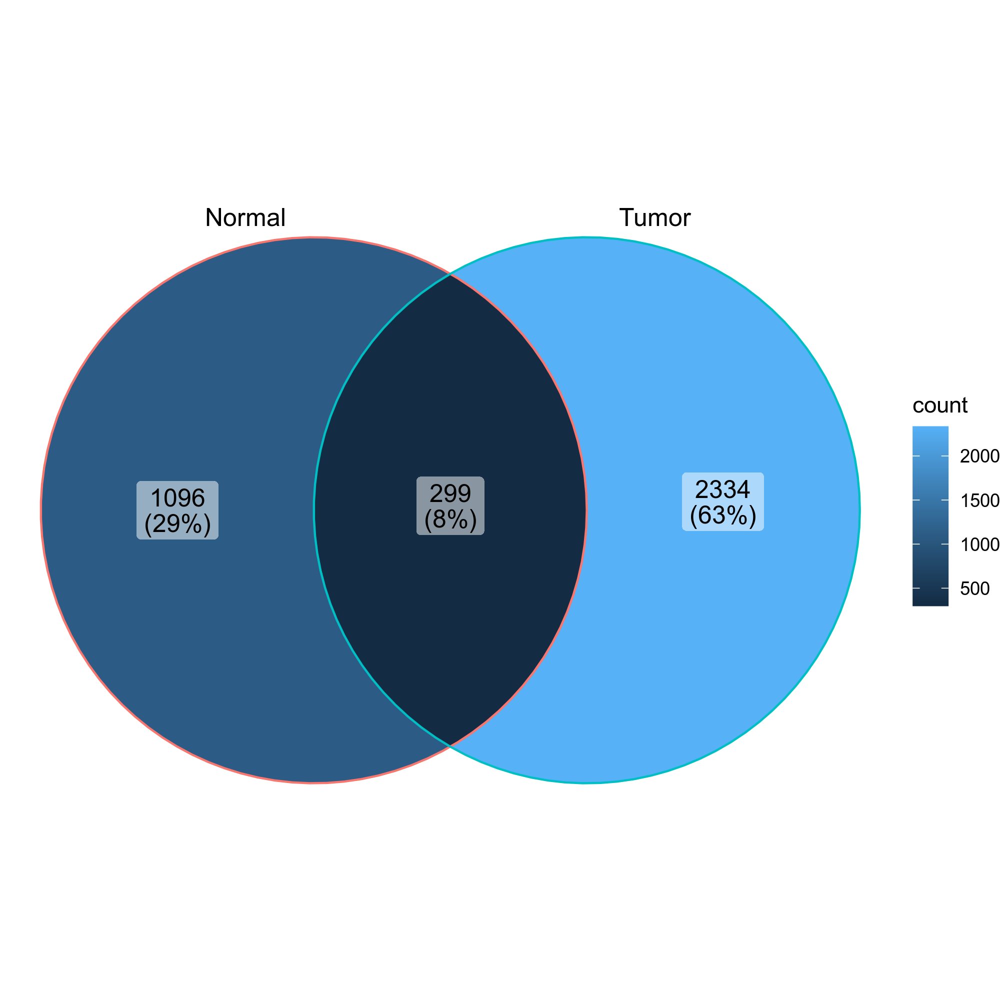

# CloneResidency

This process is used to investigate the residency of clones in groups, typically two samples (e.g. tumor and normal) from the same patient. But it can be used for any two groups of clones.

There are three types of output from this process:

- Count tables of the clones in the two groups

    | CDR3_aa          | Tumor | Normal |
    |------------------|-------|--------|
    | CASSYGLSWGSYEQYF | 306   | 55     |
    | CASSVTGAETQYF    | 295   | 37     |
    | CASSVPSAHYNEQFF  | 197   | 9      |
    | ...              | ...   | ...    |

- Residency plots showing the residency of clones in the two groups

    

    The points in the plot are jittered to avoid overplotting. The x-axis is the residency in the first group and the y-axis is the residency in the second group. The size of the points are relative to the normalized size of the clones. You may identify different types of clones in the plot based on their residency in the two groups:

    - Collapsed (The clones that are collapsed in the second group)
    - Dual (The clones that are present in both groups with equal size)
    - Expanded (The clones that are expanded in the second group)
    - First Group Multiplet (The clones only in the First Group with size > 1)
    - Second Group Multiplet (The clones only in the Second Group with size > 1)
    - First Group Singlet (The clones only in the First Group with size = 1)
    - Second Group Singlet (The clones only in the Second Group with size = 1)

    This idea is borrowed from this paper:

    > [Wu, Thomas D., et al. "Peripheral T cell expansion predicts tumour infiltration and clinical response." Nature 579.7798 (2020): 274-278.](https://www.nature.com/articles/s41586-020-2056-8)

- Venn diagrams showing the overlap of the clones in the two groups

    {: width="60%"}

## Environment variables

- `subject` (`list`): The key of subject in metadata. The clone
    residency will be examined for this subject/patient
- `group`: The key of group in metadata. This usually marks the samples
    that you want to compare. For example, Tumor vs Normal,
    post-treatment vs baseline
    It doesn't have to be 2 groups always. If there are more than 3
    groups, instead of venn diagram, upset plots will be used.
- `order` (`list`): The order of the values in `group`. Early-ordered
    group will be used as x-axis in scatter plots
    If there are more than 2 groups, for example, [A, B, C], the
    scatter plots will be drawn for pairs: B ~ A, C ~ B and C ~ A.
- `sample_groups`: How the samples aligned in the report.
    Useful for cohort with large number of samples.
- `mutaters` (`type=json`): The mutaters passed to `dplyr::mutate()` on
    `immdata$meta` to add new columns. The keys will be the names of
    the columns, and the values will be the expressions. The new names
    can be used in `subject`, `group`, `order` and `sample_groups`.
- `cases` (`type=json`): If you have multiple cases, you can use this argument
    to specify them. The keys will be used as the names of the cases.
    The values will be passed to the corresponding arguments.
    If no cases are specified, the default case will be added, with
    the name `DEFAULT` and the values of `envs.subject`, `envs.group`,
    `envs.order` and `envs.sample_groups`. These values are also the
    defaults for the other cases.