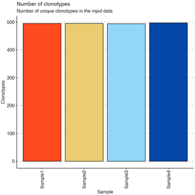
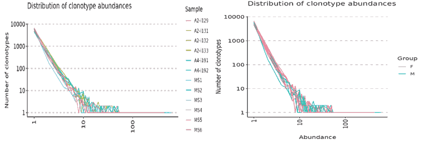
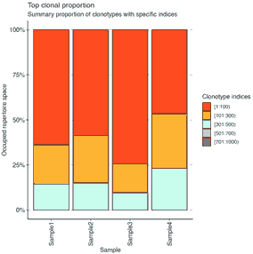
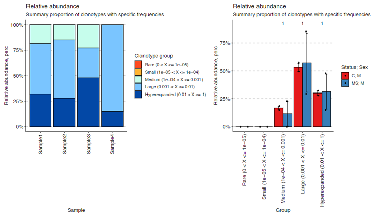

# Immunarch

After [`ImmunarchLoading`][1] loads the raw data into an [immunarch][2] object, this process wraps the functions from [`immunarch`][2] to do the following:

- Basic statistics, provided by [`immunarch::repExplore`](https://immunarch.com/reference/repExplore.html), such as number of clones or distributions of lengths and counts.
- The clonality of repertoires, provided by [`immunarch::repClonality`](https://immunarch.com/reference/repClonality.html)
- The repertoire overlap, provided by [`immunarch::repOverlap`](https://immunarch.com/reference/repOverlap.html)
- The repertoire overlap, including different clustering procedures and PCA, provided by [`immunarch::repOverlapAnalysis`](https://immunarch.com/reference/repOverlapAnalysis.html)
- The distributions of V or J genes, provided by [`immunarch::geneUsage`](https://immunarch.com/reference/geneUsage.html)
- The diversity of repertoires, provided by [`immunarch::repDiversity`](https://immunarch.com/reference/repDiversity.html)
- The dynamics of repertoires across time points/samples, provided by [`immunarch::trackClonotypes`](https://immunarch.com/reference/trackClonotypes.html)
- The spectratype of clonotypes, provided by [`immunarch::spectratype`](https://immunarch.com/reference/spectratype.html)
- The distributions of kmers and sequence profiles, provided by [`immunarch::getKmers`](https://immunarch.com/reference/getKmers.html)


## Environment Variable Design

With different sets of arguments, a single function of the above can perform different tasks. For example, `repExplore` can be used to get the statistics of the size of the repertoire, the statistics of the length of the CDR3 region, or the statistics of the number of the clonotypes. Other than that, you can also have different ways to visualize the results, by passing different arguments to the [`immunarch::vis`][3] function. For example, you can pass `.by` to `vis` to visualize the results of `repExplore` by different groups.

Before we explain each environment variable in details in the next section, we will give some examples here to show how the environment variables are organized in order for a single function to perform different tasks.

```toml
# Repertoire overlapping
[Immunarch.envs.overlaps]
# The method to calculate the overlap, passed to `repOverlap`
method = "public"
```

What if we want to calculate the overlap by different methods at the same time? We can use the following configuration:

```toml
[Immunarch.envs.overlaps.cases]
Public = { method = "public" }
Jaccard = { method = "jaccard" }
```

Then, the `repOverlap` function will be called twice, once with `method = "public"` and once with `method = "jaccard"`. We can also use different arguments to visualize the results. These arguments will be passed to the `vis` function:

```toml
[Immunarch.envs.overlaps.cases.Public]
method = "public"
vis_args = { "-plot": "heatmap2" }

[Immunarch.envs.overlaps.cases.Jaccard]
method = "jaccard"
vis_args = { "-plot": "heatmap2" }
```

`-plot` will be translated to `.plot` and then passed to `vis`. See also [Namespace and Environment Variables](../configurations.md#namespace-environment-variables).

If multiple cases share the same arguments, we can use the following configuration:

```toml
[Immunarch.envs.overlaps]
vis_args = { "-plot": "heatmap2" }

[Immunarch.envs.overlaps.cases]
Public = { method = "public" }
Jaccard = { method = "jaccard" }
```

For some results, there are futher analysis that can be performed. For example, for the repertoire overlap, we can perform clustering and PCA (see also <https://immunarch.com/articles/web_only/v4_overlap.html>):

```R
imm_ov1 <- repOverlap(immdata$data, .method = "public", .verbose = F)
repOverlapAnalysis(imm_ov1, "mds") %>% vis()
repOverlapAnalysis(imm_ov1, "tsne") %>% vis()
```

In such a case, we can use the following configuration:

```toml
[Immunarch.envs.overlaps]
method = "public"

[Immunarch.envs.overlaps.analyses.cases]
MDS = { "-method": "mds" }
TSNE = { "-method": "tsne" }
```

Then, the `repOverlapAnalysis` function will be called twice on the result generated by `repOverlap(immdata$data, .method = "public")`, once with `.method = "mds"` and once with `.method = "tsne"`. We can also use different arguments to visualize the results. These arguments will be passed to the `vis` function:

```toml
[Immunarch.envs.overlaps]
method = "public"

[Immunarch.envs.overlaps.analyses]
# See: https://immunarch.com/reference/vis.immunr_hclust.html
vis_args = { "-plot": "best" }

[Immunarch.envs.overlaps.analyses.cases]
MDS = { "-method": "mds" }
TSNE = { "-method": "tsne" }
```

Generally, you don't need to specify `cases` if you only have one case. A default case will be created for you. For multiple cases, the arguments at the same level as `cases` will be inherited by all cases.

## Environment Variables

### Mutating metadata

- `mutaters` (`type=json`): The mutaters passed to `dplyr::mutate()` on `immdata$meta` to add new columns. The keys will be the names of the columns, and the values will be the expressions. The new names can be used in `volumes`, `lens`, `counts`, `top_clones`, `rare_clones`, `hom_clones`, `gene_usages`, `divs`, etc.

    - See also [Mutating the metadata](../configurations.md#mutating-the-metadata).

    /// Tip | Examples

    ```toml
    [Immunarch.envs.mutaters]
    Vector = 'c("C", "C", "MS", "MS")'
    # You can also use an existing column
    Vector = 'Status'
    ```

    Mutates the metadata from:

    |Sample |ID   |Sex     |Age |Status |Lane|Timepoint|
    |-------|-----|--------|----|-------|----|---------|
    |Sample1|C1   |M       |11  |C      |A   |8        |
    |Sample2|C2   |M       |9   |C      |A   |6        |
    |Sample3|MS1  |M       |12  |MS     |C   |10       |
    |Sample4|MS2  |M       |30  |MS     |C   |3        |

    to:

    |Sample |ID   |Sex     |Age |Status |Lane|Timepoint|Vector|
    |-------|-----|--------|----|-------|----|---------|------|
    |Sample1|C1   |M       |11  |C      |A   |8        |C     |
    |Sample2|C2   |M       |9   |C      |A   |6        |C     |
    |Sample3|MS1  |M       |12  |MS     |C   |10       |MS    |
    |Sample4|MS2  |M       |30  |MS     |C   |3        |MS    |
    ///

### Basic statistics

- `volumes` (`ns`): Explore clonotype volume (sizes).
    - `by`: Groupings when visualize clonotype volumes, passed to the `.by` argument of `vis(imm_vol, .by = <values>)`. Multiple columns should be separated by `,`.
    - `devpars` (`ns`): The parameters for the plotting device.
        - `width` (`type=int`): The width of the plot.
        - `height` (`type=int`): The height of the plot.
        - `res` (`type=int`): The resolution of the plot.
    - `cases` (`type=json`): If you have multiple cases, you can use this argument to specify them.
        The keys will be the names of the cases.
        The values will be passed to the corresponding arguments above.
        If any of these arguments are not specified, the values in `envs.volumes` will be used.
        If NO cases are specified, the default case will be added, with the name `DEFAULT` and the
        values of `envs.volume.by`, `envs.volume.devpars`.

    /// Tip | Examples

    By default (without specifying any arguments), a bar plot will be generated for the volumes of the samples:

    

    Using `by` with one column or two columns:

    ```toml
    [Immunarch.envs.volumes.cases]
    # You can also use the columns created by `mutaters`
    # ByVector = { by = "Vector" }
    ByStatus = { by = "Status" }
    ByStatusAndSex = { by = "Status,Sex" }
    ```

    
    ///


- `lens` (`ns`): Explore clonotype CDR3 lengths.
    - `by`: Groupings when visualize clonotype lengths, passed to the `.by` argument of `vis(imm_len, .by = <values>)`.
        Multiple columns should be separated by `,`.
    - `devpars` (`ns`): The parameters for the plotting device.
        - `width` (`type=int`): The width of the plot.
        - `height` (`type=int`): The height of the plot.
        - `res` (type=int): The resolution of the plot.
    - `cases` (`type=json`): If you have multiple cases, you can use this argument to specify them.
        The keys will be the names of the cases.
        The values will be passed to the corresponding arguments above.
        If any of these arguments are not specified, the values in `envs.lens` will be used.
        If NO cases are specified, the default case will be added, with the name `DEFAULT` and the
        values of `envs.lens.by`, `envs.lens.devpars`.

    /// Tip | Examples

    Similar to `volumes`, by default (without specifying any arguments), a bar plot will be generated for the lengths of the samples:

    

    Using `by`:

    ```toml
    [Immunarch.envs.lens]
    by = "Status"
    ```

    
    ///


- `counts` (`ns`): Explore clonotype counts.
    - `by`: Groupings when visualize clonotype counts, passed to the `.by` argument of `vis(imm_count, .by = <values>)`.
        Multiple columns should be separated by `,`.
    - `devpars` (`ns`): The parameters for the plotting device.
        - `width` (`type=int`): The width of the plot.
        - `height` (`type=int`): The height of the plot.
        - `res` (`type=int`): The resolution of the plot.
    - `cases` (`type=json`): If you have multiple cases, you can use this argument to specify them.
        The keys will be the names of the cases.
        The values will be passed to the corresponding arguments above.
        If any of these arguments are not specified, the values in `envs.counts` will be used.
        If NO cases are specified, the default case will be added, with the name `DEFAULT` and the
        values of `envs.counts.by`, `envs.counts.devpars`.

    /// Tip | Examples

    Let's do with and without by at the same time this time:

    ```toml
    [Immunarch.envs.counts.cases]
    NoGrouping = {}
    BySex = { by = "Sex" }
    ```

    
    ///

### Clonality

- `top_clones` (`ns`): Explore top clonotypes.
    - `by`: Groupings when visualize top clones, passed to the `.by` argument of `vis(imm_top, .by = <values>)`.
        Multiple columns should be separated by `,`.
    - `marks` (`list`;`itype=int`): A numerical vector with ranges of the top clonotypes. Passed to the `.head` argument of `repClonoality()`.
    - `devpars` (`ns`): The parameters for the plotting device.
        - `width` (`type=int`): The width of the plot.
        - `height` (`type=int`): The height of the plot.
        - `res` (`type=int`): The resolution of the plot.
    - `cases` (`type=json`): If you have multiple cases, you can use this argument to specify them.
        The keys will be the names of the cases.
        The values will be passed to the corresponding arguments above.
        If any of these arguments are not specified, the values in `envs.top_clones` will be used.
        If NO cases are specified, the default case will be added, with the name `DEFAULT` and the
        values of `envs.top_clones.by`, `envs.top_clones.marks` and `envs.top_clones.devpars`.

    /// Tip | Examples

    ```toml
    [Immunarch.envs.top_clones.cases]
    NoGrouping = {}
    ByStatus = { by = "Status" }
    ```

    

    You can also use different `marks`:

    ```toml
    [Immunarch.envs.top_clones.cases]
    NewMarks = { marks = [100, 300, 500, 700, 1000]
    ```

    
    ///

- `rare_clones` (`ns`): Explore rare clonotypes.
    - `by`: Groupings when visualize rare clones, passed to the `.by` argument of `vis(imm_rare, .by = <values>)`.
        Multiple columns should be separated by `,`.
    - `marks` (`list`;`itype=int`): A numerical vector with ranges of abundance for the rare clonotypes in the dataset.
        Passed to the `.bound` argument of `repClonoality()`.
    - `devpars` (`ns`): The parameters for the plotting device.
        - `width` (`type=int`): The width of the plot.
        - `height` (`type=int`): The height of the plot.
        - `res` (`type=int`): The resolution of the plot.
    - `cases` (`type=json`): If you have multiple cases, you can use this argument to specify them.
        The keys will be the names of the cases.
        The values will be passed to the corresponding arguments above.
        If any of these arguments are not specified, the values in `envs.rare_clones` will be used.
        If NO cases are specified, the default case will be added, with the name `DEFAULT` and the
        values of `envs.rare_clones.by`, `envs.rare_clones.marks` and `envs.rare_clones.devpars`.

    /// Tip | Examples

    Similar to `top_clones`:

    ```toml
    [Immunarch.envs.rare_clones.cases]
    NoGrouping = {}
    ByStatus = { by = "Status" }
    ```

    
    ///

- `hom_clones` (`ns`): Explore homeo clonotypes.
    - `by`: Groupings when visualize homeo clones, passed to the `.by` argument of `vis(imm_hom, .by = <values>)`.
        Multiple columns should be separated by `,`.
    - `marks` (`ns`): A dict with the threshold of the half-closed intervals that mark off clonal groups.
        Passed to the `.clone.types` arguments of `repClonoality()`.
        The keys could be:
        - `Rare` (`type=float`): the rare clonotypes
        - `Small` (`type=float`): the small clonotypes
        - `Medium` (`type=float`): the medium clonotypes
        - `Large` (`type=float`): the large clonotypes
        - `Hyperexpanded` (`type=float`): the hyperexpanded clonotypes
    - `devpars` (`ns`): The parameters for the plotting device.
        - `width` (`type=int`): The width of the plot.
        - `height` (`type=int`): The height of the plot.
        - `res` (`type=int`): The resolution of the plot.
    - `cases` (`type=json`): If you have multiple cases, you can use this argument to specify them.
        The keys will be the names of the cases.
        The values will be passed to the corresponding arguments above.
        If any of these arguments are not specified, the values in `envs.hom_clones` will be used.
        If NO cases are specified, the default case will be added, with the name `DEFAULT` and the
        values of `envs.hom_clones.by`, `envs.hom_clones.marks` and `envs.hom_clones.devpars`.

    /// Tip | Examples

    Similar to `top_clones`:

    ```toml
    [Immunarch.envs.hom_clones.cases]
    NoGrouping = {}
    ByStatus = { by = "Status" }
    ```

    
    ///

### Repertoire overlap

- `overlaps` (`ns`): Explore clonotype overlaps.
    - `method` (`choice`): The method to calculate overlaps.
        - `public`: number of public clonotypes between two samples.
        - `overlap`: a normalised measure of overlap similarity.
            It is defined as the size of the intersection divided by the smaller of the size of the two sets.
        - `jaccard`: conceptually a percentage of how many objects two sets have in common out of how many objects they have total.
        - `tversky`: an asymmetric similarity measure on sets that compares a variant to a prototype.
        - `cosine`: a measure of similarity between two non-zero vectors of an inner product space that measures the cosine of the angle between them.
        - `morisita`: how many times it is more likely to randomly select two sampled points from the same quadrat (the dataset is
            covered by a regular grid of changing size) then it would be in the case of a random distribution generated from
            a Poisson process. Duplicate objects are merged with their counts are summed up.
        - `inc+public`: incremental overlaps of the N most abundant clonotypes with incrementally growing N using the public method.
        - `inc+morisita`: incremental overlaps of the N most abundant clonotypes with incrementally growing N using the morisita method.
    - `vis_args` (`type=json`): Other arguments for the plotting functions `vis(imm_ov, ...)`.
    - `devpars` (`ns`): The parameters for the plotting device.
        - `width` (`type=int`): The width of the plot.
        - `height` (`type=int`): The height of the plot.
        - `res` (`type=int`): The resolution of the plot.
    - `analyses` (`ns`): Perform overlap analyses.
        - `method`: Plot the samples with these dimension reduction methods.
            The methods could be `hclust`, `tsne` or `mds`.
            They could also be combined, for example, `mds+hclust`.
            See https://immunarch.com/reference/repOverlapAnalysis.html
        - `vis_args` (`type=json`): Other arguments for the plotting functions.
        - `devpars` (`ns`): The parameters for the plotting device.
            - `width` (`type=int`): The width of the plot.
            - `height` (`type=int`): The height of the plot.
            - `res` (`type=int`): The resolution of the plot.
        - `cases` (`type=json`): If you have multiple cases, you can use this argument to specify them.
            The keys will be the names of the cases.
            The values will be passed to the corresponding arguments above.
            If any of these arguments are not specified, the values in `envs.overlaps.analyses` will be used.
            If NO cases are specified, the default case will be added, with the name `DEFAULT` and the
            values of `envs.overlaps.analyses.method`, `envs.overlaps.analyses.vis_args` and `envs.overlaps.analyses.devpars`.
    - `cases` (`type=json`): If you have multiple cases, you can use this argument to specify them.
        The keys will be the names of the cases.
        The values will be passed to the corresponding arguments above.
        If any of these arguments are not specified, the values in `envs.overlaps` will be used.
        If NO cases are specified, the default case will be added, with the key the default method and the
        values of `envs.overlaps.method`, `envs.overlaps.vis_args`, `envs.overlaps.devpars` and `envs.overlaps.analyses`.

    /// Tip | Examples

    Using different methods:

    ```toml
    [Immunarch.envs.overlaps.cases]
    Public = { method = "public" }
    Morisita = { method = "morisita" }
    ```

    

    Using `vis_args`:

    ```toml
    [Immunarch.envs.overlaps.cases]
    Public = { method = "public", vis_args = { "-plot": "heatmap2" } }
    ```
    

    With `analyses`:

    ```toml
    [Immunarch.envs.overlaps.cases.Public]
    method = "public"

    [Immunarch.envs.overlaps.cases.Public.analyses]
    method = "mds+kmeans"
    ```

    
    ///

### Gene usage

- `gene_usages` (`ns`): Explore gene usages.
    - `top` (`type=int`): How many top (ranked by total usage across samples) genes to show in the plots.
        Use `0` to use all genes.
    - `norm` (flag): If True then use proportions of genes, else use counts of genes.
    - `by`: Groupings to show gene usages, passed to the `.by` argument of `vis(imm_gu_top, .by = <values>)`.
        Multiple columns should be separated by `,`.
    - `vis_args` (`type=json`): Other arguments for the plotting functions.
    - `devpars` (`ns`): The parameters for the plotting device.
        - `width` (`type=int`): The width of the plot.
        - `height` (`type=int`): The height of the plot.
        - `res` (`type=int`): The resolution of the plot.
    - `analyses` (`ns`): Perform gene usage analyses.
        - `method`: The method to control how the data is going to be preprocessed and analysed.
            One of `js`, `cor`, `cosine`, `pca`, `mds` and `tsne`. Can also be combined with following methods
            for the actual analyses: `hclust`, `kmeans`, `dbscan`, and `kruskal`. For example: `cosine+hclust`.
            See https://immunarch.com/articles/web_only/v5_gene_usage.html.
        - `vis_args` (`type=json`): Other arguments for the plotting functions.
        - `devpars` (`ns`): The parameters for the plotting device.
            - `width` (`type=int`): The width of the plot.
            - `height` (`type=int`): The height of the plot.
            - `res` (`type=int`): The resolution of the plot.
        - `cases` (`type=json`): If you have multiple cases, you can use this argument to specify them.
            The keys will be the names of the cases.
            The values will be passed to the corresponding arguments above.
            If any of these arguments are not specified, the values in `envs.gene_usages.analyses` will be used.
            If NO cases are specified, the default case will be added, with the name `DEFAULT` and the
            values of `envs.gene_usages.analyses.method`, `envs.gene_usages.analyses.vis_args` and `envs.gene_usages.analyses.devpars`.
    - `cases` (`type=json`): If you have multiple cases, you can use this argument to specify them.
        The keys will be used as the names of the cases.
        The values will be passed to the corresponding arguments above.
        If any of these arguments are not specified, the values in `envs.gene_usages` will be used.
        If NO cases are specified, the default case will be added, with the name `DEFAULT` and the
        values of `envs.gene_usages.top`, `envs.gene_usages.norm`, `envs.gene_usages.by`, `envs.gene_usages.vis_args`, `envs.gene_usages.devpars` and `envs.gene_usages.analyses`.

    /// Tip | Examples

    See also <https://immunarch.com/articles/web_only/v5_gene_usage.html>

    ```toml
    [Immunarch.envs.gene_usages.cases]
    ByStatus = { norm = true, by = "Status" }
    Grid = { norm = true, vis_args = { "-plot": "box" } }
    ```

    

    

    With `analyses`:

    ```toml
    [Immunarch.envs.gene_usages]
    norm = true

    [Immunarch.envs.gene_usages.analyses]
    # Shared arguments
    -text-size = 1.5

    [Immunarch.envs.gene_usages.analyses.cases.Js]
    method = "js"

    [Immunarch.envs.gene_usages.analyses.cases.Js.vis_args]
    -title = "Gene usage JS-divergence"
    -leg-title = "JS"

    [Immunarch.envs.gene_usages.analyses.cases.Cor]
    method = "cor"

    [Immunarch.envs.gene_usages.analyses.cases.Cor.vis_args]
    -title = "Gene usage correlation"
    -leg-title = "Cor"
    ```

    
    ///

### Spectratyping

- `spects` (`ns`): Spectratyping analysis.
    - `quant`: Select the column with clonal counts to evaluate.
        Set to `id` to count every clonotype once.
        Set to `count` to take into the account number of clones per clonotype.
        Multiple columns should be separated by `,`.
    - `col`: A string that specifies the column(s) to be processed.
        The output is one of the following strings, separated by the plus sign: "nt" for nucleotide sequences,
        "aa" for amino acid sequences, "v" for V gene segments, "j" for J gene segments.
        E.g., pass "aa+v" for spectratyping on CDR3 amino acid sequences paired with V gene segments,
        i.e., in this case a unique clonotype is a pair of CDR3 amino acid and V gene segment.
        Clonal counts of equal clonotypes will be summed up.
    - `devpars` (`ns`): The parameters for the plotting device.
        - `width` (`type=int`): The width of the plot.
        - `height` (`type=int`): The height of the plot.
        - `res` (`type=int`): The resolution of the plot.
    - `cases` (`type=json`): If you have multiple cases, you can use this argument to specify them.
        The keys will be the names of the cases.
        The values will be passed to the corresponding arguments above.
        If any of these arguments are not specified, the values in `envs.spects` will be used.
        By default, a `By_Clonotype` case will be added, with the values of `quant = "id"` and `col = "nt"`, and
        a `By_Num_Clones` case will be added, with the values of `quant = "count"` and `col = "aa+v"`.

    /// Tip | Examples

    ```toml
    [Immunarch.envs.spects.cases]
    By_Clonotype = { quant = "id", col = "nt" }
    By_Num_Clones = { quant = "count", col = "aa+v" }
    ```

    
    ///

### Diversity estimation

- `divs` (`ns`): Parameters to control the diversity analysis.
    - `filter`: The filter passed to `dplyr::filter()` to filter the data for each sample before calculating diversity.
        For example, `Clones > 1` to filter out singletons.
        To check which columns are available, use `immdata$data[[1]] |> colnames()` in R.
        You may also check quickly here:
        https://immunarch.com/articles/v2_data.html#basic-data-manipulations-with-dplyr-and-immunarch
        To use the top 10 clones, you can try `rank(desc(Clones)) <= 10`
    - `method` (`choice`): The method to calculate diversity.
        - `chao1`: a nonparameteric asymptotic estimator of species richness.
            (number of species in a population).
        - `hill`: Hill numbers are a mathematically unified family of diversity indices.
            (differing only by an exponent q).
        - `div`: true diversity, or the effective number of types.
            It refers to the number of equally abundant types needed for the average proportional abundance of the types to equal
            that observed in the dataset of interest where all types may not be equally abundant.
        - `gini.simp`: The Gini-Simpson index.
            It is the probability of interspecific encounter, i.e., probability that two entities represent different types.
        - `inv.simp`: Inverse Simpson index.
            It is the effective number of types that is obtained when the weighted arithmetic mean is used to quantify
            average proportional abundance of types in the dataset of interest.
        - `gini`: The Gini coefficient.
            It measures the inequality among values of a frequency distribution (for example levels of income).
            A Gini coefficient of zero expresses perfect equality, where all values are the same (for example, where everyone has the same income).
            A Gini coefficient of one (or 100 percents) expresses maximal inequality among values (for example where only one person has all the income).
        - `d50`: The D50 index.
            It is the number of types that are needed to cover 50%% of the total abundance.
        - `dxx`: The Dxx index.
            It is the number of types that are needed to cover xx%% of the total abundance.
            The percentage should be specified in the `args` argument using `perc` key.
        - `raref`: Species richness from the results of sampling through extrapolation.
    - `by`: The variables (column names) to group samples.
        Multiple columns should be separated by `,`.
    - `args` (`type=json`): Other arguments for `repDiversity()`.
        Do not include the preceding `.` and use `-` instead of `.` in the argument names.
        For example, `-do-norm` will be compiled to `.do.norm`.
        See all arguments at
        https://immunarch.com/reference/repDiversity.html
    - `order` (`list`): The order of the values in `by` on the x-axis of the plots.
        If not specified, the values will be used as-is.
    - `test` (`ns`): Perform statistical tests between each pair of groups.
        Does NOT work for `raref`.
        - `method` (`choice`): The method to perform the test
            - `none`: No test
            - `t.test`: Welch's t-test
            - `wilcox.test`: Wilcoxon rank sum test
        - `padjust` (`choice`): The method to adjust p-values.
            Defaults to `none`.
            - `bonferroni`: one-step correction
            - `holm`: step-down method using Bonferroni adjustments
            - `hochberg`: step-up method (independent)
            - `hommel`: closed method based on Simes tests (non-negative)
            - `BH`: Benjamini & Hochberg (non-negative)
            - `BY`: Benjamini & Yekutieli (negative)
            - `fdr`: Benjamini & Hochberg (non-negative)
            - `none`: no correction.
    - `separate_by`: A column name used to separate the samples into different plots. Only works for `raref`.
    - `align_x` (`flag`): Align the x-axis of multiple plots. Only works for `raref`.
    - `align_y` (`flag`): Align the y-axis of multiple plots. Only works for `raref`.
    - `log` (`flag`): Indicate whether we should plot with log-transformed x-axis using `vis(.log = TRUE)`. Only works for `raref`.
    - `devpars` (`ns`): The parameters for the plotting device.
        - `width` (int): The width of the device
        - `height` (int): The height of the device
        - `res` (int): The resolution of the device
    - `cases` (`type=json`): If you have multiple cases, you can use this argument to specify them.
        The keys will be used as the names of the cases.
        The values will be passed to the corresponding arguments above.
        If NO cases are specified, the default case will be added, with the name of `envs.div.method`.
        The values specified in `envs.div` will be used as the defaults for the cases here.

    /// Tip | Examples

    ```toml
    [Immunarch.envs.divs.cases]
    Chao1_NoGrouping = { method = "chao1" }
    Chao1_ByStatusSex = { method = "chao1", by = "Status,Sex" }
    ```

    

    Rarefraction:

    ```toml
    [Immunarch.envs.divs.cases]
    Raref_NoGrouping = { method = "raref" }
    Raref_ByStatus = { method = "raref", by = "Status" }
    ```

    
    ///

### Track clonotypes across samples and time

- `trackings` (`ns`): Parameters to control the clonotype tracking analysis.
    - `targets`: Either a set of CDR3AA seq of clonotypes to track (separated by `,`), or simply an integer to track the top N clonotypes.
    - `subject_col`: The column name in meta data that contains the subjects/samples on the x-axis of the alluvial plot.
        If the values in this column are not unique, the values will be merged with the values in `subject_col` to form the x-axis.
        This defaults to `Sample`.
    - `subjects` (`list`): A list of values from `subject_col` to show in the alluvial plot on the x-axis.
        If not specified, all values in `subject_col` will be used.
        This also specifies the order of the x-axis.
    - `cases` (`type=json`): If you have multiple cases, you can use this argument to specify them.
        The keys will be used as the names of the cases.
        The values will be passed to the corresponding arguments (`target`, `subject_col`, and `subjects`).
        If any of these arguments are not specified, the values in `envs.trackings` will be used.
        If NO cases are specified, the default case will be added, with the name `DEFAULT` and the
        values of `envs.trackings.target`, `envs.trackings.subject_col`, and `envs.trackings.subjects`.

    /// Tip | Examples

    ```toml
    [Immunarch.envs.trackings]
    targets = "CASSDSAGGTDTQYF,CASSDSSGGANEQFF,CASSDSSGSTDTQYF,CASSLAGGYNEQFF,CASSLDSYEQYF,CASSLEETQYF,CASSSAGGYNEQFF"
    subject_col = "Sample"
    ```

    

    ```toml
    [Immunarch.envs.trackings]
    targets = 7
    subject_col = "Sample"
    subjects = ["A2-i129", "A2-i133", "A4-i191"]
    ```

    
    ///

### Kmer and sequence motif analysis and visualisation

- `kmers` (`ns`): Arguments for kmer analysis.
    - `k` (`type=int`): The length of kmer.
    - `head` (`type=int`): The number of top kmers to show.
    - `vis_args` (`type=json`): Other arguments for the plotting functions.
    - `devpars` (`ns`): The parameters for the plotting device.
        - `width` (`type=int`): The width of the plot.
        - `height` (`type=int`): The height of the plot.
        - `res` (`type=int`): The resolution of the plot.
    - `profiles` (`ns`): Arguments for sequence profilings.
        - `method` (`choice`): The method for the position matrix.
            For more information see https://en.wikipedia.org/wiki/Position_weight_matrix.
            - `freq`: position frequency matrix (PFM) - a matrix with occurences of each amino acid in each position.
            - `prob`: position probability matrix (PPM) - a matrix with probabilities of each amino acid in each position.
            - `wei`: position weight matrix (PWM) - a matrix with log likelihoods of PPM elements.
            - `self`: self-information matrix (SIM) - a matrix with self-information of elements in PWM.
        - `vis_args` (`type=json`): Other arguments for the plotting functions.
        - `devpars` (`ns`): The parameters for the plotting device.
            - `width` (`type=int`): The width of the plot.
            - `height` (`type=int`): The height of the plot.
            - `res` (`type=int`): The resolution of the plot.
        - `cases` (`type=json`): If you have multiple cases, you can use this argument to specify them.
            The keys will be the names of the cases.
            The values will be passed to the corresponding arguments above.
            If any of these arguments are not specified, the values in `envs.kmers.profiles` will be used.
            If NO cases are specified, the default case will be added, with the name `DEFAULT` and the
            values of `envs.kmers.profiles.method`, `envs.kmers.profiles.vis_args` and `envs.kmers.profiles.devpars`.
    - `cases` (`type=json`): If you have multiple cases, you can use this argument to specify them.
        The keys will be used as the names of the cases.
        The values will be passed to the corresponding arguments above.
        If any of these arguments are not specified, the default case will be added, with the name `DEFAULT` and the
        values of `envs.kmers.k`, `envs.kmers.head`, `envs.kmers.vis_args` and `envs.kmers.devpars`.

    /// Tip | Examples

    ```toml
    [Immunarch.envs.kmers]
    k = 5
    ```

    

    ```toml
    [Immunarch.envs.kmers]
    # Shared by cases
    k = 5

    [Immunarch.envs.kmers.cases]
    Head5 = { head = 5, -position = "stack" }
    Head10 = { head = 10, -position = "fill" }
    Head30 = { head = 30, -position = "dodge" }
    ```

    

    With motif profiling:

    ```toml
    [Immunarch.envs.kmers]
    k = 5

    [Immnuarch.envs.kmers.profiles.cases]
    TextPlot = { method = "self", vis_args = { "-plot": "text" } }
    SeqPlot = { method = "self", vis_args = { "-plot": "seq" } }
    ```

    
    ///


[1]: ./ImmunarchLoading.md
[2]: https://immunarch.com
[3]: https://immunarch.com/reference/vis.html
