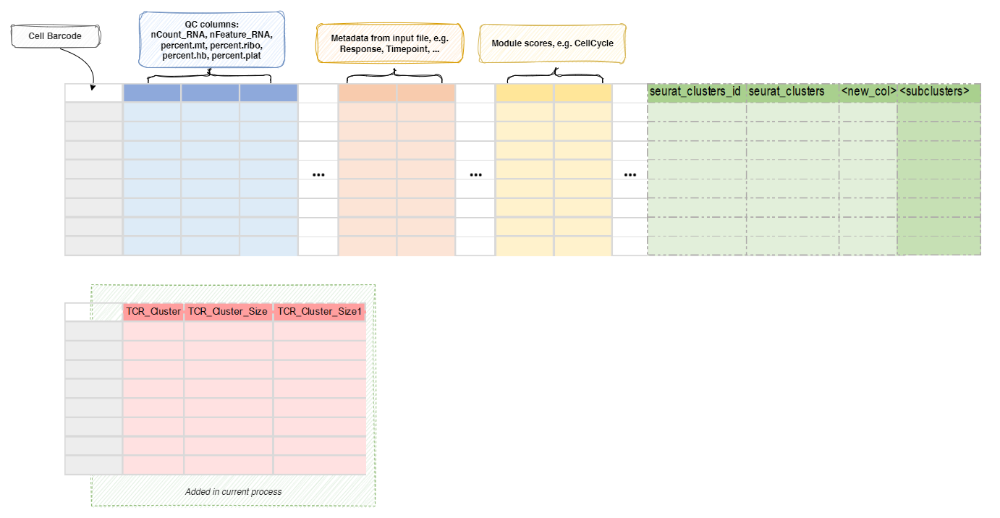

# IntegratingTCR

Attach TCR clone information as meta columns to Seurat object

This process is used to integrate scTCR-seq data into the `Seurat` object.<br />
The scTCR-seq data is loaded by [ImmunarchLoading](./ImmunarchLoading.md)
process. The integration is done by matching the barcodes from the `Seurat`
object and the scTCR-seq data.<br />
The barcodes from the scTCR-seq data are prefixed with the sample name,
for example, `Sample1_AAACCTGAGAAGGCTA-1`. The prefix is specified by the
`prefix` environment variable in the [ImmunarchLoading](./ImmunarchLoading.md)
process.<br />

[ImmunarchLoading](./ImmunarchLoading.md) process will generate a text file
with the information for each cell. `ImmunarchLoading.envs.metacols` can be
used to specify the columns to be exported to the text file, which will then be
integrated into the `Seurat` object by this process.<br />

You may also use `envs.mutaters` to add new columns to the metadata.<br />
These columns can be used for downstream analysis.<br />
An additional column `TCR_Presence` is added so later on we can overlay the
TCR presence on the dimension reduction plot in
[`SeuratClusterStats`](./SeuratClusterStats.md) process.<br />

/// Warning
If you are modifying `envs.mutaters`, make sure you keep the `TCR_Presence`
column if you have scTCR-seq data available by:<br />

```toml
[IntegratingTCR.envs.mutaters]
TCR_Presence = 'if_else(is.na(CDR3.aa), "TCR_absent", "TCR_present")'
# other mutaters
```

Because by default, [`SeuratClusterStats`](./SeuratClusterStats.md)
process will use this column to overlay the TCR presence on the dimension
reduction plot with scTCR-seq data available.<br />
///


## Environment Variables

- `mutaters` *(`type=json`)*: *Default: `{'TCR_Presence': 'if_else(is.na(CDR3.aa), "TCR_absent", "TCR_present")'}`*. <br />
    The mutaters to mutate the metadata.<br />
    The key-value pairs will be passed the `dplyr::mutate()` to mutate the metadata.<br />
    There are also also 4 helper functions, `expanded`, `collapsed`, `emerged` and `vanished`,
    which can be used to identify the expanded/collpased/emerged/vanished groups (i.e. TCR clones).<br />
    See also <../configurations/#mutater-helpers>.<br />
    For example, you can use
    `{"Patient1_Tumor_Collapsed_Clones": "expanded(., Source, 'Tumor', subset = Patent == 'Patient1', uniq = FALSE)"}`
    to create a new column in metadata named `Patient1_Tumor_Collapsed_Clones`
    with the collapsed clones in the tumor sample (compared to the normal sample) of patient 1.<br />
    The values in this columns for other clones will be `NA`.<br />
    Those functions take following arguments:<br />
    * `df`: The metadata data frame. You can use the `.` to refer to it.<br />
    * `group.by`: The column name in metadata to group the cells.<br />
    * `idents`: The first group or both groups of cells to compare (value in `group.by` column). If only the first group is given, the rest of the cells (with non-NA in `group.by` column) will be used as the second group.<br />
    * `subset`: An expression to subset the cells, will be passed to `dplyr::filter()`. Default is `TRUE` (no filtering).<br />
    * `each`: A column name (without quotes) in metadata to split the cells.<br />
    Each comparison will be done for each value in this column (typically each patient or subject).<br />
    * `id`: The column name in metadata for the group ids (i.e. `CDR3.aa`).<br />
    * `compare`: Either a (numeric) column name (i.e. `Clones`) in metadata to compare between groups, or `.n` to compare the number of cells in each group.<br />
    If numeric column is given, the values should be the same for all cells in the same group.<br />
    This will not be checked (only the first value is used).<br />
    It is helpful to use `Clones` to use the raw clone size from TCR data, in case the cells are not completely mapped to RNA data.<br />
    Also if you have `subset` set or `NA`s in `group.by` column, you should use `.n` to compare the number of cells in each group.<br />
    * `uniq`: Whether to return unique ids or not. Default is `TRUE`. If `FALSE`, you can mutate the meta data frame with the returned ids. For example, `df |> mutate(expanded = expanded(...))`.<br />
    * `debug`: Return the data frame with intermediate columns instead of the ids. Default is `FALSE`.<br />
    * `order`: The expression passed to `dplyr::arrange()` to order intermediate dataframe and get the ids in order accordingly.<br />
    The intermediate dataframe includes the following columns:<br />
    * `<id>`: The ids of clones (i.e. `CDR3.aa`).<br />
    * `<each>`: The values in `each` column.<br />
    * `ident_1`: The size of clones in the first group.<br />
    * `ident_2`: The size of clones in the second group.<br />
    * `.diff`: The difference between the sizes of clones in the first and second groups.<br />
    * `.sum`: The sum of the sizes of clones in the first and second groups.<br />
    * `.predicate`: Showing whether the clone is expanded/collapsed/emerged/vanished.<br />
    * `include_emerged`: Whether to include the emerged group for `expanded` (only works for `expanded`). Default is `FALSE`.<br />
    * `include_vanished`: Whether to include the vanished group for `collapsed` (only works for `collapsed`). Default is `FALSE`.<br />

    You can also use `top()` to get the top clones (i.e. the clones with the largest size) in each group.<br />
    For example, you can use
    `{"Patient1_Top10_Clones": "top(subset = Patent == 'Patient1', uniq = FALSE)"}`
    to create a new column in metadata named `Patient1_Top10_Clones`.<br />
    The values in this columns for other clones will be `NA`.<br />
    This function takes following arguments:<br />
    * `df`: The metadata data frame. You can use the `.` to refer to it.<br />
    * `id`: The column name in metadata for the group ids (i.e. `CDR3.aa`).<br />
    * `n`: The number of top clones to return. Default is `10`.<br />
    If n < 1, it will be treated as the percentage of the size of the group.<br />
    Specify `0` to get all clones.<br />
    * `compare`: Either a (numeric) column name (i.e. `Clones`) in metadata to compare between groups, or `.n` to compare the number of cells in each group.<br />
    If numeric column is given, the values should be the same for all cells in the same group.<br />
    This will not be checked (only the first value is used).<br />
    It is helpful to use `Clones` to use the raw clone size from TCR data, in case the cells are not completely mapped to RNA data.<br />
    Also if you have `subset` set or `NA`s in `group.by` column, you should use `.n` to compare the number of cells in each group.<br />
    * `subset`: An expression to subset the cells, will be passed to `dplyr::filter()`. Default is `TRUE` (no filtering).<br />
    * `each`: A column name (without quotes) in metadata to split the cells.<br />
    Each comparison will be done for each value in this column (typically each patient or subject).<br />
    * `uniq`: Whether to return unique ids or not. Default is `TRUE`. If `FALSE`, you can mutate the meta data frame with the returned ids. For example, `df |> mutate(expanded = expanded(...))`.<br />
    * `debug`: Return the data frame with intermediate columns instead of the ids. Default is `FALSE`.<br />
    * `with_ties`: Whether to include ties (i.e. clones with the same size as the last clone) or not. Default is `FALSE`.<br />

## Metadata

The metadata of the `Seurat` object will be updated with information from
TCR data:<br />



All of the columns above can be used for downstream analysis.<br />

