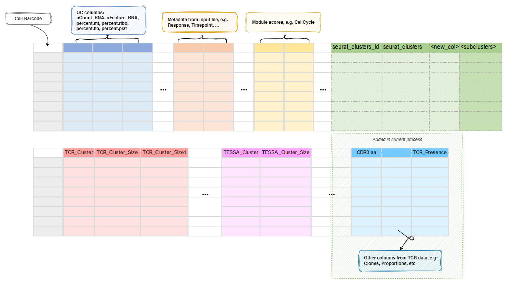

# IntegratingTCRClusters

Attach TCR clusters as meta columns to Seurat object


This process is used to merge the cluster assignments from
[TCRClustering](./TCRClustering.md) to the `Seurat` object.<br />
The cluster assignments are prefixed with `S_` or `M_` to indicate whether
a cluster has only one unique CDR3 sequence or multiple CDR3 sequences.<br />
Note that a cluster with `S_` prefix may still have multiple cells,
as the same CDR3 sequence may be shared by multiple cells.<br />
The cluster assignments are saved in the `Seurat` object at `TCR_Cluster`
column in `seurat_object@meta.data` in `R`.<br />

Other two columns are also added to the `Seurat` object: `TCR_Cluster_Size`
and `TCR_Cluster_Size1`. The `TCR_Cluster_Size` column contains the number of
cells in each cluster, while the `TCR_Cluster_Size1` column contains the
number of unique CDR3 sequences in each cluster.<br />

Those columns can be then used for further downstream analysis. For example,
you can find the markers for the TCR cluster (i.e. `S_1` vs `S_2`) in
each seurat cluster by

```toml
[MarkersFinder.envs]
group-by = "TCR_Cluster"
ident-1 = "S_1"
ident-2 = "S_2"
each = "seurat_clusters"
```

## Metadata

The metadata of the `Seurat` object will be updated with the TCR cluster
assignments and their sizes:<br />



