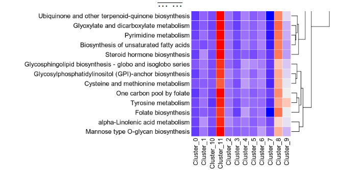
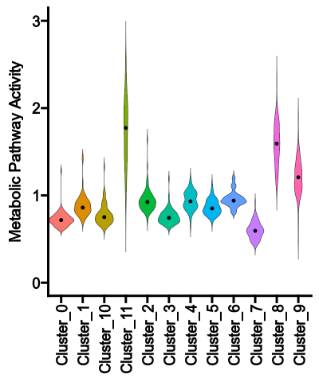

# MetabolicPathwayActivity

This process calculates the pathway activities in different groups and subsets.

The cells are first grouped by subsets and then the metabolic activities are
examined for each groups in different subsets. 

For each subset, a heatmap and a violin plot will be generated. 
The heatmap shows the pathway activities for each group and each metabolic pathway

{: width="80%"}

The violin plot shows the distribution of the pathway activities for each group

{: width="45%"}

## Input

- `sobjfile`:
    The Seurat object file. 
    It should be loaded as a Seurat object

## Output

- `outdir`: *Default: `{{in.sobjfile | stem}}.pathwayactivity`*.  
    The output directory. 
    It will contain the pathway activity score files and plots. 

## Environment Variables

- `ntimes` *(`type=int`)*: *Default: `5000`*.  
    Number of permutations to estimate the p-values
- `ncores` *(`type=int;pgarg`)*: *Default: `1`*.  
    Number of cores to use for parallelization
    Defaults to `ScrnaMetabolicLandscape.ncores`
- `gmtfile` *(`pgarg`)*:
    The GMT file with the metabolic pathways. 
    Defaults to `ScrnaMetabolicLandscape.gmtfile`
- `subset_by` *(`pgarg;readonly`)*:
    Subset the data by the given column in the
    metadata. For example, `Response`. 
    `NA` values will be removed in this column. 
    Defaults to `ScrnaMetabolicLandscape.subset_by`
    If None, the data will not be subsetted. 
- `group_by` *(`pgarg;readonly`)*:
    Group the data by the given column in the
    metadata. For example, `cluster`. 
    Defaults to `ScrnaMetabolicLandscape.group_by`
- `plots` *(`type=json`)*: *Default: `{'Pathway Activity (violin plot)': Diot({'plot_type': 'violin', 'add_box': True, 'devpars': Diot({'res': 100})}), 'Pathway Activity (heatmap)': Diot({'plot_type': 'heatmap', 'devpars': Diot({'res': 100})})}`*.  
    The plots to generate. 
    Names will be used as the prefix for the output files. Values will be
    a dictionary with the following keys: 
    * `plot_type` is the type of plot to generate. One of `heatmap`,
    `box`, `violin` or `merged_heatmap` (all subsets in one plot). 
    * `devpars` is a dictionary with the device parameters for the plot. 
    * Other arguments for `plotthis::Heatmap()`, `plotthis::BoxPlot()`
    or `plotthis::ViolinPlot()`, depending on the `plot_type`. 
- `cases` *(`type=json`)*: *Default: `{}`*.  
    Multiple cases for the analysis. 
    If you only have one case, you can specify the parameters directly to
    `envs.ntimes`, `envs.subset_by`, `envs.group_by`, `envs.group1`,
    `envs.group2`, and `envs.plots`. The name of the case will be
    `envs.subset_by`. 
    If you have multiple cases, you can specify the parameters for each case
    in a dictionary. The keys will be the names of the cases and the values
    will be dictionaries with the parameters for each case, where the values
    will be inherited from `envs.ntimes`, `envs.subset_by`, `envs.group_by`,
    `envs.group1`, `envs.group2`, and `envs.plots`. 

