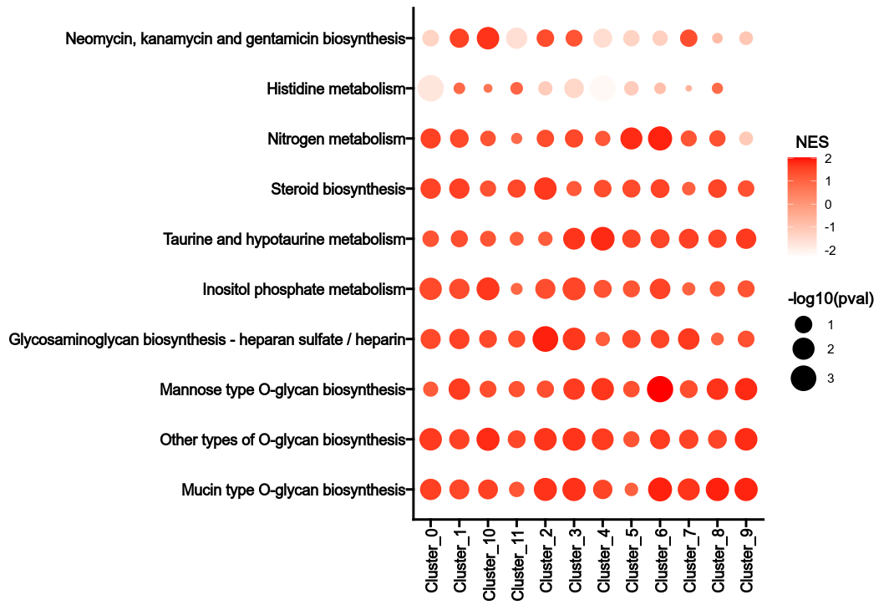

# MetabolicPathwayHeterogeneity

For each subset, the normalized enrichment score (NES) of each metabolic pathway is calculated for each group. The NES is calculated by comparing the enrichment score of the subset to the enrichment scores of the same subset in the permutations. The p-value is calculated by comparing the NES to the NESs of the same subset in the permutations. The heterogeneity can be reflected by the NES values and the p-values in different groups for the metabolic pathways.

## Environment variables

- `gmtfile`: The GMT file with the metabolic pathways.
    Defaults to `ScrnaMetabolicLandscape.gmtfile`
- `select_pcs` (`type=float`): Select the PCs to use for the analysis.
- `pathway_pval_cutoff` (`type=float`): The p-value cutoff to select
    the enriched pathways
- `ncores` (type=int): Number of cores to use for parallelization
    Defaults to `ScrnaMetabolicLandscape.ncores`
- `bubble_devpars` (ns): The devpars for the bubble plot
    - `width` (`type=int`): The width of the plot
    - `height` (`type=int`): The height of the plot
    - `res` (`type=int`): The resolution of the plot
- `grouping` (`type=auto`;`readonly`): Defines the basic groups to
    investigate the metabolic activity.
    Defaults to `ScrnaMetabolicLandscape.grouping`
- `grouping_prefix` (`type=auto`;`readonly`): Working as a prefix to group
    names.
    Defaults to `ScrnaMetabolicLandscape.grouping_prefix`
- `subsetting` (`type=auto`;`readonly`): How do we subset the data.
    Another column(s) in the metadata.
    Defaults to `ScrnaMetabolicLandscape.subsetting`
- `subsetting_prefix` (`type=auto`;`readonly`): Working as a prefix to
    subset names.
    Defaults to `ScrnaMetabolicLandscape.subsetting_prefix`
