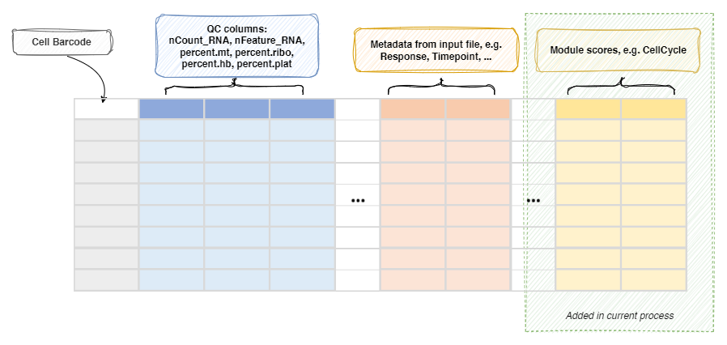

# ModuleScoreCalculator

Calculate the module scores for each cell

The module scores are calculated by
[`biopipen.utils::RunModuleScoring()`](https://pwwang.github.io/biopipen.utils.R/reference/RunModuleScoring.html)
with the scoring method specified by `env.defaults.method` (or per module
by `method` in the module dict):<br />

- `seurat`: [`Seurat::AddModuleScore()`](https://satijalab.org/seurat/reference/addmodulescore),
the default. The module scores are calculated as the average expression
levels of each program on single cell level, subtracted by the
aggregated expression of control feature sets. All analyzed features
are binned based on averaged expression, and the control features are
randomly selected from each bin. (Tirosh I, et al. 2016. Dissecting the
multicellular ecosystem of metastatic melanoma by single-cell RNA-seq.<br />
*Science* 352(6282):189-196.<br />
<https://www.science.org/doi/10.1126/science.aad0501>)
- `ucell`: [`UCell::AddModuleScore_UCell()`](https://bioconductor.org/packages/release/bioc/html/UCell.html)
(Andreatta M, Carmona SJ. 2021. UCell: Robust and scalable single-cell
gene signature scoring. *Comput Struct Biotechnol J* 19:3796-3798.<br />
<https://doi.org/10.1016/j.csbj.2021.06.043>). Missing genes are
imputed with expression 0 (with a warning).<br />
- `aucell`: [`AUCell::AUCell_calcAUC()`](https://bioconductor.org/packages/release/bioc/html/AUCell.html)
(Aibar S, et al. 2017. SCENIC: single-cell regulatory network inference
and clustering. *Nat Methods* 14:1083-1086.<br />
<https://doi.org/10.1038/nmeth.4463>)
- `ssgsea`: [`GSVA::gsva()`](https://bioconductor.org/packages/release/bioc/html/GSVA.html)
with `method = "ssgsea"` (Barbie DA, et al. 2009. Systematic RNA
interference reveals that oncogenic KRAS-driven cancers require TBK1.<br />
*Nature* 462:108-112. <https://doi.org/10.1038/nature08460>)
- `jasmine`: (Noureen N, et al. 2022. Integrated analysis of telomerase
enzymatic activity unravels an association with cancer stemness and
proliferation. *eLife* 11:e71994. <https://doi.org/10.7554/eLife.71994>)
- `scse`: (Pont F, et al. 2019. Single-cell signature explorer for
personalized transcriptomics studies and drug discovery. *Nucleic Acids
Res* 47(19):e90. <https://doi.org/10.1093/nar/gkz601>)
- `scps`: (the scPS benchmarking study:<br />
<https://academic.oup.com/nargab/article/6/3/lqae124/7770961>)

Scores from different methods are not comparable with each other — only
the column names are consistent.<br />

## Input

- `srtobj`:
    The seurat object loaded by `SeuratClustering`

## Output

- `rdsfile`: *Default: `{{in.srtobj | stem}}.qs`*. <br />
    The seurat object with module scores added to the metadata.<br />

## Environment Variables

- `defaults` *(`ns`)*:
    The default parameters for `modules`.<br />
    - `method` *(`choice`)*: *Default: `seurat`*. <br />
        The scoring method to use, one of `seurat`,
        `ucell`, `aucell`, `ssgsea`, `jasmine`, `scse` or `scps`.<br />
        Can be overridden per module.<br />
    - `features`:
        The features (genes) to calculate the scores.<br />
        A comma-separated string of genes, e.g.<br />
        `"HAVCR2,ENTPD1,LAYN,LAG3"`, yields one score column named by
        the module key. A list of gene vectors, e.g.<br />
        `["HAVCR2","ENTPD1"]`, yields one column per element, named
        `{key}1`, `{key}2`, ... if unnamed, or `{key}_{name}` if
        named. You can also specify `cc.genes`,
        `cc.genes.updated.2019` or `cc.genes.mouse` (or use
        `kind: "cc"`, with `features` defaulting to `cc.genes`) to
        calculate cell cycle scores. Three columns will be added to
        the metadata: `{key}_S.Score`, `{key}_G2M.Score` and
        `{key}_Phase`. This works for all methods. Use one of the
        reserved no-prefix keys (`"_"`, `"-"`, `"*"` or `"#"`) as the
        module key to keep the plain `S.Score`, `G2M.Score` and
        `Phase` names. For diffusion map modules (`kind: "dm"`), this
        is the number of components to keep (default 2).<br />
    - `nbin` *(`type=int`)*: *Default: `24`*. <br />
        Number of bins of aggregate expression levels
        for all analyzed features. Only for the `seurat` method.<br />
    - `ctrl` *(`type=int`)*: *Default: `100`*. <br />
        Number of control features selected from
        the same bin per analyzed feature. Only for the `seurat`
        method.<br />
    - `k` *(`flag`)*: *Default: `False`*. <br />
        Use feature clusters returned from `DoKMeans`.<br />
        Only for the `seurat` method.<br />
    - `assay`:
        The assay to use (for tools that accept it).<br />
    - `seed` *(`type=int`)*: *Default: `8525`*. <br />
        Set a random seed. Only for the `seurat` method.<br />
    - `search` *(`flag`)*: *Default: `False`*. <br />
        Search for symbol synonyms for features that
        don't match features in object? Only for the `seurat` method.<br />
    - `<more>`:
        Other parameters, passed to the underlying tool of the
        `method`. For `seurat`, they go to `Seurat::AddModuleScore()`
        or `Seurat::CellCycleScoring()` (see
        <https://satijalab.org/seurat/reference/addmodulescore> and
        <https://satijalab.org/seurat/reference/cellcyclescoring>).<br />
        For `ucell`: `maxRank`, `w_neg` and `slot` (default
        `"counts"`, not `layer`). For `aucell`: `aucMaxRank`,
        `plotStats`. For `ssgsea`: `kcdf`, `verbose`, `min.sz`,
        `max.sz`, `tau`, etc. For `scse`/`scps`: `layer` (default
        `"data"`). `scps` uses the bundled scPS implementation, which
        runs PCA on the `scale.data` of the object, so the signature
        genes must be scaled first (`ScaleData(features = ...)` or
        `SCTransform`); it also requires the
        [`GSEABase`](https://bioconductor.org/packages/release/bioc/html/GSEABase.html)
        package. For diffmap modules (`kind: "dm"`): `n_pcs` (use PCA
        embeddings instead of assay data) and other arguments passed
        to
        [`destiny::DiffusionMap()`](https://www.rdocumentation.org/packages/destiny/versions/2.0.4/topics/DiffusionMap%20class).<br />
        The `agg` and `keep` parameters from old versions are removed
        and ignored.<br />
- `ncores` *(`type=int`)*: *Default: `1`*. <br />
    The number of cores to use for reading and writing the seurat object.<br />
- `modules` *(`type=json`)*: *Default: `{}`*. <br />
    The modules to calculate the scores.<br />
    Keys are the names of the expression programs and values are the
    dicts inherited from `env.defaults`.<br />
    Here are some examples -

    ```python
    {
        "CellCycleMouse": {"features": "cc.genes.mouse"},
        "CellCycle": {"kind": "cc", "features": "cc.genes.updated.2019"},
        "TcellState": {
            "features": {
                "Exhaustion": ["HAVCR2", "ENTPD1", "LAYN", "LAG3"],
                "Activation": ["IFNG"]
            },
            "method": "ucell",
            "maxRank": 500
        },
        "Proliferation": {"features": "STMN1,TUBB"},
        "DC": {"kind": "dm"}
    }
    ```


    For `CellCycle`, the columns `CellCycle_S.Score`,
    `CellCycle_G2M.Score` and `CellCycle_Phase` will be added to the
    metadata.<br />

    For `TcellState`, the columns `TcellState_Exhaustion` and
    `TcellState_Activation` will be added to the metadata, one for each
    program in the named `features` list (the list values are gene
    vectors, not comma-separated strings).<br />

    For `DC`, a diffusion map will be calculated with
    [`destiny`](https://bioconductor.org/packages/release/bioc/html/destiny.html)
    (regardless of `method`), and the first 2 components will be added
    as the `DC` reduction as well as the `DC_1` and `DC_2` columns to
    the metadata. `dm` is a shortcut for `diffmap`/`diffusion_map`.<br />
    You can later plot the diffusion map by using
    `reduction = "DC"` in `env.dimplots` in `SeuratClusterStats`.<br />
    This requires
    [`SingleCellExperiment`](https://bioconductor.org/packages/release/bioc/html/SingleCellExperiment.html)
    and [`destiny`](https://bioconductor.org/packages/release/bioc/html/destiny.html) R packages.<br />
- `post_mutaters` *(`type=json`)*: *Default: `{}`*. <br />
    The mutaters to mutate the metadata after
    calculating the module scores.<br />
    The mutaters will be applied in the order specified.<br />
    This is useful when you want to create new scores based on the
    calculated module scores.<br />

## Metadata

The metadata of the `Seurat` object will be updated with the module scores:<br />



