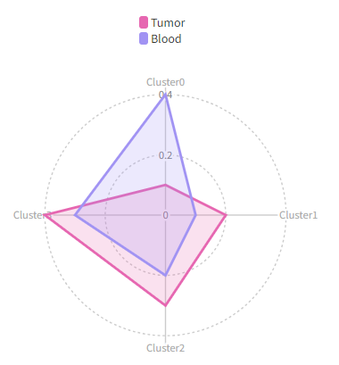
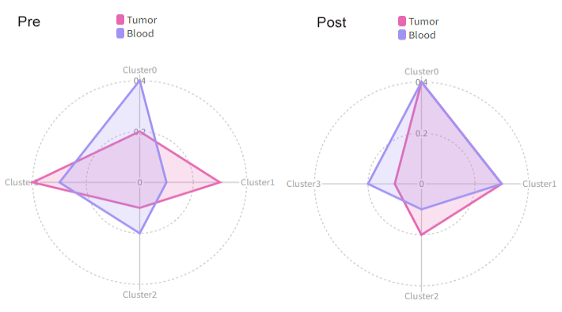
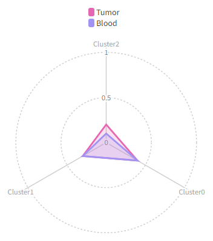

# RadarPlots

Radar plots for cell proportion in different clusters.

This process generates the radar plots for the clusters of T cells.<br />
It explores the proportion of cells in different groups (e.g. Tumor vs Blood)
in different T-cell clusters.<br />

## Environment Variables

- `mutaters` *(`type=json`)*: *Default: `{}`*. <br />
    Mutaters to mutate the metadata of the seurat object. Keys are the column names and values are the expressions to mutate the columns. These new columns will be used to define your cases..<br />
    See also
    [`mutating the metadata`](../configurations.md#mutating-the-metadata).<br />
- `by`:
    Which column to use to separate the cells in different groups.<br />
    `NA`s will be ignored. For example, If you have a column named `Source`
    that marks the source of the cells, and you want to separate the cells
    into `Tumor` and `Blood` groups, you can set `by` to `Source`.<br />
    The there will be two curves in the radar plot, one for `Tumor` and
    one for `Blood`.<br />
- `each`:
    A column with values to separate all cells in different cases
    When specified, the case will be expanded to multiple cases for
    each value in the column.<br />
    If specified, `section` will be ignored, and the case name will
    be used as the section name.<br />
- `prefix_each` *(`flag`)*: *Default: `True`*. <br />
    Whether to prefix the `each` column name to the values as the
    case/section name.<br />
- `breakdown`:
    An additional column with groups to break down the cells
    distribution in each cluster. For example, if you want to see the
    distribution of the cells in each cluster in different samples. In
    this case, you should have multiple values in each `by`. These values
    won't be plotted in the radar plot, but a barplot will be generated
    with the mean value of each group and the error bar.<br />
- `test` *(`choice`)*: *Default: `wilcox`*. <br />
    The test to use to calculate the p values.<br />
    If there are more than 2 groups in `by`, the p values will be calculated
    pairwise group by group. Only works when `breakdown` is specified and
    `by` has 2 groups or more.<br />
    - `wilcox`:
        Wilcoxon rank sum test
    - `t`:
        T test
    - `none`:
        No test will be performed
- `order` *(`list`)*:
    The order of the values in `by`. You can also limit
    (filter) the values we have in `by`. For example, if column `Source`
    has values `Tumor`, `Blood`, `Spleen`, and you only want to plot
    `Tumor` and `Blood`, you can set `order` to `["Tumor", "Blood"]`.<br />
    This will also have `Tumor` as the first item in the legend and `Blood`
    as the second item.<br />
- `colors`:
    The colors for the groups in `by`. If not specified,
    the default colors will be used.<br />
    Multiple colors can be separated by comma (`,`).<br />
    You can specify `biopipen` to use the `biopipen` palette.<br />
- `ident`: *Default: `seurat_clusters`*. <br />
    The column name of the cluster information.<br />
- `cluster_order` *(`list`)*: *Default: `[]`*. <br />
    The order of the clusters.<br />
    You may also use it to filter the clusters. If not given,
    all clusters will be used.<br />
    If the cluster names are integers, use them directly for the order,
    even though a prefix `Cluster` is added on the plot.<br />
- `breaks` *(`list;itype=int`)*: *Default: `[]`*. <br />
    breaks of the radar plots, from 0 to 100.<br />
    If not given, the breaks will be calculated automatically.<br />
- `direction` *(`choice`)*: *Default: `intra-cluster`*. <br />
    Direction to calculate the percentages.<br />
    - `inter-cluster`:
        the percentage of the cells in all groups
        in each cluster (percentage adds up to 1 for each cluster).<br />
    - `intra-cluster`:
        the percentage of the cells in all clusters.<br />
        (percentage adds up to 1 for each group).<br />
- `section`: *Default: `DEFAULT`*. <br />
    If you want to put multiple cases into a same section
    in the report, you can set this option to the name of the section.<br />
    Only used in the report.<br />
- `subset`:
    The subset of the cells to do the analysis.<br />
- `bar_devpars` *(`ns`)*:
    The parameters for `png()` for the barplot
    - `res` *(`type=int`)*: *Default: `100`*. <br />
        The resolution of the plot
    - `height` *(`type=int`)*: *Default: `800`*. <br />
        The height of the plot
    - `width` *(`type=int`)*: *Default: `1200`*. <br />
        The width of the plot
- `devpars` *(`ns`)*:
    The parameters for `png()`
    - `res` *(`type=int`)*: *Default: `100`*. <br />
        The resolution of the plot
    - `height` *(`type=int`)*: *Default: `1000`*. <br />
        The height of the plot
    - `width` *(`type=int`)*: *Default: `1200`*. <br />
        The width of the plot
- `cases` *(`type=json`)*: *Default: `{}`*. <br />
    The cases for the multiple radar plots.<br />
    Keys are the names of the cases and values are the arguments for
    the plots (`each`, `by`, `order`, `breaks`, `direction`,
    `ident`, `cluster_order` and `devpars`).<br />
    If not cases are given, a default case will be used, with the
    key `DEFAULT`.<br />
    The keys must be valid string as part of the file name.<br />

## Examples

Let's say we have a metadata like this:<br />

| Cell | Source | Timepoint | seurat_clusters |
| ---- | ------ | --------- | --------------- |
| A    | Blood  | Pre       | 0               |
| B    | Blood  | Pre       | 0               |
| C    | Blood  | Post      | 1               |
| D    | Blood  | Post      | 1               |
| E    | Tumor  | Pre       | 2               |
| F    | Tumor  | Pre       | 2               |
| G    | Tumor  | Post      | 3               |
| H    | Tumor  | Post      | 3               |

With configurations:<br />

```toml
[RadarPlots.envs]
by = "Source"
```

Then we will have a radar plots like this:<br />



We can use `each` to separate the cells into different cases:<br />

```toml
[RadarPlots.envs]
by = "Source"
each = "Timepoint"
```

Then we will have two radar plots, one for `Pre` and one for `Post`:<br />



Using `cluster_order` to change the order of the clusters and show only the first 3 clusters:<br />

```toml
[RadarPlots.envs]
by = "Source"
cluster_order = ["2", "0", "1"]
breaks = [0, 50, 100]  # also change the breaks
```



/// Attention
All the plots used in the examples are just for demonstration purpose. The real plots will have different appearance.<br />
///

