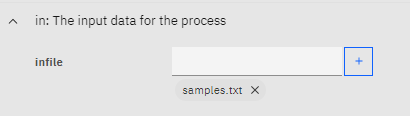
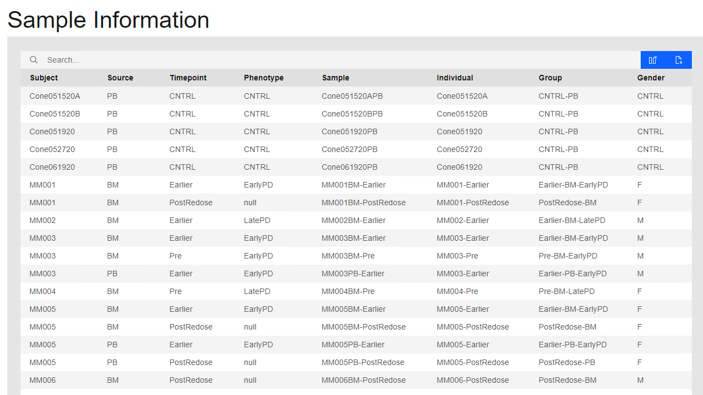
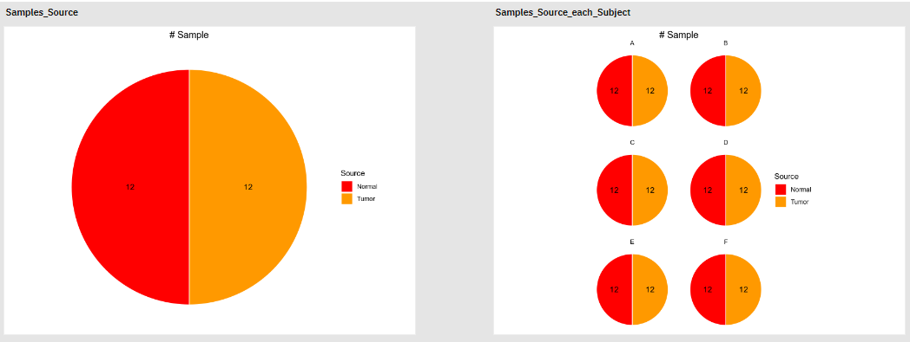
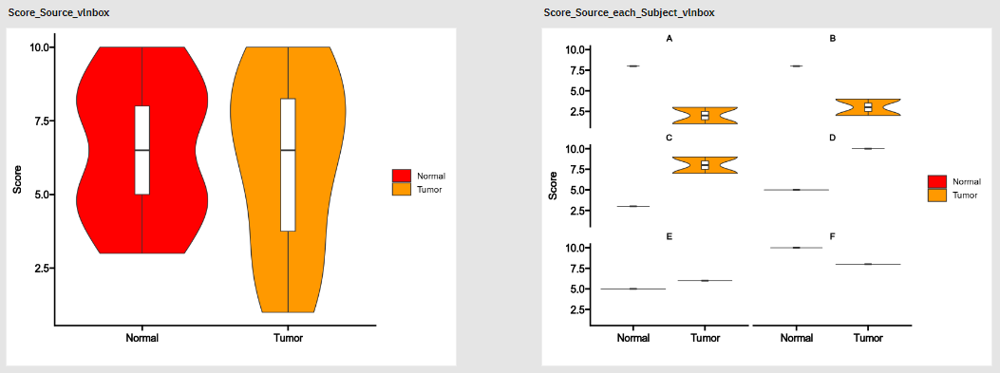

# SampleInfo

This process is the entrance of the pipeline. It just pass by input file and list the sample information in the report.

To specify the input file:

```toml
[SampleInfo.in]
infile = [ "path/to/sample_info.txt" ]
```

Or with `pipen-board`, find the `SampleInfo` process and click the `Edit` button. Then you can specify the input file here:



Theroetically, we can have multiple input files. However, it is not tested yet. If you have multiple input files to run, please run it with a different pipeline instance (configuration file).

For the content of the input file, please see details [here](../preparing-input.md#metadata).

Once the pipeline is finished, you can see the sample information in the report:



Note that the required `RNAData` and `TCRData` columns are not shown in the report. They are used to specify the paths of the `scRNA-seq` and `scTCR-seq` data, respectively.

You may also perform some statistics on the sample information, for example, number of samples per group. See next section for details.

## Environment variables

- `sep`: The separator of the input file.
- `mutaters` (`type=json`): A dict of mutaters to mutate the data frame.
    The key is the column name and the value is the R expression
    to mutate the column. The dict will be transformed to a list in R
    and passed to [`dplyr::mutate`](https://dplyr.tidyverse.org/reference/mutate.html).
    You may also use `paired()` to identify paired samples. The function
    takes following arguments:
    * `df`: The data frame. Use `.` if the function is called in
        a dplyr pipe.
    * `id_col`: The column name in `df` for the ids to be returned in
        the final output.
    * `compare_col`: The column name in `df` to compare the values for
        each id in `id_col`.
    * `idents`: The values in `compare_col` to compare. It could be
        either an an integer or a vector. If it is an integer,
        the number of values in `compare_col` must be the same as
        the integer for the `id` to be regarded as paired. If it is
        a vector, the values in `compare_col` must be the same
        as the values in `idents` for the `id` to be regarded as paired.
    * `uniq`: Whether to return unique ids or not. Default is `TRUE`.
        If `FALSE`, you can mutate the meta data frame with the
        returned ids. Non-paired ids will be `NA`.
- `save_mutated` (`flag`): Whether to save the mutated columns.
- `exclude_cols`: The columns to exclude in the table in the report.
    Could be a list or a string separated by comma.
- `defaults` (`ns`): The default parameters for each case in `envs.stats`.
    - `on`: The column name in the data for the stats.
        Default is `Sample`.
        If there are duplicated values in `on`, and you want to do stats
        on the unique values, you can use `distinct:` prefix.
        For example, `distinct:Patient` will keep only the first
        duplicated value in `Patient` and do stats on the unique values.
        If this is a column with discrete values, we are performing stats on
        the number of samples in each `group` (see below). If this is a
        column with continuous values, we are performing stats on the distribution of the
        values in each `group`.
    - `group`: The column name in the data for the group ids.
        If not provided, all records will be regarded as one group.
    - `na_group` (`flag`): Whether to include `NA`s in the group.
    - `each`: The column in the data to split the analysis in different
        plots, which will be passed to [`facet_wrap`](https://ggplot2.tidyverse.org/reference/facet_wrap.html) in [`ggplot2`](https://ggplot2.tidyverse.org/).
    - `ncol` (`type=int`): The number of columns in the plot when `each`
        is not `NULL`. Default is `2`.
    - `na_each` (`flag`): Whether to include `NA`s in the `each` column.
    - `plot`: Type of plot. If `on` is continuous, it could be
        `boxplot` (default), `violin`, `violin+boxplot (vlnbox)` or `histogram`.
        If `on` is not continuous, it could be `barplot` or
        `pie` (default).
    - `devpars` (`ns`): The device parameters for the plot.
        - `width` (`type=int`): The width of the plot.
        - `height` (`type=int`): The height of the plot.
        - `res` (`type=int`): The resolution of the plot.
- `stats` (`type=json`): The statistics to perform.
    The keys are the case names and the values are the parameters
    inheirted from `envs.defaults`.

/// Tip

This is the start process of the pipeline. Once you change the parameters for this process, the whole pipeline will be re-run.

If you just want to change the parameters for the statistics, and use the cached (previous) results for other processes, you can set `cache` at pipeline level to `"force"` to force the pipeline to use the cached results and `cache` of `SampleInfo` to `false` to force the pipeline to re-run the `SampleInfo` process only.

```toml
cache = "force"

[SampleInfo]
cache = false
```
///

## Example

### Example data

| Subject | Sample | Source | Score |
| ------- | ------ | ------ | ----- |
| A       | A1     | Tumor  | 1     |
| A       | A2     | Numor  | 8     |
| A       | A3     | Tumor  |3      |
| A       | A4     | Normal |8      |
| B       | B1     | Tumor  |2      |
| B       | B2     | Normal |8      |
| B       | B3     | Tumor  |4      |
| B       | B4     | Normal |8      |
| C       | C1     | Tumor  |9      |
| C       | C2     | Normal |3      |
| C       | C3     | Tumor  |7      |
| C       | C4     | Normal |3      |
| D       | D1     | Tumor  |10     |
| D       | D2     | Normal |5      |
| D       | D3     | Tumor  |10     |
| D       | D4     | Normal |5      |
| E       | E1     | Tumor  |6      |
| E       | E2     | Normal |5      |
| E       | E3     | Tumor  |6      |
| E       | E4     | Normal |5      |
| F       | F1     | Tumor  |8      |
| F       | F2     | Normal |10     |
| F       | F3     | Tumor  |8      |
| F       | F4     | Normal |10     |

### Count the number of samples per Source

```toml
[SampleInfo.envs.stats]
Samples_Source = { "group": "Source" }
Samples_Source_each_Subject = { "group": "Source", "each": "Subject" }
```



### Explore the distribution of the Score

```toml
[SampleInfo.envs.stats.Score_Source_vlnbox]
on = "Score"
group = "Source"
plot = "violin+box"

[SampleInfo.envs.stats.Score_Source_each_Subject_vlnbox]
on = "Score"
group = "Source"
plot = "violin+box"
each = "Subject"
```


