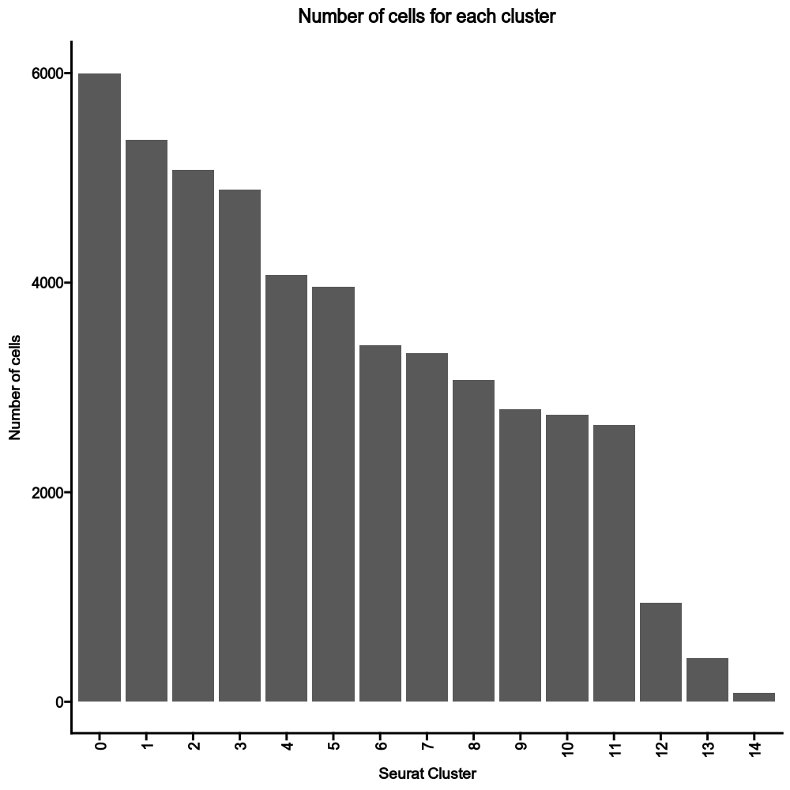
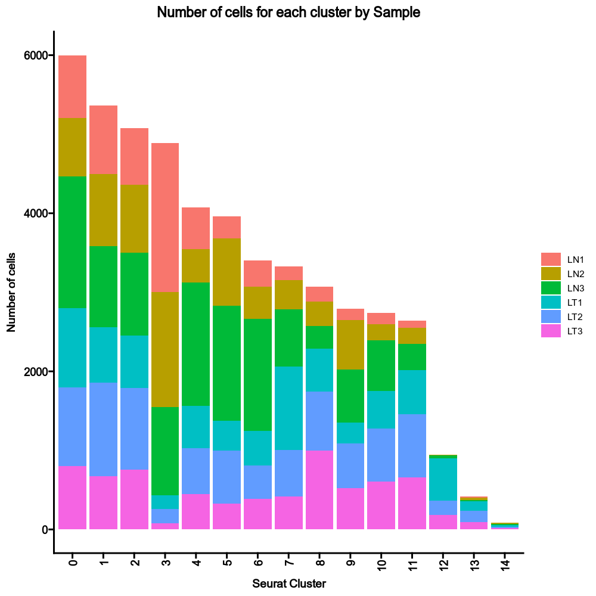
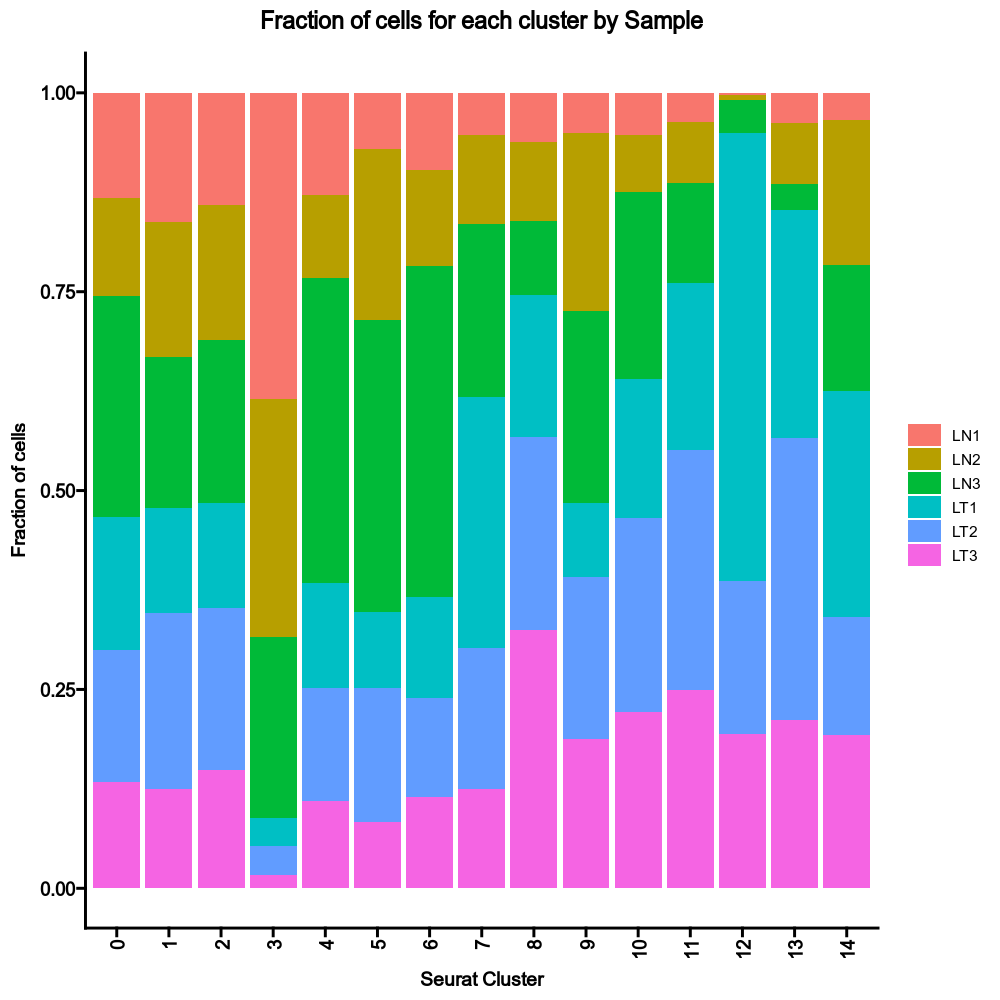
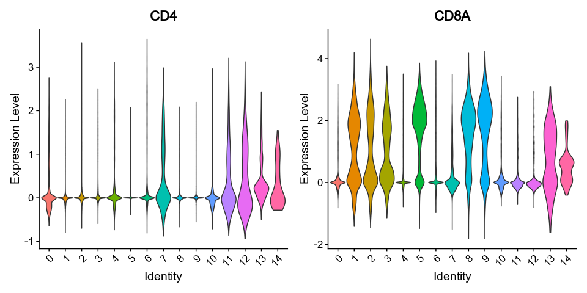
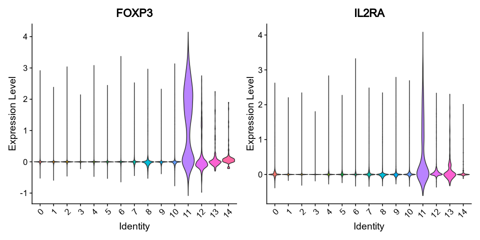
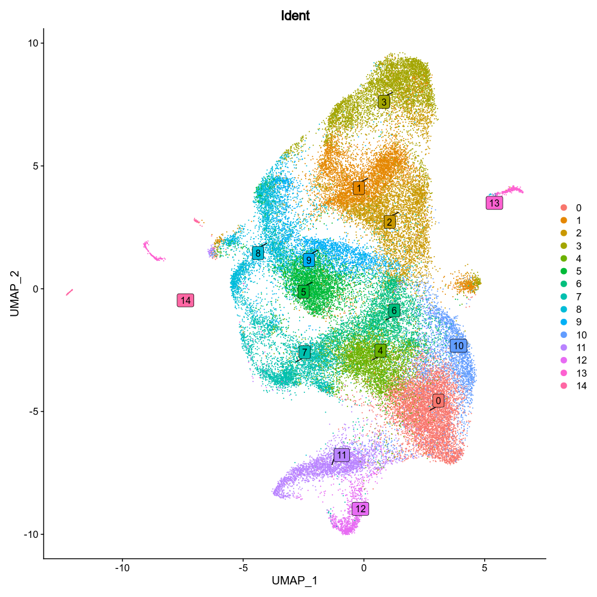

# SeuratClusterStats

Statistics of the clustering, including the number/fraction of cells in each cluster, the gene expression values and dimension reduction plots. It's also possible to perform stats on TCR clones/clusters for each T-cell cluster.

## Environment variables

- `stats` (`type=json`): The number/fraction of cells to plot.
    * `nCells_*` - Number of cells for each cluster.
        You can specify `by` to group the cells by a metadata column,
        and `devpars` to specify the device parameters for the plot.
        You can also specify `filter` to filter the cells under certain
        conditions using metadata columns.
    * `fracCells_*` - Fraction of cells for each cluster.
        Similar to `nCells_*`, but the fraction is calculated
        instead of the absolute number.
- `exprs` (`type=json`): The expression values to plot.
    * `genes` - The set of genes (separated by comma) for the plots,
        unless `features` for those plots is specified.
        One could also specify a file with genes (one per line).
    * `ridgeplots` - The ridge plots for the gene expressions.
        See [`Seurat::RidgePlot`](https://satijalab.org/seurat/reference/ridgeplot).
    * `vlnplots` - Violin plots for the gene expressions.
        See [`Seurat::VlnPlot`](https://satijalab.org/seurat/reference/vlnplot).
        You can have `boxplot` key to add `geom_boxplot()` to the violin plots.
    * `featureplots` - The feature plots for the gene expressions.
        See [`Seurat::FeaturePlot`](https://satijalab.org/seurat/reference/featureplot).
    * `dotplot` - Dot plots for the gene expressions.
        See [`Seurat::DotPlot`](https://satijalab.org/seurat/reference/dotplot).
    * `heatmap` - Heatmap for the gene expressions.
        See [`Seurat::DoHeatmap`](https://satijalab.org/seurat/reference/doheatmap).
        You can specify `average=True` to plot on the average of the expressions.
    * `table` - The table for the gene expressions.
        (supported keys: title, log2, subset and features).
    * All the above can have `devpars` to define the output figures
        and `plus` to add elements to the `ggplot` object.
        You can also have `subset` to subset the data.
        Multiple cases can be distinguished by `ridgeplots` and
        `ridgeplots_1`.
        If no `features` specified, will use `genes`. If you want to use
        the default gene list `VariantFeatures(srtobj)[1:20]`, specify
        `features = "default"`. Or you can also specify the genes
        directly to `features`.
- `dimplots` (`type=json`): The dimensional reduction plots.
    * `<case>` - The case to plot.
        Keys are the arguments for `Seurat::Dimplot()`, plus `devpars`
        for the plots. `devpars` is a dictionary with keys `res`,
        `height` and `width` to specify the resolution, height and
        width of the plot. The hyphen (`-`) in the keys will be replaced
        by `.`.


## Examples

### Number of cells in each cluster

```toml
[SeuratClusterStats.envs.stats]
nCells_All = { }
```

{: width="80%" }

### Number of cells in each cluster by groups

```toml
[SeuratClusterStats.envs.stats]
nCells_Sample = { by = "Sample" }
```

{: width="80%" }

### Fraction of cells in each cluster by groups

```toml
[SeuratClusterStats.envs.stats]
fracCells_Sample = { by = "Sample" }
```

{: width="80%" }

### Violin plots for the gene expressions

```toml
[SeuratClusterStats.envs.exprs]
genes = "CD4,CD8A"
# Remove the dots in the violin plots
vlnplots = { pt-size = 0 }
# Don't use the default genes
vlnplots_1 = { features = ["FOXP3", "IL2RA"], pt-size = 0 }
```

{: width="80%" }
{: width="80%" }

### Dimension reduction plot with labels

```toml
[SeuratClusterStats.envs.dimplots.Idents]
group-by = "seurat_clusters"
label = true
label-box = true
repel = true
```

{: width="80%" }
