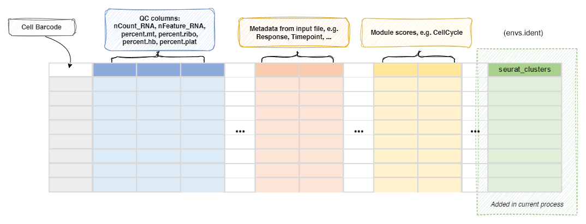

# SeuratClustering

Cluster all cells or selected T/B cells selected by `TOrBCellSelection`.

If `[TOrBCellSelection]` is not set in the configuration, meaning
all cells are T/B cells, this process will be run on all T/B cells. Otherwise,
this process will be run on the selected T/B cells by
[`TOrBCellSelection`](./TOrBCellSelection.md). 

/// Note

If you have other annotation processes, including
[`SeuratMap2Ref`](./SeuratMap2Ref.md) process or
[`CellTypeAnnotation`](./CellTypeAnnotation.md) process enabled in the same run,
you can specify a different name for the column to store the cluster information
using `envs.ident`, so that the results from different
annotation processes won't overwrite each other. 

///

## Input

- `srtobj`:
    The seurat object loaded by SeuratPreparing

## Output

- `outfile`: *Default: `{{in.srtobj | stem}}.qs`*.  
    The seurat object with cluster information at `seurat_clusters` or
    the name specified by `envs.ident`

## Environment Variables

- `ncores` *(`type=int;order=-100`)*: *Default: `1`*.  
    Number of cores to use. 
    Used in `future::plan(strategy = "multicore", workers = <ncores>)`
    to parallelize some Seurat procedures. 
    See also: <https://satijalab.org/seurat/articles/future_vignette.html>
- `ident`: *Default: `seurat_clusters`*.  
    The name in the metadata to save the cluster labels. 
    A shortcut for `envs["FindClusters"]["cluster.name"]`. 
- `RunUMAP` *(`ns`)*:
    Arguments for [`RunUMAP()`](https://satijalab.org/seurat/reference/runumap). 
    `object` is specified internally, and `-` in the key will be replaced with `.`. 
    `dims=N` will be expanded to `dims=1:N`; The maximal value of `N` will be the minimum of `N` and the number of columns - 1 for each sample. 
    You can also specify `features` instead of `dims` to use specific features for UMAP. It can be
    a list with the following fields: `order` (the order of the markers to use for UMAP, e.g. "desc(abs(avg_log2FC))", and
    `n` (the number of total features to use for UMAP, e.g. 30). 
    If `features` is a list, it will run `biopipen.utils::RunSeuratDEAnalysis` to get the markers
    for each group, and then select the top `n`/`ngroups` features for each group based on the `order` field. 
    If `features` is a numeric value, it will be treated as the `n` field
    in the list above, with the default `order` being "desc(abs(avg_log2FC))". 
    - `dims` *(`type=int`)*:
        The number of PCs to use
    - `reduction`:
        The reduction to use for UMAP. 
        If not provided, `sobj@misc$integrated_new_reduction` will be used. 
    - `<more>`:
        See <https://satijalab.org/seurat/reference/runumap>
- `RunPCA` *(`ns`)*:
    Arguments for [`RunPCA()`](https://satijalab.org/seurat/reference/runpca). 
- `FindNeighbors` *(`ns`)*:
    Arguments for [`FindNeighbors()`](https://satijalab.org/seurat/reference/findneighbors). 
    `object` is specified internally, and `-` in the key will be replaced with `.`. 
    - `reduction`:
        The reduction to use. 
        If not provided, `sobj@misc$integrated_new_reduction` will be used. 
    - `<more>`:
        See <https://satijalab.org/seurat/reference/findneighbors>
- `FindClusters` *(`ns`)*:
    Arguments for [`FindClusters()`](https://satijalab.org/seurat/reference/findclusters). 
    `object` is specified internally, and `-` in the key will be replaced with `.`. 
    The cluster labels will be saved in cluster names and prefixed with "c". 
    The first cluster will be "c1", instead of "c0". 
    - `resolution` *(`type=auto`)*: *Default: `0.8`*.  
        The resolution of the clustering. You can have multiple resolutions as a list or as a string separated by comma. 
        Ranges are also supported, for example: `0.1:0.5:0.1` will generate `0.1, 0.2, 0.3, 0.4, 0.5`. The step can be omitted, defaulting to 0.1. 
        The results will be saved in `<ident>_<resolution>`. 
        The final resolution will be used to define the clusters at `<ident>`. 
    - `<more>`:
        See <https://satijalab.org/seurat/reference/findclusters>
- `cache` *(`type=auto`)*: *Default: `/tmp`*.  
    Where to cache the information at different steps. 
    If `True`, the seurat object will be cached in the job output directory, which will be not cleaned up when job is rerunning. 
    Set to `False` to not cache the results. 

## SeeAlso

- [SeuratClusteringOfAllCells](./SeuratClusteringOfAllCells.md)

## Metadata

The metadata of the `Seurat` object will be updated with the cluster
assignments: 

