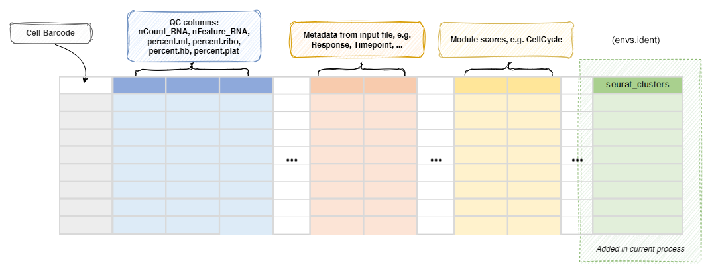

# SeuratMap2Ref

Map the seurat object to reference

See: <https://satijalab.org/seurat/articles/integration_mapping.html>
and <https://satijalab.org/seurat/articles/multimodal_reference_mapping.html>

/// Note

If you have other annotation processes, including [`SeuratClustering`](./SeuratClustering.md)
process or [`CellTypeAnnotation`](./CellTypeAnnotation.md) process enabled in the same run,
you may want to specify a different name for the column to store the mapped cluster information
using `envs.ident`, so that the results from different annotation processes won't overwrite each other.<br />

///

## Input

- `sobjfile`:
    The seurat object

## Output

- `outfile`: *Default: `{{in.sobjfile | stem}}.qs`*. <br />
    The rds file of seurat object with cell type annotated.<br />
    Note that the reduction name will be `ref.umap` for the mapping.<br />
    To visualize the mapping, you should use `ref.umap` as the reduction name.<br />

## Environment Variables

- `ncores` *(`type=int;order=-100`)*: *Default: `1`*. <br />
    Number of cores to use.<br />
    When `split_by` is used, this will be the number of cores for each object to map to the reference.<br />
    When `split_by` is not used, this is used in `future::plan(strategy = "multicore", workers = <ncores>)`
    to parallelize some Seurat procedures.<br />
    See also: <https://satijalab.org/seurat/archive/v3.0/future_vignette.html>
- `mutaters` *(`type=json`)*: *Default: `{}`*. <br />
    The mutaters to mutate the metadata.<br />
    This is helpful when we want to create new columns for `split_by`.<br />
    See <https://pwwang.github.io/biopipen.utils.R/reference/MutateSeuratMeta.html>.<br />
- `use`:
    A column name of metadata from the reference
    (e.g. `celltype.l1`, `celltype.l2`) to transfer to the query as the
    cell types (ident) for downstream analysis. This field is required.<br />
    If you want to transfer multiple columns, you can use
    `envs.MapQuery.refdata`.<br />
- `ident`: *Default: `seurat_clusters`*. <br />
    The name of the ident for query transferred from `envs.use` of the reference.<br />
- `ref`:
    The reference seurat object file.<br />
    Either an RDS file or a h5seurat file that can be loaded by
    `Seurat::LoadH5Seurat()`.<br />
    The file type is determined by the extension. `.rds` or `.RDS` for
    RDS file, `.h5seurat` or `.h5` for h5seurat file.<br />
- `refnorm` *(`choice`)*: *Default: `auto`*. <br />
    Normalization method the reference used. The same method will be used for the query.<br />
    - `LogNormalize`:
        Using [`NormalizeData`](https://satijalab.org/seurat/reference/normalizedata).<br />
    - `SCTransform`:
        Using [`SCTransform`](https://satijalab.org/seurat/reference/sctransform).<br />
    - `SCT`:
        Alias of SCTransform.<br />
    - `auto`:
        Automatically detect the normalization method.<br />
        If the default assay of reference is `SCT`, then `SCTransform` will be used.<br />
- `split_by`:
    The column name in metadata to split the query into multiple objects.<br />
    This helps when the original query is too large to process.<br />
- `skip_if_normalized`: *Default: `True`*. <br />
    Skip normalization if the query is already normalized.<br />
    Since the object is supposed to be generated by `SeuratPreparing`, it is already normalized.<br />
    However, a different normalization method may be used.<br />
    If the reference is normalized by the same method as the query, the normalization can be skipped.<br />
    Otherwise, the normalization cannot be skipped.<br />
    The normalization method used for the query set is determined by the default assay.<br />
    If `SCT`, then `SCTransform` is used; otherwise, `NormalizeData` is used.<br />
    You can set this to `False` to force re-normalization (with or without the arguments previously used).<br />
- `SCTransform` *(`ns`)*:
    Arguments for [`SCTransform()`](https://satijalab.org/seurat/reference/sctransform)
    - `do-correct-umi` *(`flag`)*: *Default: `False`*. <br />
        Place corrected UMI matrix in assay counts layer?<br />
    - `do-scale` *(`flag`)*: *Default: `False`*. <br />
        Whether to scale residuals to have unit variance?<br />
    - `do-center` *(`flag`)*: *Default: `True`*. <br />
        Whether to center residuals to have mean zero?<br />
    - `<more>`:
        See <https://satijalab.org/seurat/reference/sctransform>.<br />
        Note that the hyphen (`-`) will be transformed into `.` for the keys.<br />
- `NormalizeData` *(`ns`)*:
    Arguments for [`NormalizeData()`](https://satijalab.org/seurat/reference/normalizedata)
    - `normalization-method`: *Default: `LogNormalize`*. <br />
        Normalization method.<br />
    - `<more>`:
        See <https://satijalab.org/seurat/reference/normalizedata>.<br />
        Note that the hyphen (`-`) will be transformed into `.` for the keys.<br />
- `FindTransferAnchors` *(`ns`)*:
    Arguments for [`FindTransferAnchors()`](https://satijalab.org/seurat/reference/findtransferanchors)
    - `normalization-method` *(`choice`)*:
        Name of normalization method used.<br />
        - `LogNormalize`:
            Log-normalize the data matrix
        - `SCT`:
            Scale data using the SCTransform method
        - `auto`:
            Automatically detect the normalization method.<br />
            See `envs.refnorm`.<br />
    - `reference-reduction`:
        Name of dimensional reduction to use from the reference if running the pcaproject workflow.<br />
        Optionally enables reuse of precomputed reference dimensional reduction.<br />
    - `<more>`:
        See <https://satijalab.org/seurat/reference/findtransferanchors>.<br />
        Note that the hyphen (`-`) will be transformed into `.` for the keys.<br />
- `MapQuery` *(`ns`)*:
    Arguments for [`MapQuery()`](https://satijalab.org/seurat/reference/mapquery)
    - `reference-reduction`:
        Name of reduction to use from the reference for neighbor finding
    - `reduction-model`:
        `DimReduc` object that contains the umap model.<br />
    - `refdata` *(`type=json`)*: *Default: `{}`*. <br />
        Extra data to transfer from the reference to the query.<br />
    - `<more>`:
        See <https://satijalab.org/seurat/reference/mapquery>.<br />
        Note that the hyphen (`-`) will be transformed into `.` for the keys.<br />
- `cache` *(`type=auto`)*: *Default: `/tmp`*. <br />
    Whether to cache the information at different steps.<br />
    If `True`, the seurat object will be cached in the job output directory, which will be not cleaned up when job is rerunning.<br />
    The cached seurat object will be saved as `<signature>.<kind>.RDS` file, where `<signature>` is the signature determined by
    the input and envs of the process.<br />
    See <https://github.com/satijalab/seurat/issues/7849>, <https://github.com/satijalab/seurat/issues/5358> and
    <https://github.com/satijalab/seurat/issues/6748> for more details also about reproducibility issues.<br />
    To not use the cached seurat object, you can either set `cache` to `False` or delete the cached file at
    `<signature>.RDS` in the cache directory.<br />
- `plots` *(`type=json`)*: *Default: `{'Mapped Identity': Diot({'features': '{ident}:{use}'}), 'Mapping Score': Diot({'features': '{ident}.score'})}`*. <br />
    The plots to generate.<br />
    The keys are the names of the plots and the values are the arguments for the plot.<br />
    The arguments will be passed to `biopipen.utils::VizSeuratMap2Ref()` to generate the plots.<br />
    The plots will be saved to the output directory.<br />
    See <https://pwwang.github.io/biopipen.utils.R/reference/VizSeuratMap2Ref.html>.<br />

## Details


### Preparing a Seurat reference for mapping

#### Step 0: Create the Seurat reference object

Start from raw counts.<br />

```r
reference <- CreateSeuratObject(counts = reference_counts)
```

At this stage the object should contain at least:<br />

* RNA counts
* cell barcodes

#### Step 1: Choose normalization strategy

Two main normalization strategies are supported for reference mapping.<br />

##### Option A — LogNormalize workflow

Recommended for:<br />

* standard scRNA-seq
* single modality datasets
* smaller references

```r
reference <- NormalizeData(reference, normalization.method = "LogNormalize", scale.factor = 10000)
reference <- FindVariableFeatures(reference, selection.method = "vst", nfeatures = 2000)
reference <- ScaleData(reference)
```

This produces the normalized expression matrix used for PCA.<br />

##### Option B — SCTransform workflow

Recommended for:<br />

* large datasets
* heterogeneous samples
* multimodal references (e.g. CITE-seq)

```r
reference <- SCTransform(reference, verbose = FALSE)
```

Important notes:<br />

* Creates an **SCT assay**
* Variable features and scaling are performed automatically
* Mapping later requires `normalization.method = "SCT"`

#### Step 2: Choose dimensional reduction

The reference must contain a dimensional reduction used for mapping.<br />

##### Option A — PCA (standard references)

Used with LogNormalize.<br />

```r
reference <- RunPCA(reference, verbose = FALSE)
```

Typical usage:<br />

* 30-50 PCs

##### Option B — SPCA (supervised PCA)

Used with SCTransform references and often in multimodal workflows.<br />

```r
reference <- RunSPCA(reference, assay = "SCT")
```

SPCA learns a projection supervised by a cell‑cell similarity graph and is commonly used in reference atlases.<br />

####  Step 3: Compute neighbors and clustering (optional but recommended)

Precomputing neighbors allows faster anchor finding.<br />

##### PCA reference

```r
reference <- FindNeighbors(reference, reduction = "pca", dims = 1:30)
reference <- FindClusters(reference, resolution = 0.5)
```

##### SPCA / multimodal reference

```r
reference <- FindMultiModalNeighbors(
reference,
reduction.list = list("spca"),
dims.list = list(1:30)
)
```

This creates a **weighted nearest neighbor (WNN)** graph.<br />

#### Step 4: Compute UMAP and store the model

To allow `MapQuery` to project new cells into the same UMAP space, the model must be saved.<br />

```r
reference <- RunUMAP(
    reference,
    reduction = "pca",
    dims = 1:30,
    return.model = TRUE
)
```

For WNN references:<br />

```r
reference <- RunUMAP(
    reference,
    nn.name = "weighted.nn",
    reduction.name = "wnn.umap",
    return.model = TRUE
)
```

Storing the model enables **ProjectUMAP / MapQuery** to reuse the trained embedding.<br />

#### Step 5: Annotate the reference

Reference mapping transfers metadata labels.<br />

Add cell type annotations to metadata:<br />

```r
reference$celltype <- annotated_celltypes
reference$celltype_l1 <- broad_labels
reference$celltype_l2 <- fine_labels
```

Any metadata field can later be transferred.<br />

#### Step 6: Save the reference

```r
saveRDS(reference, "reference.rds")
```

Or save it in [qs2](https://github.com/qsbase/qs2) format for faster loading:<br />

```r
biopipen.utils::save_obj(reference, "reference.qs")
```

This allows the reference to be reused across multiple mapping runs.<br />

### Prepare the query dataset (can be done with `SeuratPreparing` process)

The **query must use the same normalization method as the reference**.<br />

If the query is not normalized in the same way as the reference, you can specify arguments
in `envs.NormalizeData` or `envs.SCTransform` for this process to reproduce the same normalization.<br />

You can also specify `envs.skip_if_normalized = false` to force re‑normalization of the query dataset.<br />

### Find transfer anchors (arguments specified in `envs.FindTransferAnchors`)

Anchors link cells between the query and reference.<br />

#### LogNormalize reference

```r
anchors <- FindTransferAnchors(
    reference = reference,
    query = query,
    reference.reduction = "pca",
    dims = 1:30,
    normalization.method = "LogNormalize"
)
```

#### SCTransform reference

```r
anchors <- FindTransferAnchors(
    reference = reference,
    query = query,
    reference.reduction = "spca",
    dims = 1:30,
    normalization.method = "SCT"
)
```

Optional useful parameters:<br />

* `reference.assay = "SCT"`
* `recompute.residuals = TRUE`
* `reference.neighbors = "pca.nn"` (reuse neighbor index if precomputed)

### Map the query (arguments specified in `envs.MapQuery`)

```r
query <- MapQuery(
    anchorset = anchors,
    query = query,
    reference = reference,
    refdata = list(celltype = "celltype"),
    reference.reduction = "pca",
    reduction.model = "umap"
)
```

`MapQuery` performs:<br />

1. `TransferData`
2. `IntegrateEmbeddings`
3. `ProjectUMAP`

The query cells will:<br />

* receive predicted cell type labels
* be projected into the reference UMAP

The reference UMAP reduction is reused and saved in the query object as `ref.umap`.<br />

### Decision summary

| Reference type          | Normalization | Reduction  | Typical use                       |
| ----------------------- | ------------- | ---------- | --------------------------------- |
| Standard scRNA‑seq      | LogNormalize  | PCA        | Single modality datasets          |
| Large / atlas reference | SCTransform   | SPCA       | Large heterogeneous datasets      |
| Multimodal reference    | SCTransform   | SPCA + WNN | CITE‑seq / multimodal integration |

---

### Important rules

1. Query and reference **must use the same normalization strategy**.<br />
2. The **reference dimensional reduction must already exist**.<br />
3. Metadata labels in the reference are required for label transfer.<br />
4. Store a **UMAP model (`return.model = TRUE`)** to enable projection.<br />
5. Precomputing neighbors improves performance for repeated mapping.<br />
6. Use `ref.umap` for consistent visualization of mapped query cells.<br />

### Practical advice

For high-quality reference atlases:<br />

* integrate multiple datasets first
* curate annotations carefully
* use ~30-50 PCs
* keep metadata hierarchy (broad → fine labels)

The reference effectively acts as a **pretrained cell atlas** that new datasets can be projected onto.<br />

## Metadata

The metadata of the `Seurat` object will be updated with the cluster
assignments (column name determined by `envs.name`):<br />



