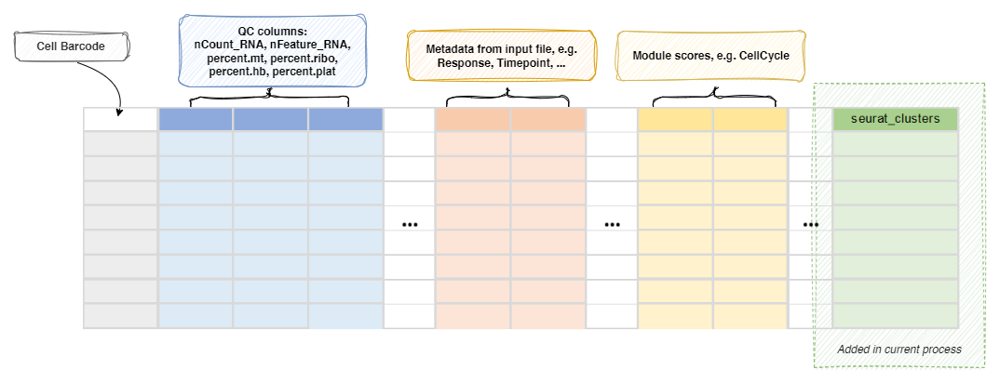

# SeuratMap2Ref

Map the seurat object to reference

See: <https://satijalab.org/seurat/articles/integration_mapping.html>
and <https://satijalab.org/seurat/articles/multimodal_reference_mapping.html>

## Environment Variables

- `ncores` *(`type=int;order=-100`)*: *Default: `1`*.  
    Number of cores to use. 
    Used in `future::plan(strategy = "multicore", workers = <ncores>)`
    to parallelize some Seurat procedures. 
    See also: <https://satijalab.org/seurat/articles/future_vignette.html>
- `use`:
    A column name of metadata from the reference
    (e.g. `celltype.l1`, `celltype.l2`) to transfer to the query as the
    cell types (ident) for downstream analysis. This field is required. 
    If you want to transfer multiple columns, you can use
    `envs.MapQuery.refdata`. 
- `ident`: *Default: `seurat_clusters`*.  
    The name of the ident for query transferred from `envs.use` of the reference. 
- `ref`:
    The reference seurat object file. 
    Either an RDS file or a h5seurat file that can be loaded by
    `Seurat::LoadH5Seurat()`. 
    The file type is determined by the extension. `.rds` or `.RDS` for
    RDS file, `.h5seurat` or `.h5` for h5seurat file. 
- `SCTransform` *(`ns`)*:
    Arguments for [`SCTransform()`](https://satijalab.org/seurat/reference/sctransform)
    - `do-correct-umi` *(`flag`)*: *Default: `False`*.  
        Place corrected UMI matrix in assay counts layer? 
    - `do-scale` *(`flag`)*: *Default: `False`*.  
        Whether to scale residuals to have unit variance? 
    - `do-center` *(`flag`)*: *Default: `True`*.  
        Whether to center residuals to have mean zero? 
    - `<more>`:
        See <https://satijalab.org/seurat/reference/sctransform>. 
        Note that the hyphen (`-`) will be transformed into `.` for the keys. 
- `FindTransferAnchors` *(`ns`)*:
    Arguments for [`FindTransferAnchors()`](https://satijalab.org/seurat/reference/findtransferanchors)
    - `normalization-method` *(`choice`)*: *Default: `SCT`*.  
        Name of normalization method used. 
        - `LogNormalize`:
            Log-normalize the data matrix
        - `SCT`:
            Scale data using the SCTransform method
    - `reference-reduction`: *Default: `spca`*.  
        Name of dimensional reduction to use from the reference if running the pcaproject workflow. 
        Optionally enables reuse of precomputed reference dimensional reduction. 
    - `<more>`:
        See <https://satijalab.org/seurat/reference/findtransferanchors>. 
        Note that the hyphen (`-`) will be transformed into `.` for the keys. 
- `MapQuery` *(`ns`)*:
    Arguments for [`MapQuery()`](https://satijalab.org/seurat/reference/mapquery)
    - `reference-reduction`: *Default: `spca`*.  
        Name of reduction to use from the reference for neighbor finding
    - `reduction-model`: *Default: `wnn.umap`*.  
        `DimReduc` object that contains the umap model. 
    - `refdata` *(`type=json`)*: *Default: `{}`*.  
        Extra data to transfer from the reference to the query. 
    - `<more>`:
        See <https://satijalab.org/seurat/reference/mapquery>. 
        Note that the hyphen (`-`) will be transformed into `.` for the keys. 
- `MappingScore` *(`ns`)*:
    Arguments for [`MappingScore()`](https://satijalab.org/seurat/reference/mappingscore)
    - `<more>`:
        See <https://satijalab.org/seurat/reference/mappingscore>. 
        Note that the hyphen (`-`) will be transformed into `.` for the keys. 
    - `ndim`: *Default: `30`*.  

## Metadata

The metadata of the `Seurat` object will be updated with the cluster
assignments (column name determined by `envs.name`): 

