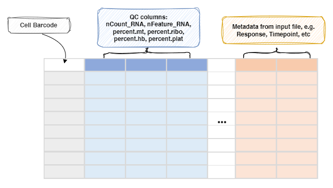

# SeuratPreparing

Load, prepare and apply QC to data, using `Seurat`

This process will -
- Prepare the seurat object
- Apply QC to the data
- Integrate the data from different samples

See also
- <https://satijalab.org/seurat/articles/pbmc3k_tutorial.html#standard-pre-processing-workflow-1)>
- <https://nbisweden.github.io/workshop-scRNAseq/labs/compiled/seurat/seurat_01_qc.html#Create_one_merged_object>

This process will read the scRNA-seq data, based on the information provided by
`SampleInfo`, specifically, the paths specified by the `RNAData` column.<br />
Those paths should be either paths to directoies containing `matrix.mtx`,
`barcodes.tsv` and `features.tsv` files that can be loaded by
[`Seurat::Read10X()`](https://satijalab.org/seurat/reference/read10x),
or paths to `h5` files that can be loaded by
[`Seurat::Read10X_h5()`](https://satijalab.org/seurat/reference/read10x_h5).<br />

Each sample will be loaded individually and then merged into one `Seurat` object, and then perform QC.<br />

In order to perform QC, some additional columns are added to the meta data of the `Seurat` object. They are:<br />

- `precent.mt`: The percentage of mitochondrial genes.<br />
- `percent.ribo`: The percentage of ribosomal genes.<br />
- `precent.hb`: The percentage of hemoglobin genes.<br />
- `percent.plat`: The percentage of platelet genes.<br />

For integration, two routes are available:<br />

- [Performing integration on datasets normalized with `SCTransform`](https://satijalab.org/seurat/articles/seurat5_integration#perform-streamlined-one-line-integrative-analysis)
- [Using `NormalizeData` and `FindIntegrationAnchors`](https://satijalab.org/seurat/articles/seurat5_integration#layers-in-the-seurat-v5-object)

/// Note
When using `SCTransform`, the default Assay will be set to `SCT` in output, rather than `RNA`.<br />
If you are using `cca` or `rpca` interation, the default assay will be `integrated`.<br />
///

/// Note
From `biopipen` v0.23.0, this requires `Seurat` v5.0.0 or higher.<br />
///

See also [Preparing the input](../preparing-input.md#scRNA-seq-data).<br />

## Environment Variables

- `ncores` *(`type=int`)*: *Default: `1`*. <br />
    Number of cores to use.<br />
    Used in `future::plan(strategy = "multicore", workers = <ncores>)`
    to parallelize some Seurat procedures.<br />
- `cell_qc`:
    Filter expression to filter cells, using
    `tidyrseurat::filter()`.<br />
    Available QC keys include `nFeature_RNA`, `nCount_RNA`,
    `percent.mt`, `percent.ribo`, `percent.hb`, and `percent.plat`.<br />

    /// Tip | Example
    Including the columns added above, all available QC keys include
    `nFeature_RNA`, `nCount_RNA`, `percent.mt`, `percent.ribo`, `percent.hb`,
    and `percent.plat`. For example:<br />

    ```toml
    [SeuratPreparing.envs]
    cell_qc = "nFeature_RNA > 200 & percent.mt < 5"
    ```
    will keep cells with more than 200 genes and less than 5%% mitochondrial
    genes.<br />
    ///

- `gene_qc` *(`ns`)*:
    Filter genes.<br />
    `gene_qc` is applied after `cell_qc`.<br />
    - `min_cells`: *Default: `0`*. <br />
        The minimum number of cells that a gene must be
        expressed in to be kept.<br />
    - `excludes`: *Default: `[]`*. <br />
        The genes to exclude. Multiple genes can be specified by
        comma separated values, or as a list.<br />

        /// Tip | Example
        ```toml
        [SeuratPreparing.envs]
        gene_qc = { min_cells = 3 }
        ```
        will keep genes that are expressed in at least 3 cells.<br />
        ///
- `use_sct` *(`flag`)*: *Default: `False`*. <br />
    Whether use SCTransform routine to integrate samples or not.<br />
    Before the following procedures, the `RNA` layer will be split by samples.<br />

    If `False`, following procedures will be performed in the order:<br />
    * [`NormalizeData`](https://satijalab.org/seurat/reference/normalizedata).<br />
    * [`FindVariableFeatures`](https://satijalab.org/seurat/reference/findvariablefeatures).<br />
    * [`ScaleData`](https://satijalab.org/seurat/reference/scaledata).<br />
    See <https://satijalab.org/seurat/articles/seurat5_integration#layers-in-the-seurat-v5-object>
    and <https://satijalab.org/seurat/articles/pbmc3k_tutorial.html>

    If `True`, following procedures will be performed in the order:<br />
    * [`SCTransform`](https://satijalab.org/seurat/reference/sctransform).<br />
    See <https://satijalab.org/seurat/articles/seurat5_integration#perform-streamlined-one-line-integrative-analysis>

- `no_integration` *(`flag`)*: *Default: `False`*. <br />
    Whether to skip integration or not.<br />
- `NormalizeData` *(`ns`)*:
    Arguments for [`NormalizeData()`](https://satijalab.org/seurat/reference/normalizedata).<br />
    `object` is specified internally, and `-` in the key will be replaced with `.`.<br />
    - `<more>`:
        See <https://satijalab.org/seurat/reference/normalizedata>
- `FindVariableFeatures` *(`ns`)*:
    Arguments for [`FindVariableFeatures()`](https://satijalab.org/seurat/reference/findvariablefeatures).<br />
    `object` is specified internally, and `-` in the key will be replaced with `.`.<br />
    - `<more>`:
        See <https://satijalab.org/seurat/reference/findvariablefeatures>
- `ScaleData` *(`ns`)*:
    Arguments for [`ScaleData()`](https://satijalab.org/seurat/reference/scaledata).<br />
    `object` and `features` is specified internally, and `-` in the key will be replaced with `.`.<br />
    - `<more>`:
        See <https://satijalab.org/seurat/reference/scaledata>
- `RunPCA` *(`ns`)*:
    Arguments for [`RunPCA()`](https://satijalab.org/seurat/reference/runpca).<br />
    `object` and `features` is specified internally, and `-` in the key will be replaced with `.`.<br />
    - `npcs` *(`type=int`)*:
        The number of PCs to compute.<br />
        For each sample, `npcs` will be no larger than the number of columns - 1.<br />
    - `<more>`:
        See <https://satijalab.org/seurat/reference/runpca>
- `SCTransform` *(`ns`)*:
    Arguments for [`SCTransform()`](https://satijalab.org/seurat/reference/sctransform).<br />
    `object` is specified internally, and `-` in the key will be replaced with `.`.<br />
    - ``return-only-var-genes``:
        Whether to return only variable genes.<br />
    - ``min_cells``:
        The minimum number of cells that a gene must be expressed in to be kept.<br />
        A hidden argument of `SCTransform` to filter genes.<br />
        If you try to keep all genes in the `RNA` assay, you can set `min_cells` to `0` and
        `return-only-var-genes` to `False`.<br />
        See <https://github.com/satijalab/seurat/issues/3598#issuecomment-715505537>
    - `<more>`:
        See <https://satijalab.org/seurat/reference/sctransform>
    - `return-only-var-genes`: *Default: `True`*. <br />
    - `min_cells`: *Default: `5`*. <br />
- `IntegrateLayers` *(`ns`)*:
    Arguments for [`IntegrateLayers()`](https://satijalab.org/seurat/reference/integratelayers).<br />
    `object` is specified internally, and `-` in the key will be replaced with `.`.<br />
    When `use_sct` is `True`, `normalization-method` defaults to `SCT`.<br />
    - `method` *(`choice`)*: *Default: `harmony`*. <br />
        The method to use for integration.<br />
        - `CCAIntegration`:
            Use `Seurat::CCAIntegration`.<br />
        - `CCA`:
            Same as `CCAIntegration`.<br />
        - `cca`:
            Same as `CCAIntegration`.<br />
        - `RPCAIntegration`:
            Use `Seurat::RPCAIntegration`.<br />
        - `RPCA`:
            Same as `RPCAIntegration`.<br />
        - `rpca`:
            Same as `RPCAIntegration`.<br />
        - `HarmonyIntegration`:
            Use `Seurat::HarmonyIntegration`.<br />
        - `Harmony`:
            Same as `HarmonyIntegration`.<br />
        - `harmony`:
            Same as `HarmonyIntegration`.<br />
        - `FastMNNIntegration`:
            Use `Seurat::FastMNNIntegration`.<br />
        - `FastMNN`:
            Same as `FastMNNIntegration`.<br />
        - `fastmnn`:
            Same as `FastMNNIntegration`.<br />
        - `scVIIntegration`:
            Use `Seurat::scVIIntegration`.<br />
        - `scVI`:
            Same as `scVIIntegration`.<br />
        - `scvi`:
            Same as `scVIIntegration`.<br />
    - `<more>`:
        See <https://satijalab.org/seurat/reference/integratelayers>

## Metadata

Here is the demonstration of basic metadata for the `Seurat` object. Future
processes will use it and/or add more metadata to the `Seurat` object.<br />



