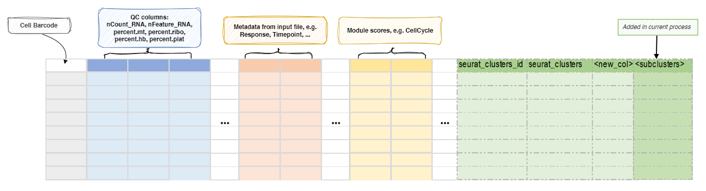

# SeuratSubClustering

Sub-clustering for all or selected T/B cells.

Find clusters of a subset of cells. 

It's unlike [`Seurat::FindSubCluster`], which only finds subclusters of a single
cluster. Instead, it will perform the whole clustering procedure on the subset of
cells. One can use metadata to specify the subset of cells to perform clustering on. 

For the subset of cells, the reductions will be re-performed on the subset of cells,
and then the clustering will be performed on the subset of cells. The reduction
will be saved in `object@reduction$<casename>.<reduction>` of the original object and the
clustering will be saved in the metadata of the original object using the casename
as the column name. 

## Input

- `srtobj`:
    The seurat object in RDS or qs/qs2 format. 

## Output

- `outfile`: *Default: `{{in.srtobj | stem}}.qs`*.  
    The seurat object with the subclustering information in qs/qs2 format. 

## Environment Variables

- `ncores` *(`type=int;order=-100`)*: *Default: `1`*.  
    Number of cores to use. 
    Used in `future::plan(strategy = "multicore", workers = <ncores>)`
    to parallelize some Seurat procedures. 
- `mutaters` *(`type=json`)*: *Default: `{}`*.  
    The mutaters to mutate the metadata to subset the cells. 
    The mutaters will be applied in the order specified. 
- `subset`:
    An expression to subset the cells, will be passed to
    [`tidyseurat::filter()`](https://stemangiola.github.io/tidyseurat/reference/filter.html). 
- `RunPCA` *(`ns`)*:
    Arguments for [`RunPCA()`](https://satijalab.org/seurat/reference/runpca). 
    `object` is specified internally as the subset object, and `-` in the key will be replaced with `.`. 
    - `<more>`:
        See <https://satijalab.org/seurat/reference/runpca>
- `RunUMAP` *(`ns`)*:
    Arguments for [`RunUMAP()`](https://satijalab.org/seurat/reference/runumap). 
    `object` is specified internally as the subset object, and `-` in the key will be replaced with `.`. 
    `dims=N` will be expanded to `dims=1:N`; The maximal value of `N` will be the minimum of `N` and the number of columns - 1 for each sample. 
    - `dims` *(`type=int`)*:
        The number of PCs to use
    - `reduction`:
        The reduction to use for UMAP. 
        If not provided, `sobj@misc$integrated_new_reduction` will be used. 
    - `<more>`:
        See <https://satijalab.org/seurat/reference/runumap>
- `FindNeighbors` *(`ns`)*:
    Arguments for [`FindNeighbors()`](https://satijalab.org/seurat/reference/findneighbors). 
    `object` is specified internally, and `-` in the key will be replaced with `.`. 
    - `reduction`:
        The reduction to use. 
        If not provided, `object@misc$integrated_new_reduction` will be used. 
    - `<more>`:
        See <https://satijalab.org/seurat/reference/findneighbors>
- `FindClusters` *(`ns`)*:
    Arguments for [`FindClusters()`](https://satijalab.org/seurat/reference/findclusters). 
    `object` is specified internally, and `-` in the key will be replaced with `.`. 
    The cluster labels will be prefixed with "s". The first cluster will be "s1", instead of "s0". 
    - `resolution` *(`type=auto`)*: *Default: `0.8`*.  
        The resolution of the clustering. You can have multiple resolutions as a list or as a string separated by comma. 
        Ranges are also supported, for example: `0.1:0.5:0.1` will generate `0.1, 0.2, 0.3, 0.4, 0.5`. The step can be omitted, defaulting to 0.1. 
        The results will be saved in `<casename>_<resolution>`. 
        The final resolution will be used to define the clusters at `<casename>`. 
    - `<more>`:
        See <https://satijalab.org/seurat/reference/findclusters>
- `cache` *(`type=auto`)*: *Default: `/tmp`*.  
    Whether to cache the results. 
    If `True`, the seurat object will be cached in the job output directory, which will be not cleaned up when job is rerunning. 
    Set to `False` to not cache the results. 
- `cases` *(`type=json`)*: *Default: `{}`*.  
    The cases to perform subclustering. 
    Keys are the names of the cases and values are the dicts inherited from `envs` except `mutaters` and `cache`. 
    If empty, a case with name `subcluster` will be created with default parameters. 
    The case name will be passed to `biopipen.utils::SeuratSubCluster()` as `name`. 
    It will be used as the prefix for the reduction name, keys and cluster names. 
    For reduction keys, it will be `toupper(<name>)` + "PC_" and `toupper(<name>)` + "UMAP_". 
    For cluster names, it will be `<name>` + "." + resolution. 
    And the final cluster name will be `<name>`. 
    Note that the `name` should be alphanumeric and anything other than alphanumeric will be removed. 

## Metadata

The metadata of the `Seurat` object will be updated with the sub-clusters
specified by names (keys) of `envs.cases`: 

