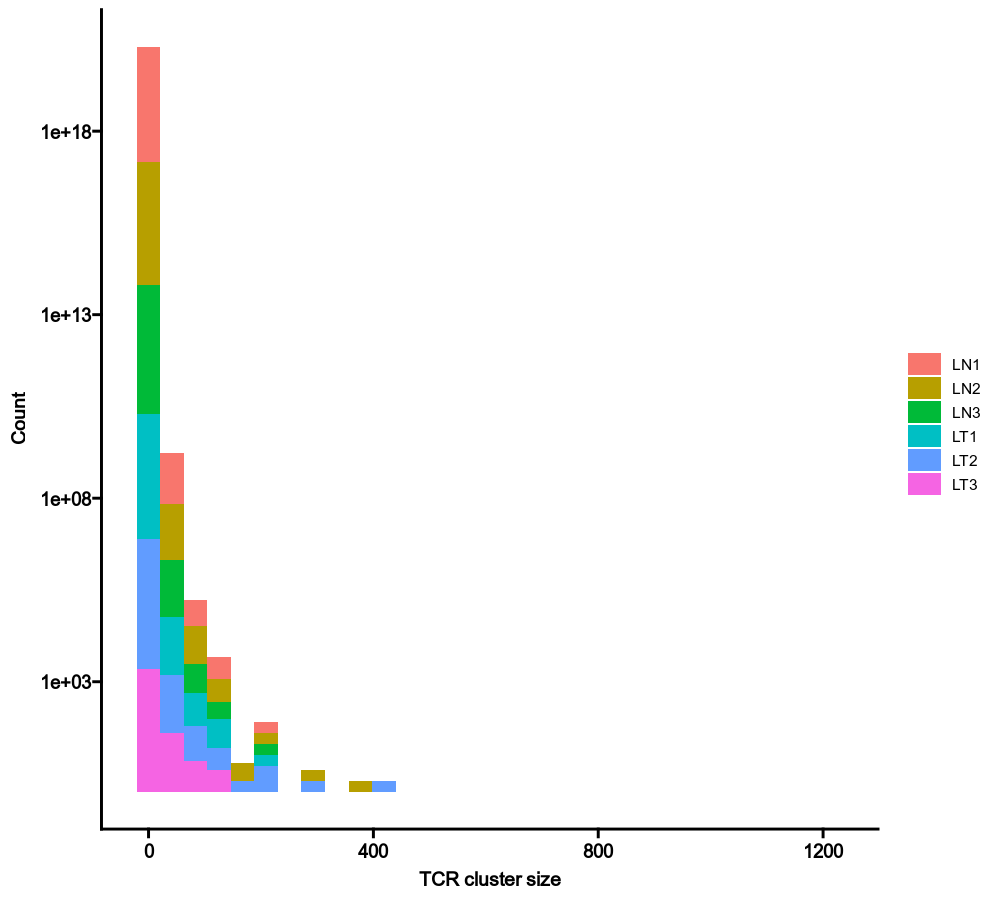
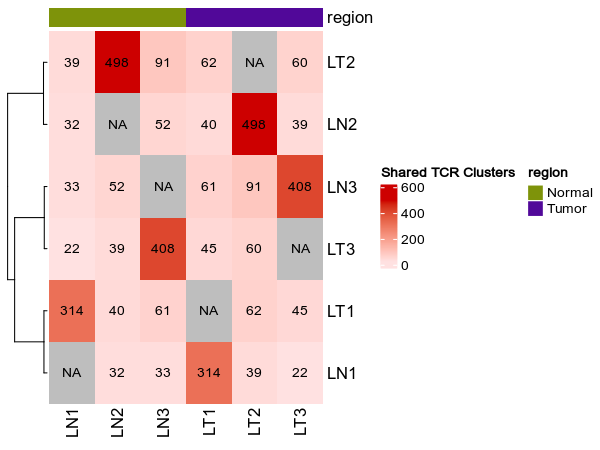
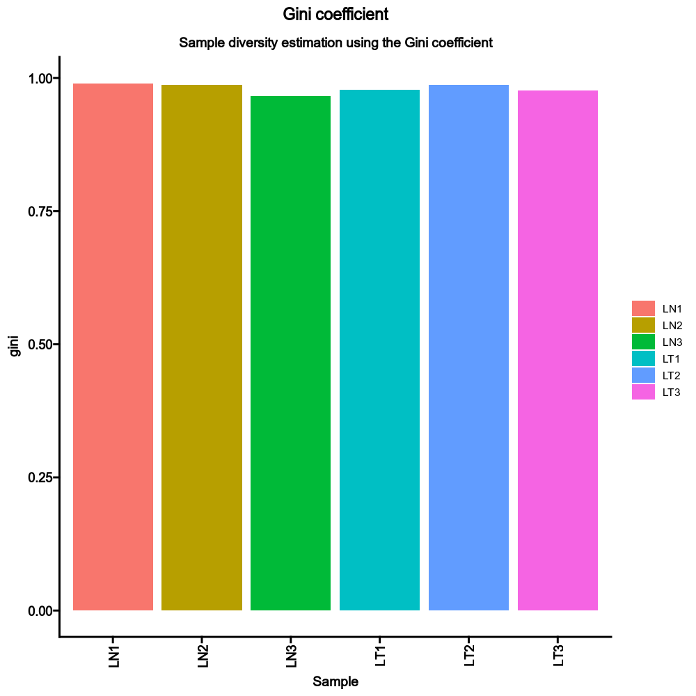
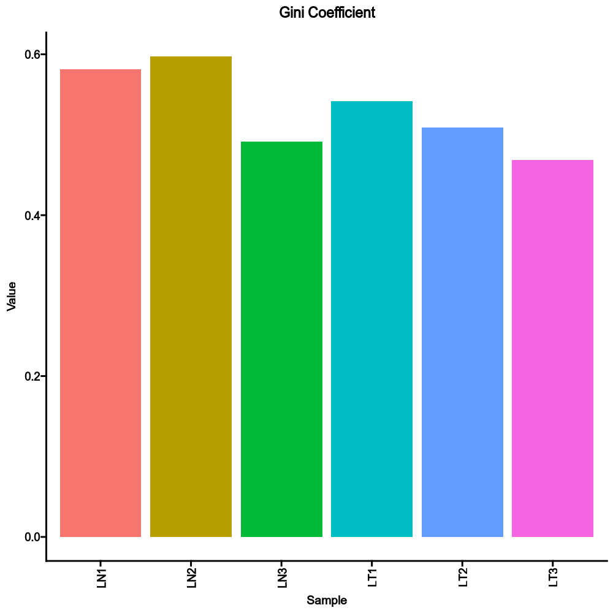

# TCRClusteringStats

This process explores the Statistics of TCR clusters, generated by [TCRClustering](./TCRClustering.md).

The statistics include:

- The number of cells in each cluster (cluster size)
- Sample diversity using TCR clusters instead of TCR clones
- Shared TCR clusters between samples

## Environment variables

All of the following environment variables follow the multi-case design pattern for the environment variables. See also [Multi-case variable design](../configurations.md#multi-case-variable-design).

- `cluster_size` (`ns`): The distribution of size of each cluster.
    - `by`: The variables (column names) used to fill the histogram.
        Only a single column is supported.
    - `devpars` (`ns`): The parameters for the plotting device.
        - `width` (`type=int`): The width of the device
        - `height` (`type=int`): The height of the device
        - `res` (`type=int`): The resolution of the device
    - `cases` (`type=json`): If you have multiple cases, you can use this
        argument to specify them. The keys will be the names of the
        cases. The values will be passed to the corresponding arguments
        above. If any of these arguments are not specified, the values
        in `envs.cluster_size` will be used. If NO cases are
        specified, the default case will be added, with the name
        `DEFAULT`.
- `shared_clusters` (`ns`): Stats about shared TCR clusters
    - numbers_on_heatmap (flag): Whether to show the
        numbers on the heatmap.
    - heatmap_meta (list): The columns of metadata to show on the
        heatmap.
    - grouping: The groups to investigate the shared clusters.
        If specified, venn diagrams will be drawn instead of heatmaps.
        In such case, `numbers_on_heatmap` and `heatmap_meta` will be
        ignored.
    - `devpars` (`ns`): The parameters for the plotting device.
        - `width` (`type=int`): The width of the device
        - `height` (`type=int`): The height of the device
        - `res` (`type=int`): The resolution of the device
    - `cases` (`type=json`): If you have multiple cases, you can use this
        argument to specify them. The keys will be the names of the
        cases. The values will be passed to the corresponding arguments
        above. If any of these arguments are not specified, the values
        in `envs.shared_clusters` will be used. If NO cases are
        specified, the default case will be added, with the name
        `DEFAULT`.
- `sample_diversity` (`ns`): Sample diversity using TCR clusters instead of
    clones.
    - `by`: The variables (column names) to group samples.
        Multiple columns should be separated by `,`.
    - `method` (`choice`): The method to calculate diversity.
        - `gini`: The Gini coefficient.
            It measures the inequality among values of a frequency
            distribution (for example levels of income).
        - `gini.simp`: The Gini-Simpson index.
            It is the probability of interspecific encounter, i.e.,
            probability that two entities represent different types.
        - `inv.simp`: Inverse Simpson index.
            It is the effective number of types that is obtained when
            the weighted arithmetic mean is used to quantify average
            proportional abundance of types in the dataset of interest.
        - `div`: true diversity, or the effective number of types.
            It refers to the number of equally abundant types needed
            for the average proportional abundance of the types to
            equal that observed in the dataset of interest where all
            types may not be equally abundant.
    - `devpars` (`ns`): The parameters for the plotting device.
        - `width` (`type=int`): The width of the device
        - `height` (`type=int`): The height of the device
        - `res` (`type=int`): The resolution of the device
    - `cases` (`type=json`): If you have multiple cases, you can use this
        argument to specify them. The keys will be the names of the
        cases. The values will be passed to the corresponding arguments
        above. If any of these arguments are not specified, the values
        in `envs.sample_diversity` will be used. If NO cases are
        specified, the default case will be added, with the name
        `DEFAULT`.

## Examples

### Cluster size

```toml
[TCRClusteringStats.envs.cluster_size]
by = "Sample"
```

{: width="80%"}

### Shared clusters

```toml
[TCRClusteringStats.envs.shared_clusters]
numbers_on_heatmap = true
heatmap_meta = ["region"]
```

{: width="80%"}

### Sample diversity

```toml
[TCRClusteringStats.envs.sample_diversity]
method = "gini"
```

{: width="80%"}

Compared to the sample diversity using TCR clones:

{: width="80%"}
