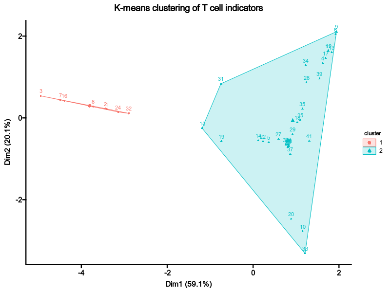

# TCellSelection

Separate T and non-T cells and select T cells.

If all of your cells are T cells, do not set any configurations for this process.

In such a case, [`SeuratClusteringOfAllCells`](SeuratClusteringOfAllCells.md) will be clustering all T cells and [`SeuratClusteringOfTCells`](SeuratClusteringOfTCells.md) will be skipped.

There are two ways to separate T and non-T cells:

1. Use the T cell indicator directly from the metadata.
2. Use the expression values of indicator genes, and the clonotype percentage of the clusters.

## Environment variables

- `tcell_indicator`: The expression passed to `tidyseurat::mutate(is_TCell = ...)` to indicate whether a cell is a T cell. For example, `Clonotype_Pct > 0.25` to indicate cells with clonotype percentage > 25% are T cells.
- `indicator_genes` (`list`): A list of indicator genes whose expression values and clonotype percentage will be used to determine T cells. A kmeans clustering will be performed on those values with K=2.

## Examples

### Use T cell indicator directly

If you have a metadata like this:

| id | Clonotype_Pct | seurat_clusters |
|----|---------------|-----------------|
| 1  | 0.1           | 1               |
| 2  | 0.3           | 2               |
| 3  | 0.5           | 3               |

With the configuration below:

```toml
[TCellSelection.envs]
tcell_indicator = "Clonotype_Pct > 0.25"
```

The T cells will be selected as:

| id | Clonotype_Pct | seurat_clusters | is_TCell |
|----|---------------|-----------------|----------|
| 1  | 0.1           | 1               | FALSE    |
| 2  | 0.3           | 2               | TRUE     |
| 3  | 0.5           | 3               | TRUE     |

### Use indicator genes

Let's say we set the indicator genes to `["CD3D", "CD3E", "CD3G"]`.

The mean expression values will be calculated for each cluster:

| id | Clonotype_Pct | seurat_clusters | CD3D | CD3E | CD3G |
|----|---------------|-----------------|------|------|------|
| 1  | 0.1           | 1               | 0.1  | 0.0  | 0.1  |
| 2  | 0.3           | 2               | 1.2  | 1.3  | 0.6  |
| 3  | 0.5           | 3               | 1.5  | 0.8  | 0.9  |

Then a kmeans clustering will be performed on the mean expression values of the indicator genes, together with `Clonotype_Pct`, with K=2.

| id | Clonotype_Pct | seurat_clusters | CD3D | CD3E | CD3G | is_TCell |
|----|---------------|-----------------|------|------|------|----------|
| 1  | 0.1           | 1               | 0.1  | 0.0  | 0.1  | FALSE    |
| 2  | 0.3           | 2               | 1.2  | 1.3  | 0.6  | TRUE     |
| 3  | 0.5           | 3               | 1.5  | 0.8  | 0.9  | TRUE     |



The cells within clusters that are marked by `is_TCell = TRUE` will be selected as T cells, and sent to [`SeuratClusteringOfTCells`](SeuratClusteringOfTCells.md) for further clustering and downstream analysis.
