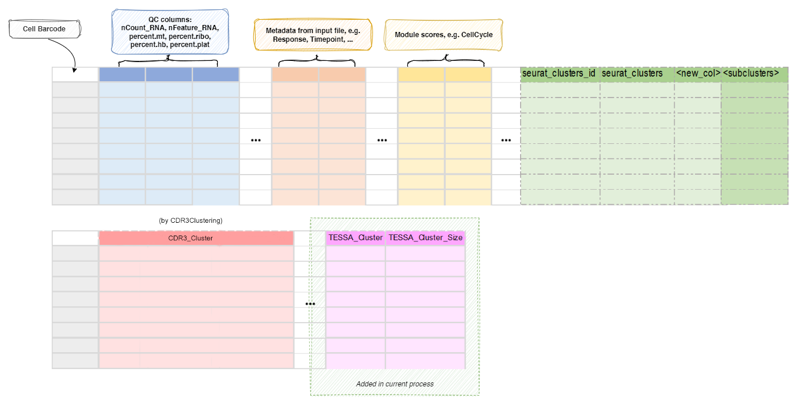

# TESSA

Tessa is a Bayesian model to integrate T cell receptor (TCR) sequence profiling with transcriptomes of T cells.

Enabled by the recently developed single cell sequencing techniques, which provide
both TCR sequences and RNA sequences of each T cell concurrently, Tessa maps the
functional landscape of the TCR repertoire, and generates insights into
understanding human immune response to diseases. As the first part of tessa,
BriseisEncoder is employed prior to the Bayesian algorithm to capture the TCR
sequence features and create numerical embeddings. We showed that the reconstructed
Atchley Factor matrices and CDR3 sequences, generated through the numerical
embeddings, are highly similar to their original counterparts. The CDR3 peptide
sequences are constructed via a RandomForest model applied on the reconstructed
Atchley Factor matrices. 

See <https://github.com/jcao89757/TESSA>

When finished, two columns will be added to the `meta.data` of the `Seurat` object: 

- `TESSA_Cluster`: The cluster assignments from TESSA. 
- `TESSA_Cluster_Size`: The number of cells in each cluster. 

These columns can be then used for further downstream analysis to explore the
functional landscape of the TCR repertoire. 

/// Tip

If you are using docker image to run the pipeline, you can use
`envs.python = "python_np1"` to use the python environment with
necessary python packages installed. 

///

## Input

- `screpdata`:
    The data loaded by `ScRepCombiningExpression`, saved in RDS or
    qs/qs2 format. 
    The data is actually generated by `scRepertiore::combineExpression()`. 
    The data must have both TRA and TRB chains. 

## Output

- `outfile`: *Default: `{{in.screpdata | stem}}.tessa.qs`*.  
    a qs fileof a Seurat object, with
    `TESSA_Cluster` and `TESSA_Cluster_Size` added to the `meta.data`

## Environment Variables

- `python`: *Default: `python`*.  
    The path of python with `TESSA`'s dependencies installed
- `within_sample` *(`flag`)*: *Default: `False`*.  
    Whether the TCR networks are constructed only
    within TCRs from the same sample/patient (True) or with all the
    TCRs in the meta data matrix (False). 
- `assay`:
    Which assay to use to extract the expression matrix. 
    Only works if `in.srtobj` is an RDS file of a Seurat object. 
    By default, if `SCTransform` is performed, `SCT` will be used. 
- `predefined_b` *(`flag`)*: *Default: `False`*.  
    Whether use the predefined `b` or not. 
    Please check the paper of tessa for more details about the b vector. 
    If True, the tessa will not update b in the MCMC iterations. 
- `max_iter` *(`type=int`)*: *Default: `1000`*.  
    The maximum number of iterations for MCMC. 
- `save_tessa` *(`flag`)*: *Default: `False`*.  
    Save tessa detailed results to seurat object? 
    It will be saved to `sobj@misc$tessa`. 

## Reference

- 'Mapping the Functional Landscape of TCR Repertoire.',
    Zhang, Z., Xiong, D., Wang, X. et al. 2021. 
    [link](https://www.nature.com/articles/s41592-020-01020-3)
- 'Deep learning-based prediction of the T cell receptor-antigen
    binding specificity.', Lu, T., Zhang, Z., Zhu, J. et al. 2021. 
    [link](https://www.nature.com/articles/s42256-021-00383-2)

## Metadata

The metadata of the `Seurat` object will be updated with the TESSA clusters
and the cluster sizes: 

