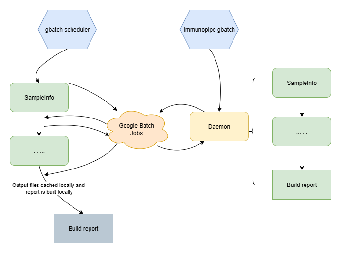

# Running the pipeline

## Run the pipeline locally via CLI

Once the pipeline is installed, you can run it via CLI:

```shell
$ immunopipe --help
```

You can specify the options directly in the CLI. For example:

```shell
$ immunopipe --forks 4 --TopExpressingGenes.envs.n 100 ...
```

It's recommended to use a configuration file to specify all the options. For example:

```shell
$ immunopipe @config.toml
```

You can also use both ways together. The options specified in the CLI will override the ones in the configuration file.

```shell
$ immunopipe @config.toml --forks 4 --TopExpressingGenes.envs.n 100 ...
```

For configuration items, see [configurations](./configurations.md) for more details.

/// Tip
If you want to run the pipeline on a cluster, see [How to run the pipeline on a cluster?](./faq.md#how-to-run-the-pipeline-on-a-cluster) for more details.
///

/// Attention
For settings that determine the routes (a set of processes) of the pipeline, you should define them in the configuration file. For example, if you want to perform supervised clustering, you need to add `[SeuratMap2Ref]` in the configuration file with necessary parameters. If you just pass the section as a command line argument (`--SeuratMap2Ref`), it will not trigger the corresponding processes.

To indicate whether the scTCR-/scBCR-seq data is available or not, you also need to specify the sample information file in the configuration file `[SampleInfo.in.infile]`. Passing the sample information file as a command line argument (`--Sample.in.infile`) does not trigger the corresponding processes.

See [Routes of the pipeline](./introduction.md#routes-of-the-pipeline) for more details.
///

## Run the pipeline via `pipen-board`

[`pipen-board`](https://github.com/pwwang/pipen-board) is a web-based dashboard for `pipen`. It provides a user-friendly interface to configure and run the pipeline. It also provides a way to monitor the running progress of the pipeline.

`pipen-board` is installed by default with `immunopipe`. You can run it via CLI:

```shell
$ pipen board immunopipe:Immunopipe
 *
 *        __   __  __.  .     __  __   +  __  __
 *       |__)||__)|_ |\ | __ |__)/  \ /\ |__)|  \
 *       |   ||   |__| \|    |__)\__//--\| \ |__/
 *
 *                   version: 0.11.1
 *
 * Configure and run pipen pipelines from the web
 *
 * Serving Quart app 'pipen_board'
 * Environment: development
 * Debug mode: True
 * Running on http://0.0.0.0:18521 (CTRL + C to quit)
[07/31/23 21:23:27] INFO     Running on http://0.0.0.0:18521 (CTRL + C to quit)
```

Then you can open the dashboard in your browser at `http://localhost:18521`.


In the `Configuration` tab, you can configure the pipeline and the processes. Then you can use the `Generate Configuration` button to generate the configuration file and then use the generated configuration file to run the pipeline via CLI.

If you want to run the pipeline via `pipen-board`, you need an additional configuration file to tell `pipen-board` how to run the pipeline:

```shell
$ pipen board immunopipe:Immunopipe -a gh:pwwang/immunopipe/board.toml@dev
```

The additional file is available at `immunopipe`'s GitHub repo. You can also download it and modify it to fit your needs, but in most cases, you don't have to. With the additional file, you can find four `running options`, `LOCAL`, `DOCKER`, `SINGULARITY` and `APPTAINER`, on the left side of the `Configuration` tab. You can choose one of them to run the pipeline.

Take `LOCAL` as an example. When clicking the `Run the command` button, a configuration file specified by `configfile` is saved and used to run the pipeline via CLI. Then the `Previous Run` tab is replaced by the `Running` tab to track the progress of the pipeline.

## Run the pipeline using docker image

### Choose the right tag of the docker image

The docker image is tagged with the version of `immunopipe`, together with `master` and `dev`. They are listed here: <https://hub.docker.com/repository/docker/justold/immunopipe/tags>.

`dev` is the latest development version of `immunopipe`. It may have unstable features. If you want to use a more stable version, please try `master`, or a specific semantic version.

You can pull the images in advance using `docker`, `singularity` or `apptainer`. See help options of `docker pull`, `singularity pull` or `apptainer pull` for more details.

You can also specify the tag when running the pipeline. See the following sections for more details.

/// tab | Using docker
To run the pipeline using the docker image with `docker`, you need to mount the current working directory to the `/workdir` directory in the container. You also need to specify the configuration file via `@<configfile>` option. For example:

```shell
$ docker run \
    --rm -w /workdir -v $(pwd):/workdir -v /tmp:/tmp \
    justold/immunopipe:<tag> \
    @config.toml
```
///

/// tab | Using singularity
You also need to mount the current working directory to the `/workdir` directory in the container if you are using `singularity`. You also need to specify the configuration file via `@<configfile>` option. For example:

```shell
$ singularity run \
    --pwd /workdir -B $(pwd):/workdir,/tmp -c -e --writable-tmpfs \
    docker://justold/immunopipe:<tag> \
    @config.toml
```
///

/// tab | Using apptainer
You also need to mount the current working directory to the `/workdir` directory in the container if you are using `apptainer`. You also need to specify the configuration file via `@<configfile>` option. For example:

```shell
$ apptainer run \
    --pwd /workdir -B $(pwd):/workdir,/tmp -c -e --unsquash --writable-tmpfs \
    docker://justold/immunopipe:<tag> \
    @config.toml
```
///

## Run the pipeline via `pipen-board` using docker image

//// tab | Using docker
You can also run the pipeline via `pipen-board` using the docker image with `docker`:

```shell
$ docker run -p 18521:18521 \
    --rm -w /workdir -v $(pwd):/workdir -v /tmp:/tmp \
    justold/immunopipe:<tag> board \
    immunopipe:Immunopipe \
    -a /immunopipe/board.toml
```

The under the `running options`, choose `LOCAL` to run the pipeline.

/// Tip | Note
You should use `LOCAL` instead of `DOCKER` to run the pipeline. Otherwise, the pipeline will be run in a docker container inside the docker container.
///
////

/// tab | Using singularity
You can also run the pipeline via `pipen-board` using the docker image with `singularity`:

```shell
$ singularity run \
    --pwd /workdir -B $(pwd):/workdir,/tmp -c -e --writable-tmpfs \
    docker://justold/immunopipe:<tag> board \
    immunopipe:Immunopipe \
    -a /immunopipe/board.toml
```

The under the `running options`, choose `LOCAL` to run the pipeline.

Similarly, you should use `LOCAL` instead of `SINGULARITY` to run the pipeline. Otherwise, the pipeline will be run in a docker container inside the container.
///

/// tab | Using apptainer
You can also run the pipeline via `pipen-board` using the docker image with `apptainer`:

```shell
$ apptainer run \
    --pwd /workdir -B $(pwd):/workdir,/tmp -c -e --unsquash --writable-tmpfs \
    docker://justold/immunopipe:<tag> board \
    immunopipe:Immunopipe \
    -a /immunopipe/board.toml
```

Also similarly, you should use `LOCAL` instead of `APPTAINER` to run the pipeline. Otherwise, the pipeline will be run in a docker container inside the container.
///

When the command is running, you will see the following message:


Then, You can open the dashboard in your browser at `http://localhost:18521`.

## Run the pipeline using Google Cloud Batch Jobs

There are two ways to run the pipeline using Google Cloud Batch Jobs:

### Use the `gbatch` scheduler of `pipen`

When using the [`gbatch`](https://github.com/pwwang/xqute#using-google-batch-jobs-scheduler), the metadata of the processes (job status, job output, etc) are managed locally. Even though they are on the cloud, they are manipuated locally (using the API provided by [`cloudpathlib`](https://cloudpathlib.drivendata.org/stable/)). The processes are submitted to Google Cloud Batch Jobs using `gcloud batch jobs submit`. And the processes are run on Google Cloud Compute Engine VMs, and they need to be sumbitted one after another.

See the documentation of [`cloud support`](https://pwwang.github.io/pipen/cloud/#run-the-pipeline-on-the-cloud) of `pipen`.

### Use `pipen-cli-gbatch`

You need install the dependencies via `pip install -U immunopipe[cli-gbatch]` to use this feature.

`immunopipe` has integrated with [`pipen-cli-gbatch`](https://github.com/pwwang/pipen-cli-gbatch) to provide a seamless way to run the pipeline using Google Cloud Batch Jobs. The entire pipeline is wrapped (like it is running locally) and submitted as a single job to Google Cloud Batch Jobs. You just need to run the following:

```shell
> immunopipe gbatch @config.toml
```

To provide the scheduler options to run the wrapped job (daemon) on Google Cloud Batch Jobs, you can specify them by `--gbatch.machine-type`, `--gbatch.provisioning-model`, `--gbatch.disk-size-gb`, etc. See the help message of `immunopipe gbatch --help` for more details.

```shell
> immunopipe gbatch --help

# pipeline options

Options For Pipen-cli-gbatch (extra Options):
  --gbatch.profile PROFILE
                        Use the `scheduler_opts` as the Scheduler Options of a given profile from pipen configuration files,
                        including ~/.pipen.toml and ./pipen.toml.
                        Note that if not provided, nothing will be loaded from the configuration files.
  --gbatch.loglevel {DEBUG,INFO,WARNING,ERROR,CRITICAL,debug,info,warning,error,critical}
                        Set the logging level for the daemon process. [default: INFO]
  --gbatch.error-strategy {retry,halt}
                        The strategy when there is error happened [default: halt]
  --gbatch.num-retries NUM_RETRIES
                        The number of retries when there is error happened. Only valid when --error-strategy is 'retry'. [default: 0]
  --gbatch.prescript PRESCRIPT
                        The prescript to run before the main command.
  --gbatch.postscript POSTSCRIPT
                        The postscript to run after the main command.
  --gbatch.recheck-interval RECHECK_INTERVAL
                        The interval to recheck the job status, each takes about 0.1 seconds. [default: 600]
  --gbatch.cwd CWD      The working directory to run the command. If not provided, the current directory is used. You can pass either a mounted path (inside the VM) or a
                        Google Storage Bucket path (gs://...). If a Google Storage Bucket path is provided, the mounted path will be inferred from the mounted paths of
                        the VM.
  --gbatch.project PROJECT
                        The Google Cloud project to run the job.
  --gbatch.location LOCATION
                        The location to run the job.
  --gbatch.mount MOUNT  The list of mounts to mount to the VM, each in the format of SOURCE:TARGET, where SOURCE must be either a Google Storage Bucket path (gs://...).
                        You can also use named mounts like `INDIR=gs://my-bucket/inputs` and the directory will be mounted to `/mnt/disks/INDIR` in the VM;
                        then you can use environment variable `$INDIR` in the command/script to refer to the mounted path.
                        You can also mount a file like `INFILE=gs://my-bucket/inputs/file.txt`. The parent directory will be mounted to `/mnt/disks/INFILE/inputs` in the
                        VM,
                        and the file will be available at `/mnt/disks/INFILE/inputs/file.txt` in the VM. `$INFILE` can also be used in the command/script to refer to the
                        mounted path.
                        [default: []]
  --gbatch.mount-as-cwd MOUNT_AS_CWD
                        The directory to mount as the current working directory of the command.
                        This is a shortcut for `--mount <cloudpath>:/mnt/disks/.cwd --cwd /mnt/disks/.cwd`.
                        The <cloudpath> must be a Google Storage Bucket path (gs://...). When this option is used,
                        and `--workdir` is not provided, the workdir will be set to `<cloudpath>/.pipen/<command_name>`,
                        where <command_name> is the name of the command (or the value of `--name` if provided).
  --gbatch.service-account SERVICE_ACCOUNT
                        The service account to run the job.
  --gbatch.network NETWORK
                        The network to run the job.
  --gbatch.subnetwork SUBNETWORK
                        The subnetwork to run the job.
  --gbatch.no-external-ip-address
                        Whether to disable external IP address for the VM.
  --gbatch.machine-type MACHINE_TYPE
                        The machine type of the VM.
  --gbatch.provisioning-model {STANDARD,SPOT}
                        The provisioning model of the VM.
  --gbatch.image-uri IMAGE_URI
                        The custom image URI of the VM.
  --gbatch.runnables RUNNABLES
                        The JSON string of extra settings of runnables add to the job.json.
                        Refer to https://cloud.google.com/batch/docs/reference/rest/v1/projects.locations.jobs#Runnable for details.
                        You can have an extra key 'order' for each runnable, where negative values mean to run before the main command,
                        and positive values mean to run after the main command.
  --gbatch.allocationPolicy ALLOCATIONPOLICY
                        The JSON string of extra settings of allocationPolicy add to the job.json. Refer to
                        https://cloud.google.com/batch/docs/reference/rest/v1/projects.locations.jobs#AllocationPolicy for details. [default: {}]
  --gbatch.taskGroups TASKGROUPS
                        The JSON string of extra settings of taskGroups add to the job.json. Refer to
                        https://cloud.google.com/batch/docs/reference/rest/v1/projects.locations.jobs#TaskGroup for details. [default: []]
  --gbatch.labels LABELS
                        The strings of labels to add to the job (key=value). Refer to
                        https://cloud.google.com/batch/docs/reference/rest/v1/projects.locations.jobs#Job.FIELDS.labels for details. [default: []]
  --gbatch.gcloud GCLOUD
                        The path to the gcloud command. [default: gcloud]
```

When `--gbatch.profile` is provided, the default scheduler options will be used from `~/.pipen.toml` and `./pipen.toml`. For example, you can add the following to `~/.pipen.toml`:

```toml
[gbatch.scheduler_opts]
project = "my-project"
location = "us-central1"
```

Then you can run the pipeline using the following command:

```shell
> immunopipe gbatch @config.toml --gbatch.profile gbatch
```

To use the default `project` and `location`.

You can also specify these options directly in the command line or under a section `gbatch` in the configuration file. The options specified in the command line will override the ones in the configuration file, which will override the ones in the profile.

For example, you may have the following in `config.toml`:

```toml
name = "Immunopipe"
workdir = "gs://my-bucket/immunopipe_workdir"
outdir = "gs://my-bucket/immunopipe_outdir"

[gbatch]
project = "my-project"
location = "us-central1"
machine-type = "n2d-standard-4"
provisioning-model = "SPOT"
# More scheduler options...
```

There are other actions you can do with `gbatch`:

- `immunopipe gbatch @config.toml --nowait`: submit the job and exit without waiting for the job to finish.
- `immunopipe gbatch @config.toml --view-logs`: view the logs of the job for the detached job.
- `immunopipe gbatch @config.toml --version`: show the version of `immunopipe`, `pipen-cli-gbatch` and `pipen`.

Here is a diagram showing the difference between using the `gbatch` scheduler and using `pipen-cli-gbatch`:



### Use Google Cloud Batch Jobs directly (not recommended)

You can also run the pipeline using Google Cloud Batch Jobs directly. In this case, you need to create a job definition file and submit the job using `gcloud batch jobs submit`. The job definition file should specify the container image, the command to run the pipeline, and the resources required for the job.

Here is an example of a job definition file (`job.json`):

```json
{
  "allocationPolicy": {
    "serviceAccount": {
      "email": "..."
    },
    "network": "...",
    "instances": [
      {
        "policy": {
          "machineType": "n2d-standard-4",
          "provisioningModel": "SPOT"
        }
      }
    ]
  },
  "taskGroups": [
    {
      "taskSpec": {
        "runnables": [
          {
            "container": {
              "image_uri": "docker.io/justold/immunopipe:dev",
              "entrypoint": "/usr/local/bin/_entrypoint.sh",
              "commands": [
                "immunopipe",
                "@/mnt/disks/workdir/Immunopipe.config.toml"
              ]
            }
          }
        ],
        "volumes": [
          {
            "gcs": {
              "remotePath": "<bucket>/path/to/workdir"
            },
            "mountPath": "/mnt/disks/workdir"
          }
        ]
      }
    }
  ],
  "logsPolicy": {
    "destination": "CLOUD_LOGGING"
  },
  "labels": "..."
}
```

Then you can submit the job using the following command:

```shell
$ gcloud batch jobs submit <job-name> --location <location> --project <project-id> --config job.json
```
