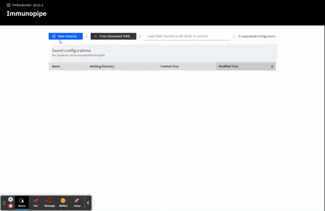
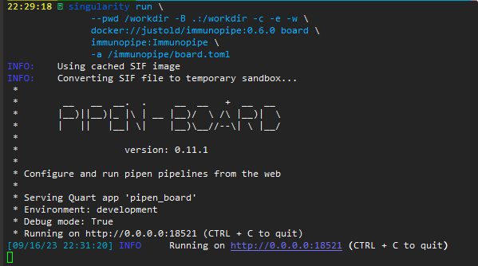

# Running the pipeline

## Run the pipeline locally via CLI

Once the pipeline is installed, you can run it via CLI:

```shell
$ immunopipe --help
```

You can specify the options directly in the CLI. For example:

```shell
$ immunopipe --forks 4 --TopExpressingGenes.envs.n 100 ...
```

It's recommended to use a configuration file to specify all the options. For example:

```shell
$ immunopipe @config.toml
```

You can also use both ways together. The options specified in the CLI will override the ones in the configuration file.

```shell
$ immunopipe @config.toml --forks 4 --TopExpressingGenes.envs.n 100 ...
```

For configuration items, see [configurations](./configurations.md) for more details.

/// Tip
If you want to run the pipeline on a cluster, see [How to run the pipeline on a cluster?](./faq.md#how-to-run-the-pipeline-on-a-cluster) for more details.
///

/// Attention
For settings that determine the routes of the pipeline, you should define them in the configuration file. For example, if you want to perform supervised clustering, you need to add `[SeuratMap2Ref]` in the configuration file with necessary parameters. If you just pass the section as a command line argument (`--SeuratMap2Ref`), it will not trigger the corresponding processes.

To indicator whether the scTCR-seq data is available or not, you also need to specify the sample information file in the configuration file `[SampleInfo.in.infile]`. Passing the sample information file as a command line argument (`--Sample.in.infile`) does not trigger the corresponding processes.

See [Routes of the pipeline](./introduction.md#routes-of-the-pipeline) for more details.
///

## Run the pipeline via `pipen-board`

[`pipen-board`](https://github.com/pwwang/pipen-board) is a web-based dashboard for `pipen`. It provides a user-friendly interface to configure and run the pipeline. It also provides a way to monitor the running progress of the pipeline.

`pipen-board` is installed by default with `immunopipe`. You can run it via CLI:

```shell
$ pipen board immunopipe:Immunopipe
 *
 *        __   __  __.  .     __  __   +  __  __
 *       |__)||__)|_ |\ | __ |__)/  \ /\ |__)|  \
 *       |   ||   |__| \|    |__)\__//--\| \ |__/
 *
 *                   version: 0.11.1
 *
 * Configure and run pipen pipelines from the web
 *
 * Serving Quart app 'pipen_board'
 * Environment: development
 * Debug mode: True
 * Running on http://0.0.0.0:18521 (CTRL + C to quit)
[07/31/23 21:23:27] INFO     Running on http://0.0.0.0:18521 (CTRL + C to quit)
```

Then you can open the dashboard in your browser at `http://localhost:18521`.



In the `Configuration` tab, you can configure the pipeline and the processes. Then you can use the `Generate Configuration` button to generate the configuration file and then use the generated configuration file to run the pipeline via CLI.

If you want to run the pipeline via `pipen-board`, you need an additional configuration file to tell `pipen-board` how to run the pipeline:

```shell
$ pipen board immunopipe:Immunopipe -a gh:pwwang/immunopipe/board.toml@dev
```

The additional file is available at `immunopipe`'s GitHub repo. You can also download it and modify it to fit your needs, but in most cases, you don't have to. With the additional file, you can find four `running options`, `LOCAL`, `DOCKER`, `SINGULARITY` and `APPTAINER`, on the left side of the `Configuration` tab. You can choose one of them to run the pipeline.

Take `LOCAL` as an example. When clicking the `Run the command` button, a configuration file specified by `configfile` is saved and used to run the pipeline via CLI. Then the `Previous Run` tab is replaced by the `Running` tab to track the progress of the pipeline.

## Run the pipeline using docker image

### Choose the right tag of the docker image

The docker image is tagged with the version of `immunopipe`, together with `master` and `dev`. They are listed here: <https://hub.docker.com/repository/docker/justold/immunopipe/tags>.

`dev` is the latest development version of `immunopipe`. It may have unstable features. If you want to use a more stable version, please try `master`, or a specific semantic version.

Any tags with a `-full` suffix are the full version of the image. It contains all the dependencies of the pipeline, especially [`keras`](https://pypi.org/project/keras/) and [`tensorflow`](https://pypi.org/project/tensorflow/) that are required by the embedding procedure of [`TESSA`](processes/TESSA.md). Those packages take quite a lot of the space of the image. If you don't need the `TESSA` process, you can use the minimal version of the image.

Any tags without the `-full` suffix are the minimal version of the image. `TESSA` process is also NOT supported in the minimal version. [`keras`](https://pypi.org/project/keras/) and [`tensorflow`](https://pypi.org/project/tensorflow/) are also NOT included in the image.

Please also keep in mind that there is no GPU support with either type of the image.

You can pull the images in advance using `docker`, `singularity` or `apptainer`. See help options of `docker pull`, `singularity pull` or `apptainer pull` for more details.

You can also specify the tag when running the pipeline. See the following sections for more details.

/// tab | Using docker
To run the pipeline using the docker image with `docker`, you need to mount the current working directory to the `/workdir` directory in the container. You also need to specify the configuration file via `@<configfile>` option. For example:

```shell
$ docker run \
    --rm -w /workdir -v .:/workdir \
    justold/immunopipe:<tag> \
    @config.toml
```
///

/// tab | Using singularity
You also need to mount the current working directory to the `/workdir` directory in the container if you are using `singularity`. You also need to specify the configuration file via `@<configfile>` option. For example:

```shell
$ singularity run \
    --pwd /workdir -B .:/workdir -c -e --writable-tmpfs \
    docker://justold/immunopipe:<tag> \
    @config.toml
```
///

/// tab | Using apptainer
You also need to mount the current working directory to the `/workdir` directory in the container if you are using `apptainer`. You also need to specify the configuration file via `@<configfile>` option. For example:

```shell
$ apptainer run \
    --pwd /workdir -B .:/workdir -c -e --unsquash --writable-tmpfs \
    docker://justold/immunopipe:<tag> \
    @config.toml
```
///

## Run the pipeline via `pipen-board` using docker image

//// tab | Using docker
You can also run the pipeline via `pipen-board` using the docker image with `docker`:

```shell
$ docker run -p 18521:18521 \
    --rm -w /workdir -v .:/workdir \
    justold/immunopipe:<tag> board \
    immunopipe:Immunopipe \
    -a /immunopipe/board.toml
```

The under the `running options`, choose `LOCAL` to run the pipeline.

/// Tip | Note
You should use `LOCAL` instead of `DOCKER` to run the pipeline. Otherwise, the pipeline will be run in a docker container inside the docker container.
///
////

/// tab | Using singularity
You can also run the pipeline via `pipen-board` using the docker image with `singularity`:

```shell
$ singularity run \
    --pwd /workdir -B .:/workdir -c -e --writable-tmpfs \
    docker://justold/immunopipe:<tag> board \
    immunopipe:Immunopipe \
    -a /immunopipe/board.toml
```

The under the `running options`, choose `LOCAL` to run the pipeline.

Similarly, you should use `LOCAL` instead of `SINGULARITY` to run the pipeline. Otherwise, the pipeline will be run in a docker container inside the container.
///

/// tab | Using apptainer
You can also run the pipeline via `pipen-board` using the docker image with `apptainer`:

```shell
$ apptainer run \
    --pwd /workdir -B .:/workdir -c -e --unsquash --writable-tmpfs \
    docker://justold/immunopipe:<tag> board \
    immunopipe:Immunopipe \
    -a /immunopipe/board.toml
```

Also similarly, you should use `LOCAL` instead of `APPTAINER` to run the pipeline. Otherwise, the pipeline will be run in a docker container inside the container.
///

When the command is running, you will see the following message:



Then, You can open the dashboard in your browser at `http://localhost:18521`.
